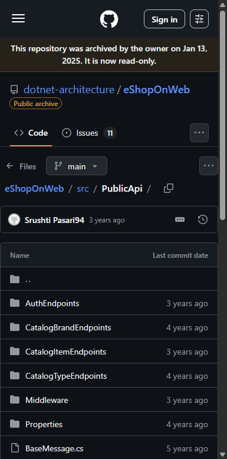
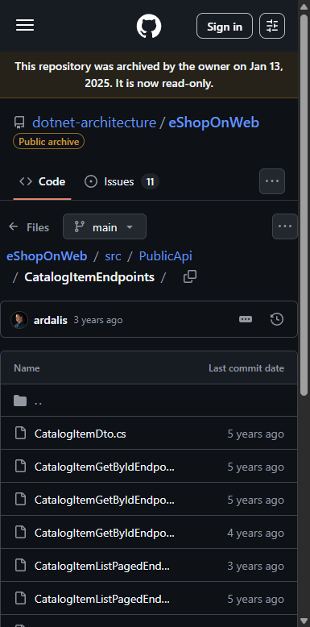
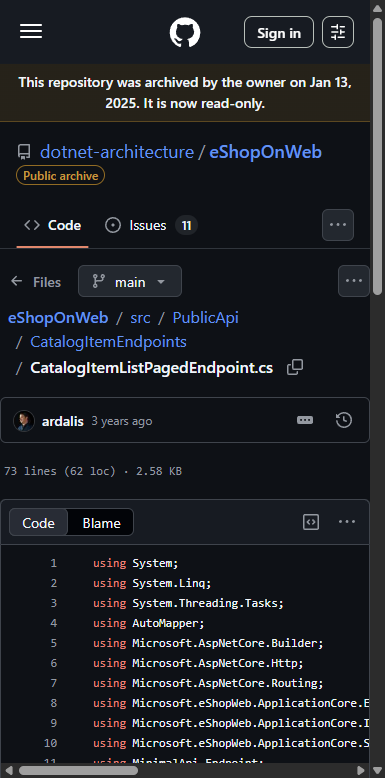
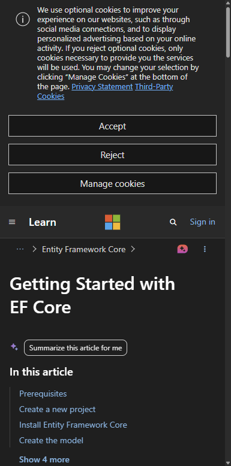
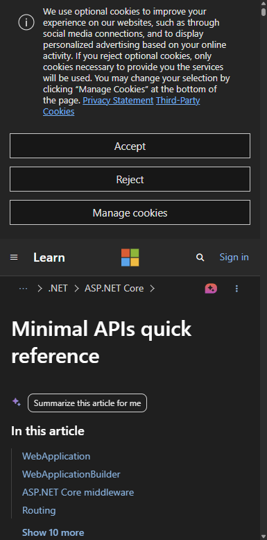
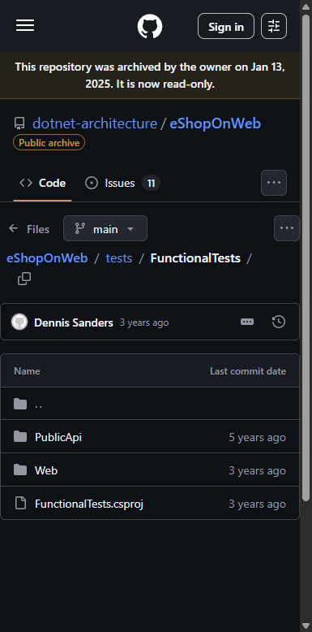
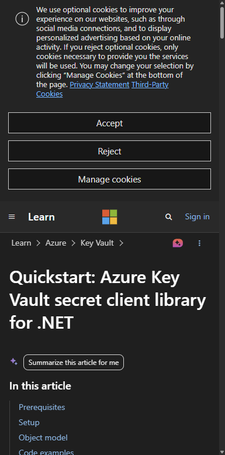
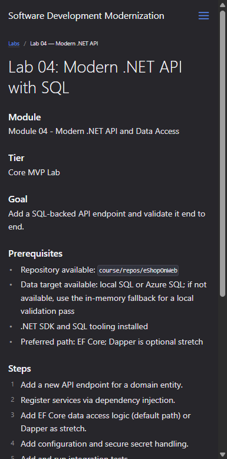

# Lab 04: Modern .NET API with SQL — Visual Walkthrough

**Course:** Software Development Modernization  
**Module:** 04 — Modern .NET API and Data Access  
**Reference App:** `dotnet-architecture/eShopOnWeb` (ASP.NET Core 8 reference app)  
**Screenshots taken:** 2026-08-10 against live GitHub repository and Microsoft Learn docs  
**Audience:** Students using this as a step-by-step guide or instructor reference

---

> **How to use this document**  
> This walkthrough mirrors every step of the lab in the exact order students encounter the codebase and tooling.  
> Each screenshot is followed by an explanation of what you are looking at **and why it matters to app modernization teams**. Where the live environment behaves unexpectedly, a **⚠️ Snag** callout explains the issue and the workaround.

---

## Why This Lab Matters — App Modernization Context

Labs 01–03 built the *foundation*: you discovered what needs to change, set up work tracking, and refactored one class with proper test coverage. Lab 04 is where you create the **first tangible modernization deliverable** — a real API endpoint backed by SQL data, built with current .NET patterns, and validated end to end.

This matters for three reasons:

1. **APIs are the cloud contract.** When a legacy monolith is modernized, the team must expose its business capabilities through HTTP APIs so other services, mobile clients, and automation can consume them. The API layer *is* the modernization.

2. **SQL migration is the highest-risk move.** Changing how a production app connects to its database is the step most likely to cause a production incident. This lab teaches the pattern — connection strings → EF Core → DI → configuration → secrets — in a safe environment where mistakes are learning.

3. **Integration tests are the safety net for Step 2.** A passing integration test against the API endpoint proves the data access layer, the business logic, the HTTP contract, and the configuration all work together correctly. No integration test = no confidence in deployment.

> **Key concept:** In a cloud-native architecture, nothing talks directly to a database except through a service that owns that database. The endpoint you build in this lab is the *first step* toward that architecture. You are not just adding a route — you are establishing the pattern every future service will follow.

---

## What You Will Build

By the end of this lab you will have:

| Artifact | What it is | Where it goes |
|---|---|---|
| New API endpoint | A `GET /api/catalog/brands` endpoint returning brand data | `src/PublicApi/CatalogBrandEndpoints/` |
| EF Core query | A repository method that fetches brands from SQL | `src/Infrastructure/Data/` |
| DI registration | Service wired into the DI container | `src/PublicApi/Program.cs` |
| Configuration | Connection string read from environment / Key Vault | `appsettings.json` + environment override |
| Integration test | A test that POSTs to the running API and validates the response | `tests/FunctionalTests/` |

---

## Prerequisites

Before starting, confirm:

| Item | How to verify |
|---|---|
| eShopOnWeb repo cloned and open in VS Code | Explorer shows the repo root |
| .NET SDK 8.x | `dotnet --version` → `8.x.x` |
| SQL Server / LocalDB available OR in-memory fallback | Try `dotnet run` from `src/Web/` — if it starts, SQL is working. If not, set `UseOnlyInMemoryDatabase=true` |
| `PublicApi` project builds | `dotnet build src/PublicApi` — zero errors |
| Lab 03 complete | Tests pass and `BasketService` or `OrderService` is refactored |

---

## Part 1 — Orient Yourself in the `PublicApi` Project

### Step 1.1 — Open the `PublicApi` Folder

Navigate to:
```
https://github.com/dotnet-architecture/eShopOnWeb/tree/main/src/PublicApi
```



**What you are looking at:**  
The `PublicApi` project is the **existing REST API** in `eShopOnWeb`. It already has a working API surface — your job is to extend it with a new endpoint following the same patterns already established.

| Item | What it tells you |
|---|---|
| **`CatalogItemEndpoints/`** | The existing endpoint family for catalog items — this is your pattern reference |
| **`AuthEndpoints/`** | Authentication endpoints — shows the app already has token-based auth wired up |
| **`Program.cs`** | Where all endpoints are registered — you will add your new endpoint here |
| **`PublicApi.csproj`** | Project dependencies — check this to understand what packages are already available |

> **The pattern this project uses:** `eShopOnWeb`'s `PublicApi` uses **FastEndpoints-style classes** (one class per endpoint), not traditional MVC controllers. Each endpoint inherits from a base class, declares its route and HTTP verb, and implements a single `HandleAsync` method. This is close to the ASP.NET Core Minimal APIs pattern you will see in all new .NET projects.

> **App modernization connection:** Legacy ASP.NET (WebForms or classic MVC) applications typically expose data through server-rendered HTML pages, SOAP web services, or thick-client remoting. The first step of their modernization is always the same: expose the core data through a clean REST API. This API becomes the contract everything else builds on — mobile apps, SPA frontends, Azure Logic Apps, and other downstream services.

> **⚠️ Snag — Students try to add a controller instead of an endpoint class:** If your instinct is to create a `CatalogBrandsController.cs` with `[ApiController]`, you can — but you will be fighting against the project's architecture. Follow the existing `CatalogItemEndpoints` pattern instead: one class per operation, registered via `app.MapCatalogItemEndpoints()` style extension methods.

---

## Part 2 — Study the Existing Endpoint Pattern

### Step 2.1 — Explore the `CatalogItemEndpoints` Folder

Navigate to:
```
https://github.com/dotnet-architecture/eShopOnWeb/tree/main/src/PublicApi/CatalogItemEndpoints
```



**What you are looking at:**  
The complete CRUD endpoint family for `CatalogItem`. Each file is one HTTP operation:

| File | HTTP verb | Route | What it does |
|---|---|---|---|
| `CatalogItemListPagedEndpoint.cs` | `GET` | `/api/catalog-items` | Returns a paged list — this is your primary reference |
| `CatalogItemGetByIdEndpoint.cs` | `GET` | `/api/catalog-items/{id}` | Returns a single item |
| `CatalogItemCreateEndpoint.cs` | `POST` | `/api/catalog-items` | Creates a new catalog item |
| `CatalogItemUpdateEndpoint.cs` | `PUT` | `/api/catalog-items/{id}` | Updates an existing item |
| `CatalogItemDeleteEndpoint.cs` | `DELETE` | `/api/catalog-items/{id}` | Soft or hard deletes an item |

> **Your task:** Create the same pattern for `CatalogBrand`. Start with the `List` endpoint (`GET /api/catalog-brands`) — the simplest operation — following `CatalogItemListPagedEndpoint.cs` as your template.

> **App modernization connection:** The separation of CRUD operations into individual endpoint classes (rather than one bloated controller) is a **modernization pattern in itself**. It enables:
> - Independent authorization policies per operation (e.g., only admins can DELETE)
> - Independent rate limiting per operation
> - Independent documentation (Swagger shows each operation cleanly)
> - Easier testing (each endpoint can be tested in isolation)

---

### Step 2.2 — Read the List Endpoint Implementation

Navigate to:
```
https://github.com/dotnet-architecture/eShopOnWeb/blob/main/src/PublicApi/CatalogItemEndpoints/CatalogItemListPagedEndpoint.cs
```



**What you are looking at:**  
The full implementation of the catalog item list endpoint. This is the template you copy-adapt for your new `CatalogBrand` endpoint. Key elements to understand:

| Element | Code pattern | What it does |
|---|---|---|
| **Constructor injection** | `IReadRepository<CatalogItem> _itemRepository` | Gets the repository from the DI container — no `new`, no static calls |
| **Request model** | `CatalogItemListPagedRequest` class | Typed request object — route and query parameters are deserialized here |
| **Response model** | `CatalogItemListPagedResponse` class | Typed response — Swagger auto-generates documentation from this |
| **`HandleAsync`** | The single method that runs for every HTTP request | Business logic + data access + response serialization all in one place |
| **Specification** | `CatalogItemsSpecification(request.PageIndex, request.PageSize)` | Encapsulated query filter — uses the Specification pattern from `ApplicationCore` |
| **AutoMapper** | `_mapper.Map<CatalogItemDto>` | Converts EF entities to API DTOs — keeps database schema changes away from the API contract |

> **Your copy-adapt checklist for CatalogBrand:**
> 1. Copy `CatalogItemListPagedEndpoint.cs` → `CatalogBrandListEndpoint.cs`
> 2. Replace `CatalogItem` with `CatalogBrand` throughout
> 3. Remove paging (brands list is small — return all)
> 4. Create `CatalogBrandDto` in the response model
> 5. Register the new endpoint in `Program.cs`

> **⚠️ Snag — AutoMapper mapping not configured:** If you add a `CatalogBrandDto` but forget to add the AutoMapper mapping profile entry, the endpoint will throw a `AutoMapperMappingException` at runtime. Add the mapping in `MappingProfile.cs` in the `PublicApi` project: `CreateMap<CatalogBrand, CatalogBrandDto>();`

---

## Part 3 — Understand EF Core Data Access

### Step 3.1 — Review the EF Core Getting Started Documentation

Navigate to:
```
https://learn.microsoft.com/en-us/ef/core/get-started/overview/first-app
```



**What you are looking at:**  
The EF Core "Getting Started" documentation. While `eShopOnWeb` already has EF Core configured, this page is the reference for the patterns you are working with:

| Concept | EF Core pattern | Where it appears in eShopOnWeb |
|---|---|---|
| **DbContext** | `CatalogContext : DbContext` | `src/Infrastructure/Data/CatalogContext.cs` |
| **DbSet** | `DbSet<CatalogBrand> CatalogBrands` | Already declared in `CatalogContext` |
| **Query** | `context.CatalogBrands.ToListAsync()` | Called through `IRepository<CatalogBrand>` |
| **Migrations** | `dotnet ef migrations add` | `src/Infrastructure/Data/Migrations/` |
| **Connection string** | `optionsBuilder.UseSqlServer(connectionString)` | Registered in `src/PublicApi/Program.cs` |

> **The eShopOnWeb pattern vs. direct DbContext:** `eShopOnWeb` wraps EF Core behind the `IRepository<T>` interface from the `Ardalis.Specification` package. You never call `_context.CatalogBrands.ToListAsync()` directly in an endpoint — you call `_repository.ListAsync(spec)`. This abstraction means you can:
> - Swap the database provider (SQL Server → PostgreSQL → Cosmos DB) without touching endpoints
> - Test endpoints with a mock repository instead of a real database
> - Enforce query patterns through Specifications instead of ad-hoc LINQ

> **Lab 04 EF Core steps:**
> ```bash
> # 1. Verify CatalogBrand is already in CatalogContext (it is — check CatalogContext.cs)
> # 2. Create a Specification for listing all brands:
> #    src/ApplicationCore/Specifications/CatalogBrandSpecification.cs
> # 3. Use it in your new endpoint's HandleAsync:
> #    var brands = await _brandRepository.ListAsync(new CatalogBrandSpecification(), cancellationToken);
> ```

> **App modernization connection:** The jump from `SqlConnection`/`SqlCommand` (legacy ADO.NET) to EF Core is one of the most common Refactor steps in a .NET modernization. EF Core gives you:
> - **Automatic parameter sanitization** — no SQL injection via string concatenation
> - **Change tracking** — the ORM knows what changed and generates minimal UPDATE statements
> - **Migrations** — schema changes are versioned and reversible
> - **Provider switching** — the same C# code runs against SQL Server, PostgreSQL, or SQLite

> **⚠️ Snag — `CatalogBrand` DbSet already exists but no Specification:** Students often try to query `CatalogBrand` directly using LINQ on the DbSet. This bypasses the Specification pattern and breaks testability. Always create a `CatalogBrandSpecification` in `ApplicationCore/Specifications/` even if the specification has no filters — it is the pattern the project enforces.

---

## Part 4 — Understand Minimal APIs (The Modern Endpoint Pattern)

### Step 4.1 — Review ASP.NET Core Minimal APIs Documentation

Navigate to:
```
https://learn.microsoft.com/en-us/aspnet/core/fundamentals/minimal-apis
```



**What you are looking at:**  
The ASP.NET Core documentation for **Minimal APIs** — the modern, low-ceremony way to define HTTP endpoints in .NET 6+. While `eShopOnWeb` uses a slightly more structured class-based pattern, understanding Minimal APIs is essential because:

1. All new .NET projects start with Minimal APIs as the default
2. The Minimal APIs model directly informs how the class-based endpoints in `eShopOnWeb` are structured
3. Azure Functions and Azure Container Apps use the same routing model

**Core Minimal API pattern:**

```csharp
// The simplest possible API endpoint
app.MapGet("/api/catalog-brands", async (IRepository<CatalogBrand> repo) =>
{
    var brands = await repo.ListAsync();
    return Results.Ok(brands);
});
```

**vs. the eShopOnWeb class-based equivalent:**

```csharp
public class CatalogBrandListEndpoint : IEndpoint<IResult, CatalogBrandListRequest>
{
    private readonly IReadRepository<CatalogBrand> _brandRepo;
    
    public CatalogBrandListEndpoint(IReadRepository<CatalogBrand> brandRepo)
        => _brandRepo = brandRepo;

    public async Task<IResult> HandleAsync(CatalogBrandListRequest request,
        CancellationToken cancellationToken)
    {
        var brands = await _brandRepo.ListAsync(cancellationToken);
        return Results.Ok(new CatalogBrandListResponse(brands.Select(b => b.Name)));
    }
}
```

> **Why the class-based version:** It is more testable (the endpoint class is injected as a dependency), more organized at scale (one file per endpoint), and cleaner for Swagger documentation. For production APIs with more than a handful of routes, prefer the class-based pattern.

> **App modernization connection:** Minimal APIs removed the last argument for keeping legacy ASP.NET MVC controllers in new code. For modernization teams moving from WebAPI 2.x (`ApiController` classes), the migration path is: extract the controller's action method body into a Minimal API handler or endpoint class, wire up DI, and delete the controller. The business logic does not change — only the HTTP plumbing.

---

## Part 5 — Run the Functional Tests

### Step 5.1 — Open the `FunctionalTests` Project

Navigate to:
```
https://github.com/dotnet-architecture/eShopOnWeb/tree/main/tests/FunctionalTests
```



**What you are looking at:**  
The **FunctionalTests** project — the integration test layer that validates the full HTTP stack. This is where you add the test for your new endpoint.

| Subfolder | Tests what | How |
|---|---|---|
| **`ApiEndpoints/`** | Tests against the `PublicApi` project | Starts an in-memory test server, sends real HTTP requests via `HttpClient` |
| **`WebEndpoints/`** | Tests against the MVC web app | Same approach but targeting the Razor Pages/MVC app |

**The integration test pattern:**

```csharp
public class CatalogBrandListEndpointTest : IClassFixture<CustomWebApplicationFactory<Program>>
{
    private readonly HttpClient _client;

    public CatalogBrandListEndpointTest(CustomWebApplicationFactory<Program> factory)
        => _client = factory.CreateClient();

    [Fact]
    public async Task ReturnsHttpOkWithBrands()
    {
        var response = await _client.GetAsync("/api/catalog-brands");
        
        response.EnsureSuccessStatusCode();
        var content = await response.Content.ReadAsStringAsync();
        Assert.Contains("Azure", content); // brand seeded in test data
    }
}
```

> **Running the functional tests:**
> ```bash
> cd tests/FunctionalTests
> dotnet test --filter "ApiEndpoints"
> ```

> **App modernization connection:** Functional tests that hit the real HTTP stack (even against an in-memory server) are the most valuable tests you can write before a cloud deployment. They answer the question: *"Does this endpoint actually work when called the way a client would call it?"* Unit tests tell you the business logic is correct. Functional tests tell you the routing, authentication, serialization, and DI wiring are all correct too. Both layers are needed.

> **⚠️ Snag — `CustomWebApplicationFactory` throws `InvalidOperationException` after adding new endpoint:** This happens when the new endpoint's service dependencies are not registered in the test factory's service collection. Open `CustomWebApplicationFactory.cs` and check that your new repository type is registered. If you use `IReadRepository<CatalogBrand>`, confirm it is in `ConfigureTestServices`.

> **⚠️ Snag — Test database not seeded with `CatalogBrand` data:** The `CatalogContextSeed.cs` file populates the in-memory database used by tests. If you query brands and get an empty list, check that `CatalogContextSeed` seeds the `CatalogBrands` table. It does — but verify the seed runs before your test by checking the `CustomWebApplicationFactory` setup calls `SeedTestData()`.

---

## Part 6 — Secure Configuration and Secret Handling

### Step 6.1 — Review Azure Key Vault Integration Documentation

Navigate to:
```
https://learn.microsoft.com/en-us/azure/key-vault/secrets/quick-create-net
```



**What you are looking at:**  
The Azure Key Vault .NET quickstart — the reference for the **secure configuration** step of Lab 04. The critical pattern is:

```csharp
// Instead of reading from appsettings.json:
// "ConnectionStrings": { "CatalogConnection": "Server=..." }

// Use DefaultAzureCredential + Key Vault:
var client = new SecretClient(
    new Uri("https://your-keyvault.vault.azure.net/"),
    new DefaultAzureCredential());

var secret = await client.GetSecretAsync("CatalogConnection");
string connectionString = secret.Value.Value;
```

**Why this matters — the three levels of secret handling:**

| Level | How | Risk |
|---|---|---|
| **Level 0 (Bad)** | Connection string in `appsettings.json` | Credentials in source control — exposed to everyone with repo access |
| **Level 1 (Better)** | Connection string in environment variable | Not in source control, but visible in process list and logs on some platforms |
| **Level 2 (Best)** | Connection string in Azure Key Vault, read at startup via `DefaultAzureCredential` | Secrets never leave Key Vault; access controlled by Azure RBAC; audit logged |

**Adding Key Vault to `Program.cs` for the API project:**

```csharp
// In PublicApi/Program.cs
if (!app.Environment.IsDevelopment())
{
    builder.Configuration.AddAzureKeyVault(
        new Uri(builder.Configuration["KeyVaultUri"]!),
        new DefaultAzureCredential());
}
```

The `KeyVaultUri` is the only non-secret setting in `appsettings.json`. Everything else comes from the vault.

> **For local development:** Use `dotnet user-secrets` instead of Key Vault:
> ```bash
> dotnet user-secrets init --project src/PublicApi
> dotnet user-secrets set "ConnectionStrings:CatalogConnection" "Server=(localdb)\\mssqllocaldb;..."
> ```
> User secrets are stored in your profile directory, never committed to Git.

> **App modernization connection:** Secret management is a **Day 1 blocker** for production cloud deployment. Azure security teams routinely scan newly deployed apps for credentials in environment variables and config files. Any connection string or API key not in Key Vault is a finding that will block the deployment go-live. Building this habit in Lab 04 means students are production-ready by the time they reach Lab 08 (CI/CD).

> **⚠️ Snag — `DefaultAzureCredential` fails locally:** In local development, `DefaultAzureCredential` tries Azure CLI credentials first. If you are not logged into the Azure CLI (`az login`), it falls through to a chain of other credential sources and eventually throws. **Fix:** Run `az login` before starting the app, or use `dotnet user-secrets` for local development and only use Key Vault in the deployed environment.

---

## Part 7 — Step-by-Step: Adding the `CatalogBrand` Endpoint

This is the hands-on implementation guide for the lab. Follow these steps in order:

### Step 7.1 — Create the Endpoint Class

Create `src/PublicApi/CatalogBrandEndpoints/CatalogBrandListEndpoint.cs`:

```csharp
using Ardalis.ApiEndpoints;
using Microsoft.AspNetCore.Mvc;
using Microsoft.eShopWeb.ApplicationCore.Entities;
using Microsoft.eShopWeb.ApplicationCore.Interfaces;

namespace Microsoft.eShopWeb.PublicApi.CatalogBrandEndpoints;

public class CatalogBrandListEndpoint(IReadRepository<CatalogBrand> brandRepository)
    : EndpointBaseAsync
        .WithRequest<EmptyRequest>
        .WithActionResult<CatalogBrandListResponse>
{
    [HttpGet("/api/catalog-brands")]
    public override async Task<ActionResult<CatalogBrandListResponse>> HandleAsync(
        [FromQuery] EmptyRequest request,
        CancellationToken cancellationToken = default)
    {
        var brands = await brandRepository.ListAsync(cancellationToken);
        var response = new CatalogBrandListResponse(
            brands.Select(b => new CatalogBrandDto(b.Id, b.Name)).ToList());
        return Ok(response);
    }
}

public record CatalogBrandDto(int Id, string Name);
public record CatalogBrandListResponse(List<CatalogBrandDto> Brands);
public record EmptyRequest;
```

### Step 7.2 — Register the Endpoint in `Program.cs`

Find where `CatalogItemEndpoints` are registered in `src/PublicApi/Program.cs` and add:

```csharp
app.MapCatalogBrandEndpoints(); // Add this line
```

Then create the extension method:

```csharp
// src/PublicApi/CatalogBrandEndpoints/CatalogBrandEndpointExtensions.cs
public static class CatalogBrandEndpointExtensions
{
    public static IEndpointRouteBuilder MapCatalogBrandEndpoints(
        this IEndpointRouteBuilder app)
    {
        new CatalogBrandListEndpoint(
            app.ServiceProvider.GetRequiredService<IReadRepository<CatalogBrand>>())
            .AddRoutes(app);
        return app;
    }
}
```

### Step 7.3 — Verify with `curl` or the Swagger UI

Start the PublicApi project and test:

```bash
# Start the API
dotnet run --project src/PublicApi

# Test the endpoint
curl -s https://localhost:5099/api/catalog-brands | jq .

# Expected response:
# {
#   "brands": [
#     { "id": 1, "name": ".NET" },
#     { "id": 2, "name": "Other" }
#   ]
# }
```

Or open the Swagger UI at `https://localhost:5099/swagger` to see and test the new endpoint interactively.

---

## Part 8 — View the Course Site Lab Reference

### Step 8.1 — Open the GitHub Pages Course Site for Lab 04

Navigate to:
```
https://derricksobrien.github.io/ALDOT-Courseware/labs/lab-04-modern-dotnet-api-sql
```



**What you are looking at:**  
The published **Lab 04** page on the course's GitHub Pages site. The evidence items for this lab are particularly important:

| Evidence | What it proves |
|---|---|
| **Endpoint code changes** | The new endpoint class, DI registration, and Specification are committed to source control |
| **Integration test output** | `dotnet test --filter ApiEndpoints` passes — the HTTP contract works end to end |
| **Config and secret handling notes** | Documents whether Key Vault, user-secrets, or environment variables were used and why |

> **On the secret handling notes:** This is not optional. On a real modernization project, the delivery team must document *how* secrets are managed so the operations team knows how to rotate them when they expire. A student who can explain "I used `dotnet user-secrets` locally and Key Vault in the deployed environment, wired with `DefaultAzureCredential`" has demonstrated production-readiness.

---

## Summary: What You Built and Why It Matters

| Lab 04 Artifact | What you created | App modernization purpose |
|---|---|---|
| **New API endpoint** | `GET /api/catalog-brands` | Exposes domain data via a clean HTTP contract — consumed by SPAs, mobile, and downstream services |
| **EF Core query** | Specification + repository call | Type-safe, SQL-injection-proof, provider-agnostic data access |
| **DI registration** | Service wired in `Program.cs` | Follows the dependency inversion principle — enables test doubles and future swaps |
| **Secure configuration** | User secrets (dev) / Key Vault (prod) | Removes credentials from source control — required for cloud production deployment |
| **Integration tests** | Functional test hitting real HTTP | End-to-end validation of the entire stack: routing → DI → EF Core → response |

> **Final thought:** The endpoint you built in Lab 04 becomes the foundation for Labs 06, 07, and 08. Lab 06 puts this API in a Docker container. Lab 07 deploys that container to Kubernetes. Lab 08 automates the build and deploy with GitHub Actions. Every subsequent lab assumes the API works correctly and its connection string is securely managed. If you skip the Key Vault step now, you will be committing credentials to your CI/CD pipeline in Lab 08 — which is a security finding, not a convenience.

---

## Documented Snags Reference

| # | Where it happens | What students see | Fix |
|---|---|---|---|
| 1 | New endpoint file | `AutoMapperMappingException` at runtime | Add `CreateMap<CatalogBrand, CatalogBrandDto>()` to `MappingProfile.cs` in `PublicApi` |
| 2 | `dotnet run` (PublicApi) | `InvalidOperationException: No service for type IReadRepository<CatalogBrand>` | Register the repository in `Program.cs`: `builder.Services.AddScoped<IReadRepository<CatalogBrand>, EfRepository<CatalogBrand>>()` |
| 3 | Functional tests | `CustomWebApplicationFactory` throws on startup | Register new dependencies in `ConfigureTestServices` in `CustomWebApplicationFactory.cs` |
| 4 | Functional tests | Empty list returned for brands | Check `CatalogContextSeed.cs` — brands are seeded, but confirm `SeedTestData()` is called in the factory setup |
| 5 | `DefaultAzureCredential` | `CredentialUnavailableException` locally | Run `az login` before starting the app, or use `dotnet user-secrets` for local dev |
| 6 | Swagger UI | New endpoint not visible | Ensure `app.MapCatalogBrandEndpoints()` is called in `Program.cs` *before* `app.Run()` |
| 7 | `dotnet ef` | `No DbContext was found` | Run EF commands from the `Infrastructure` project directory: `cd src/Infrastructure; dotnet ef migrations list` |
| 8 | EF Core Specification | `ListAsync` returns empty with no error | Check the Specification constructor — if it has a filter predicate that matches nothing, it silently returns empty. Log the generated SQL with `EnableSensitiveDataLogging()` in development |
