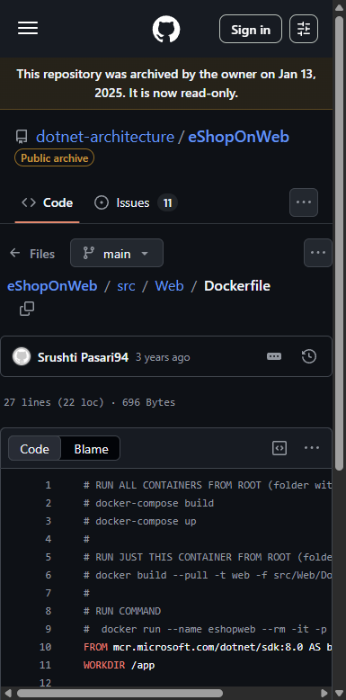
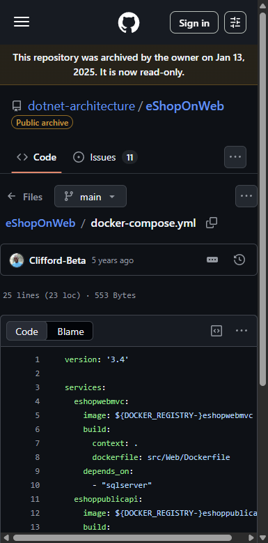
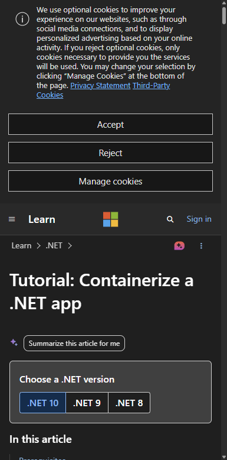
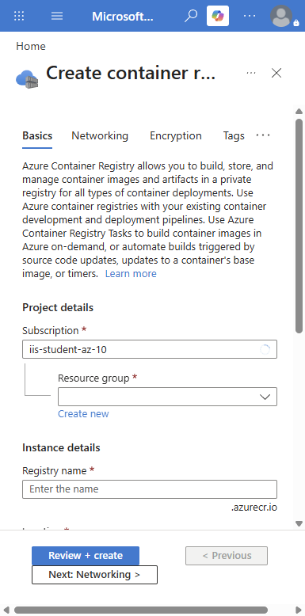
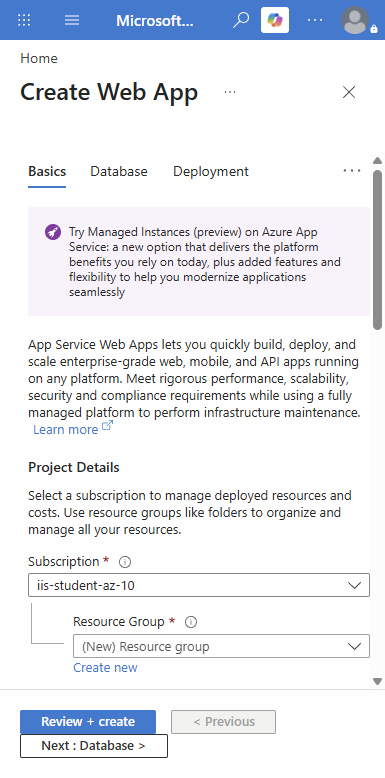
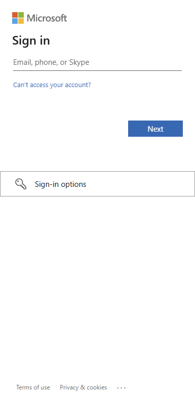
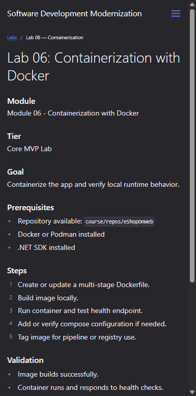

# Lab 06: Containerization with Docker — Visual Walkthrough

**Course:** Software Development Modernization  
**Module:** 06 — Containerization with Docker  
**Reference App:** `dotnet-architecture/eShopOnWeb` (ASP.NET Core 8 reference app)  
**Screenshots taken:** 2026-08-10 against live Azure Portal (instructor01-sdm-2026-aug10 account), GitHub, ADO, and Microsoft Learn  
**Audience:** Students using this as a step-by-step guide or instructor reference  
**Tier:** Core MVP Lab

---

> **How to use this document**  
> This walkthrough mirrors every step of the lab in the exact order students encounter the codebase, tooling, and cloud services.  
> Each screenshot is followed by an explanation of what you are looking at **and why it matters to app modernization teams**. Where the live environment behaves unexpectedly, a **⚠️ Snag** callout explains the issue and the workaround.

---

## Why This Lab Matters — App Modernization Context

Labs 01–05 brought you from *discovery* through *quality gates*. Lab 06 is the **packaging milestone** — the moment where your modernized .NET app stops being a source-code project and becomes a portable, deployable artifact.

This matters for three reasons:

1. **Containers eliminate "works on my machine."** A Docker image encapsulates the exact runtime — .NET 8 ASP.NET Core, dependencies, config — so the same image runs identically on a developer's laptop, the CI pipeline, and Azure. No more manual server configuration to replicate.

2. **Container images are the cloud deployment unit.** Azure Container Apps, Azure Kubernetes Service, Azure App Service (container mode), and OpenShift all expect a container image. Until your app is containerized, it cannot use any of these platforms.

3. **Multi-stage Dockerfiles keep images small and secure.** The build stage uses the full .NET SDK (hundreds of MB). The runtime stage uses only the ASP.NET runtime (tens of MB). Students learn to write a Dockerfile that produces a production-ready, minimal image — exactly the pattern used by modernization teams at scale.

> **Key concept:** In the 4 R's framework (Rehost → Replatform → Refactor → Rearchitect), containerization often happens at the **Replatform** phase: you lift the app from a Windows VM, wrap it in a container, and run it on a managed container platform without rewriting business logic. The Dockerfile you create in this lab is the primary artifact of that phase.

---

## What You Will Build

By the end of this lab you will have:

| Artifact | What it is | Where it lives |
|---|---|---|
| Multi-stage Dockerfile | Build + runtime stages for the eShopOnWeb Web project | `src/Web/Dockerfile` |
| Local image | Built image tagged `eshopweb:local` | Docker Desktop / local daemon |
| docker-compose.yml | Compose file to run web + sqlserver containers together | Repo root |
| Azure Container Registry | Private registry to store the image | Azure Portal → ACR |
| Tagged image | Image pushed to ACR as `<registry>.azurecr.io/eshopweb:v1.0` | ACR repository |
| Health check validation | `GET /health` returns 200 OK from running container | Terminal / curl |

---

## Prerequisites

Before starting, confirm:

| Item | How to verify |
|---|---|
| Docker Desktop installed | `docker --version` → `Docker version 24.x+` |
| .NET SDK 8.x | `dotnet --version` → `8.x.x` |
| Azure CLI logged in | `az account show` → shows iis-student subscription |
| eShopOnWeb repo cloned | Explorer shows `src/Web/Dockerfile` |
| Lab 04 complete | API endpoint builds and passes integration tests |

---

## Part 1 — Explore the Existing Dockerfile

### Step 1.1 — Open the Dockerfile in eShopOnWeb

Navigate to:
```
https://github.com/dotnet-architecture/eShopOnWeb/blob/main/src/Web/Dockerfile
```



**What you are looking at:**  
The existing `src/Web/Dockerfile` is a **two-stage build** — the gold standard for containerizing .NET apps. It uses Microsoft's official base images from `mcr.microsoft.com`.

```dockerfile
# Stage 1 — Build
FROM mcr.microsoft.com/dotnet/sdk:8.0 AS build
WORKDIR /app
COPY *.sln .
COPY . .
WORKDIR /app/src/Web
RUN dotnet restore
RUN dotnet publish -c Release -o out

# Stage 2 — Runtime
FROM mcr.microsoft.com/dotnet/aspnet:8.0 AS runtime
WORKDIR /app
COPY --from=build /app/src/Web/out ./
ENTRYPOINT ["dotnet", "Web.dll"]
```

| Instruction | What it does |
|---|---|
| `FROM sdk:8.0 AS build` | Uses the full .NET SDK (includes compiler, NuGet, MSBuild) |
| `COPY . .` | Copies entire solution into the build container |
| `dotnet restore` | Downloads NuGet packages into layer cache |
| `dotnet publish -c Release -o out` | Compiles and outputs only the runtime files |
| `FROM aspnet:8.0 AS runtime` | Switches to the smaller ASP.NET runtime image (~220MB vs ~800MB) |
| `COPY --from=build` | Copies only the published output — not source code or SDK |
| `ENTRYPOINT` | Sets the process that runs when the container starts |

> **App modernization connection:** The multi-stage pattern is critical for security. The production image never contains source code, build tools, or development dependencies — only the compiled app. Smaller images also mean faster pull times in CI/CD pipelines.

> ⚠️ **Snag — Build from repo root:** The Dockerfile comments are explicit: build must run from the folder containing the `.sln` file, not from `src/Web/`. Run `docker build -f src/Web/Dockerfile .` from the repo root, not from inside `src/Web/`.

---

## Part 2 — Explore the docker-compose Configuration

### Step 2.1 — Review docker-compose.yml

Navigate to:
```
https://github.com/dotnet-architecture/eShopOnWeb/blob/main/docker-compose.yml
```



**What you are looking at:**  
`docker-compose.yml` defines the **multi-container stack** — the web app and its SQL Server dependency running as a coordinated set of containers.

| Compose key | What it controls |
|---|---|
| `services.web` | The ASP.NET Core web application container |
| `services.sqlserver` | SQL Server 2022 running as a sidecar |
| `ports` | Maps host port → container port (e.g., `5106:5106`) |
| `environment` | Sets `ASPNETCORE_ENVIRONMENT`, connection strings |
| `depends_on` | Ensures SQL starts before the web app |
| `volumes` | Persists SQL data between `docker-compose down` / `up` cycles |

**Key compose commands:**

```bash
# Build all images
docker-compose build

# Start all services in the background
docker-compose up -d

# View logs
docker-compose logs -f web

# Stop and remove containers (keep volumes)
docker-compose down

# Stop and remove everything including data volume
docker-compose down -v
```

> **App modernization connection:** `docker-compose` is the local development equivalent of a Kubernetes deployment manifest. Students who understand compose translate easily to AKS/OpenShift YAML because the concepts — services, ports, environment variables, volume mounts — are identical. Learn compose → learn Kubernetes faster.

---

## Part 3 — Build the Image Locally

### Step 3.1 — Microsoft Learn: Containerize a .NET App

Navigate to:
```
https://learn.microsoft.com/en-us/dotnet/core/docker/build-container
```



**What you are looking at:**  
The official Microsoft Learn tutorial for containerizing .NET apps. This is the reference students should bookmark — it covers the full workflow from `docker build` through `docker run` with health checks.

**Build commands to run from the repo root:**

```bash
# Build the image
docker build --pull -t eshopweb:local -f src/Web/Dockerfile .

# Watch the output — you will see:
# Step 1/9 : FROM mcr.microsoft.com/dotnet/sdk:8.0 AS build
# Step 2/9 : WORKDIR /app
# ...
# Successfully built <image-id>
# Successfully tagged eshopweb:local

# Verify the image was created
docker images eshopweb

# Expected output:
# REPOSITORY   TAG     IMAGE ID       CREATED          SIZE
# eshopweb     local   <id>           <seconds> ago    ~250MB
```

> **App modernization connection:** The `--pull` flag forces Docker to fetch the latest base image. This is important in CI/CD — you want to pick up security patches in Microsoft's base images automatically, not pin to a stale layer.

---

## Part 4 — Run the Container and Validate

### Step 4.1 — Run and Test

After building, run the container and verify the health endpoint:

```bash
# Run with environment variables and port mapping
docker run --name eshopweb --rm -it \
  -p 5106:5106 \
  -e ASPNETCORE_ENVIRONMENT=Development \
  -e UseOnlyInMemoryDatabase=true \
  eshopweb:local

# In a second terminal — test the health endpoint
curl -s http://localhost:5106/health

# Expected: HTTP 200 Healthy
# Or browse to: http://localhost:5106
```

**Reading the container logs:**

| Log line | What it means |
|---|---|
| `Now listening on: http://[::]:5106` | App is bound and ready |
| `Application started` | All middleware and DI containers initialized |
| SQL connection errors | Normal when using in-memory mode — set `UseOnlyInMemoryDatabase=true` |
| `CORS policy` warnings | Expected in Development mode — not a problem |

> ⚠️ **Snag — SQL connection failure on startup:** If you run without `UseOnlyInMemoryDatabase=true` and no SQL Server is available, the app may fail to start. Add `-e UseOnlyInMemoryDatabase=true` to the `docker run` command for the local validation step. Use docker-compose with the SQL container for full integration testing.

---

## Part 5 — Create an Azure Container Registry

### Step 5.1 — Open the Azure Portal ACR Creation Form

Navigate to:
```
https://portal.azure.com → Container registries → + Create
```



**What you are looking at:**  
The Azure Container Registry (ACR) creation form. ACR is a private Docker registry hosted in Azure — equivalent to Docker Hub but inside your Azure subscription with RBAC access control.

| Field | What to enter | Why |
|---|---|---|
| **Subscription** | `iis-student-az-10` | The course subscription |
| **Resource group** | `rg-eshop-mod` (create new) | Group all lab resources together |
| **Registry name** | `eshopmod<yourname>` (globally unique) | Becomes `<name>.azurecr.io` |
| **Location** | `East US` | Same region as App Service later |
| **Pricing plan** | `Standard` | Sufficient for course use; Basic lacks geo-replication |

> **App modernization connection:** In production, teams use the **Premium** tier for geo-replication (image replicated to multiple Azure regions for low-latency pulls) and private endpoint support. For the course, Standard is sufficient and avoids unnecessary cost.

**Azure CLI alternative:**
```bash
# Log in
az login

# Create registry
az acr create \
  --resource-group rg-eshop-mod \
  --name eshopmod<yourname> \
  --sku Standard \
  --location eastus

# Enable admin access (needed for App Service integration)
az acr update -n eshopmod<yourname> --admin-enabled true
```

---

## Part 6 — Push the Image to ACR

### Step 6.1 — Tag and Push

After creating the ACR, tag your local image and push it:

```bash
# Log Docker into ACR
az acr login --name eshopmod<yourname>

# Tag the image for ACR
docker tag eshopweb:local eshopmod<yourname>.azurecr.io/eshopweb:v1.0

# Push to ACR
docker push eshopmod<yourname>.azurecr.io/eshopweb:v1.0

# Verify it arrived
az acr repository list --name eshopmod<yourname> --output table
az acr repository show-tags --name eshopmod<yourname> --repository eshopweb --output table
```

**Expected ACR repository view (Azure Portal):**

| Repository | Tags | Last Updated |
|---|---|---|
| `eshopweb` | `v1.0` | (today) |

---

## Part 7 — Deploy to Azure App Service (Container)

### Step 7.1 — Create Web App with Container Publish

Navigate to:
```
https://portal.azure.com → App Services → + Create → Web App
```



**What you are looking at:**  
The Azure App Service Web App creation form. The key field is **Publish: Container** — switching from "Code" to "Container" changes the deployment model from source-code deployment to image-based deployment from ACR.

| Setting | Value | Why |
|---|---|---|
| **Publish** | `Container` | Pulls image from ACR instead of deploying source code |
| **Operating System** | `Linux` | Container hosting requires Linux App Service Plan |
| **Region** | `East US` | Match ACR region for faster pulls |
| **Pricing plan** | `B1` Basic | Sufficient for course; Dedicated compute |

**After creating — configure the container:**
1. In the Web App → **Deployment Center** → **Container settings**
2. Source: `Azure Container Registry`
3. Registry: `eshopmod<yourname>`
4. Image: `eshopweb`
5. Tag: `v1.0`
6. Save → triggers a new deployment

> **App modernization connection:** App Service with container publish is the **Replatform** sweet spot for .NET web apps: no code changes, no Kubernetes cluster to manage, just run your existing image on a fully managed PaaS platform. The app gets auto-scaling, SSL/TLS, custom domains, deployment slots, and monitoring — all without infrastructure management.

---

## Part 8 — View ADO Pipelines and Course Lab Card

### Step 8.1 — ADO Pipelines for Container CI/CD

Navigate to:
```
https://dev.azure.com/iis-labs/Software_Dev_Mod/_build
```



**What you are looking at:**  
The Azure DevOps Pipelines list for the `Software_Dev_Mod` project. In a complete CI/CD setup, you would add a pipeline stage that:
1. Runs `docker build`
2. Pushes the image to ACR
3. Triggers an App Service deployment slot swap

**Container CI/CD pipeline YAML snippet:**
```yaml
# azure-pipelines.yml — Docker build and push stage
- stage: ContainerBuild
  displayName: 'Build & Push Docker Image'
  jobs:
  - job: DockerBuildPush
    pool:
      vmImage: ubuntu-latest
    steps:
    - task: Docker@2
      displayName: 'Build image'
      inputs:
        command: build
        dockerfile: 'src/Web/Dockerfile'
        buildContext: '$(Build.SourcesDirectory)'
        tags: '$(Build.BuildNumber)'

    - task: Docker@2
      displayName: 'Push to ACR'
      inputs:
        command: push
        containerRegistry: 'eshopmod-acr-connection'
        repository: 'eshopweb'
        tags: '$(Build.BuildNumber)'
```

### Step 8.2 — Course Site Lab 06 Card



**What you are looking at:**  
The official Lab 06 card on the course GitHub Pages site confirming: Core MVP Lab tier, goal (containerize the app), prerequisites (Docker, .NET SDK), and required evidence (build output, container run output, image tag list).

---

## Summary

| Part | What you did | Modernization purpose |
|---|---|---|
| 1 | Analyzed the existing multi-stage Dockerfile | Understood build vs runtime image separation |
| 2 | Reviewed docker-compose.yml | Learned local multi-container orchestration pattern |
| 3 | Studied MS Learn Docker tutorial | Referenced the official .NET containerization guide |
| 4 | Built and ran container locally | Validated image build and health check end to end |
| 5 | Created Azure Container Registry | Provisioned private image storage in Azure |
| 6 | Tagged and pushed image to ACR | Made the image available for cloud deployments |
| 7 | Deployed to App Service (container mode) | Replatformed the .NET app to PaaS without code changes |
| 8 | Reviewed ADO pipeline YAML for CI/CD | Automated the build-push-deploy loop |

---

## Documented Snags

| # | Snag | Root cause | Workaround |
|---|---|---|---|
| S-01 | `docker build` fails from `src/Web/` directory | Dockerfile uses `COPY . .` from solution root | Always run `docker build` from the repo root with `-f src/Web/Dockerfile .` |
| S-02 | Container exits immediately with SQL connection error | No SQL Server available; `UseOnlyInMemoryDatabase` not set | Add `-e UseOnlyInMemoryDatabase=true` to `docker run` command for local testing |
| S-03 | `docker push` fails: `unauthorized` | Not logged into ACR | Run `az acr login --name <registry>` before pushing |
| S-04 | App Service shows "Application Error :(" after container deploy | Container is not listening on the expected port | Set `WEBSITES_PORT=5106` in App Service → Configuration → Application settings |
| S-05 | ACR registry name already taken | Registry names are globally unique across all Azure customers | Add initials or date suffix: `eshopmodabc` or `eshopmod20260810` |
| S-06 | `docker-compose up` fails with SQL password policy error | SQL Server requires complex password | Set `SA_PASSWORD=YourStr0ng!Pass` in the compose environment block |
