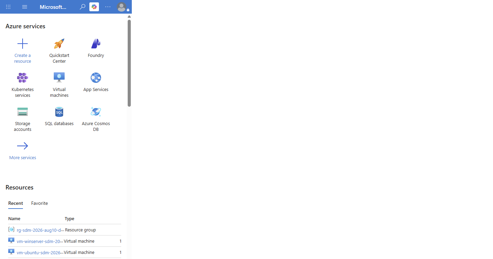
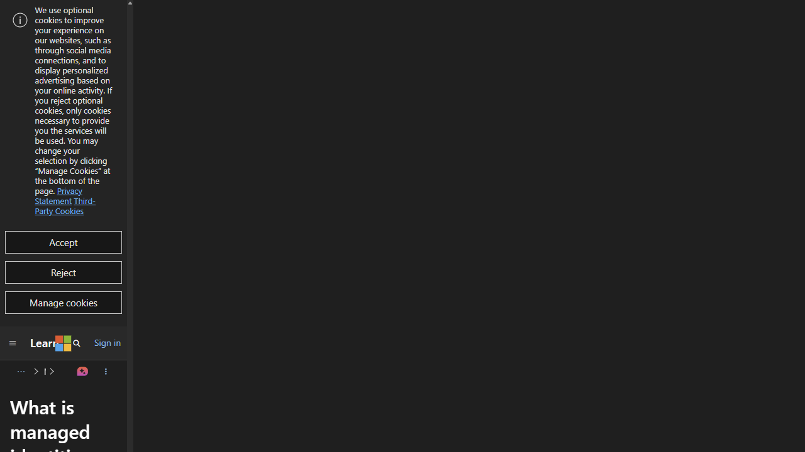
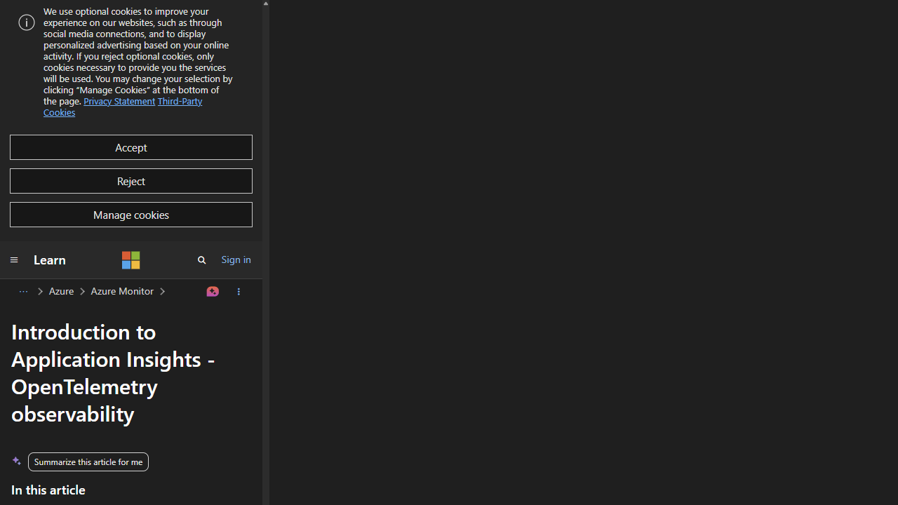
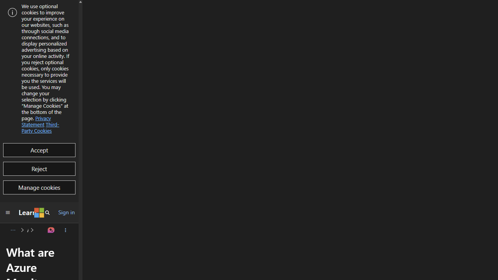
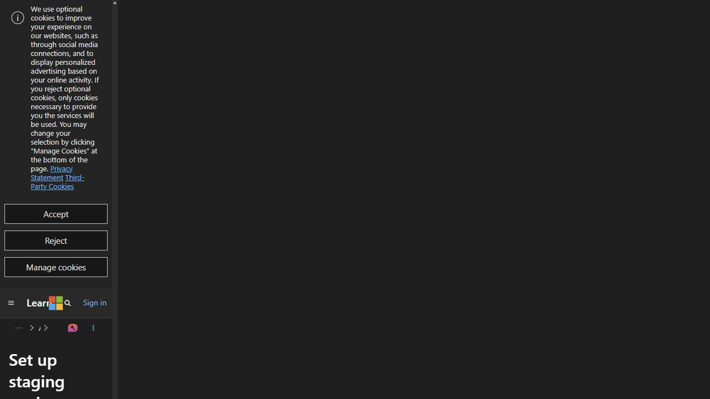
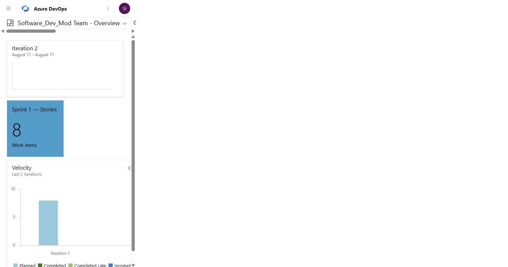

# Lab 09: Azure Deployment and Operations — Visual Walkthrough

**Course:** Software Development Modernization  
**Module:** 09 — Azure Deployment and Operations  
**Cloud path shown:** Azure App Service deployment with baseline observability and operations controls  
**Screenshots taken:** 2026-08-10/11 across live course site, Azure Portal, Microsoft Learn, and ADO  
**Audience:** Students using this as a step-by-step guide or instructor reference  
**Tier:** Optional MVP Lab

---

> **How to use this document**  
> This walkthrough follows the same approach as Labs 05–08: each section maps a required lab action to live UI evidence, expected output, and modernization rationale.

---

## Why This Lab Matters — App Modernization Context

Lab 09 moves delivery from “deployed” to “operable in production”.

1. **Infrastructure as code improves repeatability.** Bicep templates reduce manual drift.
2. **Identity-first access reduces secret sprawl.** Managed identity and RBAC replace hardcoded credentials.
3. **Observability closes the feedback loop.** Application Insights + alerts + dashboards detect issues before users report them.

> **Key concept:** Modernization is incomplete until the workload is observable, supportable, and policy-governed in cloud operations.

---

## What You Will Build

| Artifact | What it is | Where it lives |
|---|---|---|
| Bicep deployment baseline | Repeatable infra deployment | Resource group deployment history |
| Hosting target | App Service/AKS/Container Apps runtime | Azure subscription |
| Identity + RBAC model | Managed identity and role assignment | Azure IAM |
| Observability stack | Application Insights + Log Analytics | Azure Monitor |
| Alert policy | Error, latency, saturation thresholds | Azure Alerts |
| Ops dashboard and SLO notes | Runtime operational view | Azure/ADO dashboard evidence |

---

## Prerequisites

| Item | How to verify |
|---|---|
| Azure subscription | Visible in portal and selected for deployment |
| Sufficient role rights | Contributor/Owner (or documented RBAC gaps) |
| App artifact | Build/container artifact from prior labs |
| Bicep template + parameters | Files prepared in repo/workspace |

---

## Part 1 — Confirm Lab 09 Scope

**What you are looking at:**  
The official lab checklist: hosting model choice, Bicep deployment, managed identity, monitoring, alerting, and SLO definition.

---

## Part 2 — Validate Azure Subscription Context and Hosting Model



[Open full-size screenshot](lab-09-screenshots/ss02-azure-create-webapp-context-v2.png)

**What you are looking at:**  
A live Azure portal context with the correct tenant visible and the App Services entry point available from the home screen.

**Why this matters:**  
Before deploying templates/artifacts, confirm you are in the correct tenant and subscription to avoid cross-environment drift.

---

## Part 3 — Use Bicep for Baseline Infrastructure


**What you are looking at:**  
The official Azure Bicep reference for ARM-native infrastructure as code.

**Example deployment command:**

```bash
az deployment group create \
  --resource-group rg-sdm-lab09 \
  --template-file main.bicep \
  --parameters @main.parameters.json
```

---

## Part 4 — Enable Managed Identity and Document RBAC Gaps



**What you are looking at:**  
Managed identity guidance used to remove plaintext secrets from app configuration.

**Lab rule:**  
If role assignment creation is blocked (Contributor-only), document the gap and continue remaining steps.

> ⚠️ **Snag — RBAC limits:** Some student roles cannot create role assignments. Capture that as evidence and proceed with available controls.

---

## Part 5 — Enable Application Insights Telemetry



**What you are looking at:**  
Application Insights reference for request telemetry, dependency traces, failures, and performance baselines.

**Minimum telemetry checks:**
- Request rate and latency
- Failed request count
- Dependency failures

---

## Part 6 — Configure Alert Rules



**What you are looking at:**  
Alerting model for threshold-based operations responses.

**Recommended starter alerts:**
- Error rate exceeds threshold
- P95 latency exceeds target
- CPU/memory saturation signal

---

## Part 7 — Use Deployment Slots for Safer Releases



**What you are looking at:**  
Staging slot guidance used to validate releases before swap to production.

**Modernization value:**  
Slot-based rollout reduces blast radius and supports fast rollback.

---

## Part 8 — Capture Delivery/Ops Evidence in Team Context



[Open full-size screenshot](lab-09-screenshots/ss08-ado-ops-dashboard-context-v2.png)

**What you are looking at:**  
A shared dashboard context where deployment, monitoring, and reliability tasks can be tracked and reviewed.

**Evidence linkage suggestion:**
- Deployment output artifact link
- Alert rule screenshot link
- Dashboard screenshot link
- SLO note and owner assignment

---

## Validation Checklist (Student Submission)

- [ ] Bicep deployment completes with repeatable command/output evidence
- [ ] App is deployed and reachable in selected hosting model
- [ ] Managed identity enabled (or RBAC gap documented)
- [ ] Application Insights telemetry is active
- [ ] Alerts exist for errors/latency/resource pressure
- [ ] Operations dashboard and SLO statement are documented

---

## Common Snags and Fixes

| Snag | Symptom | Fix |
|---|---|---|
| Wrong subscription/tenant | Resources created in unexpected scope | Verify account context before deployment |
| RBAC restrictions | Role assignment actions fail | Document access gap and proceed with remaining tasks |
| App starts but no telemetry | Empty monitoring charts | Verify instrumentation + connection string settings |
| Alerts never fire | No test signal | Generate controlled synthetic load/failure scenario |
| Manual portal drift | Rebuilds are inconsistent | Keep all baseline resources in Bicep and redeploy |

---

## Summary

Lab 09 extends modernization into real operations: repeatable cloud infrastructure, identity-safe access, telemetry, and actionable alerting.  
This is the point where delivery teams shift from project completion to sustainable production stewardship.
