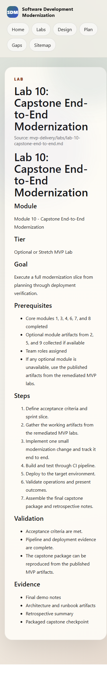
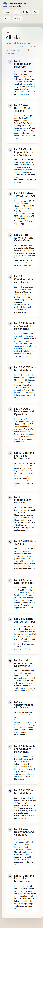
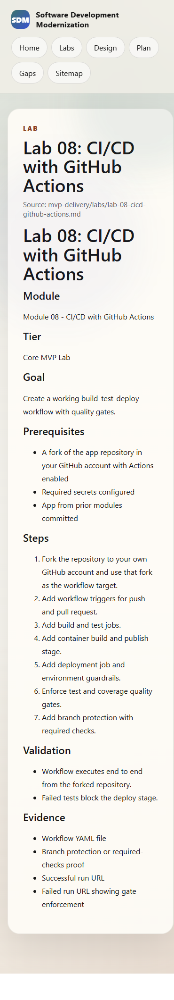
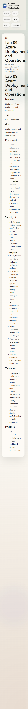

# Lab 10: Capstone End-to-End Modernization — Visual Walkthrough

**Course:** Software Development Modernization  
**Module:** 10 — Capstone End-to-End Modernization  
**Execution path shown:** One complete modernization slice from planning through deploy/ops evidence  
**Screenshots taken:** 2026-08-10/11 across live course pages, GitHub, Azure, and ADO  
**Audience:** Students using this as a step-by-step guide or instructor reference  
**Tier:** Optional or Stretch MVP Lab

---

> **How to use this document**  
> This walkthrough ties together Labs 01–09 into one capstone delivery flow.  
> Use it as a final “integration runbook” for team execution and demo preparation.

---

## Why This Lab Matters — App Modernization Context

Labs 01–09 built individual capabilities. Lab 10 proves they operate as one delivery system.

1. **Traceability:** Requirements, code, pipeline, deployment, and operations are linked.
2. **Reliability:** Quality gates and operational checks are demonstrated, not assumed.
3. **Reproducibility:** The team can rerun the slice from documented artifacts.

> **Key concept:** The capstone is not “new setup.” It is the validated synthesis of prior labs.

---

## What You Will Build

| Artifact | What it is | Source |
|---|---|---|
| Capstone scope | Acceptance criteria + sprint slice | Lab 10 planning step |
| Delivery chain evidence | Build/test/deploy run links | Labs 08–09 outputs |
| Runtime evidence | Environment and dashboard proofs | Labs 07/09 outputs |
| Final package | Demo notes + architecture + runbook + retrospective | Team deliverable |

---

## Prerequisites

| Item | How to verify |
|---|---|
| Core labs complete | Labs 1, 3, 4, 6, 7, 8 artifacts exist |
| Optional artifacts collected | Labs 2, 5, 9 evidence available when possible |
| Team ownership model | Roles assigned for build/deploy/ops/demo |
| Shared artifact location | Repo folder or board links defined |

---

## Part 1 — Confirm Capstone Scope



**What you are looking at:**  
The authoritative Lab 10 scope and success criteria.

**Immediate action:**  
Turn the listed steps into a team task board with owners and due times.

---

## Part 2 — Map the Full Lab Sequence



**What you are looking at:**  
The end-to-end module/lab map your capstone must traverse.

**Capstone framing:**  
Pick one thin vertical slice that touches planning → code/test → deploy → operate.

---

## Part 3 — Pull CI/CD Evidence from Lab 08



**What you are looking at:**  
The workflow and quality-gate requirements that must be visible in capstone evidence.

**Minimum CI evidence:**
- Successful run URL
- Failed gate run URL
- Required checks enabled

---

## Part 4 — Pull Deployment/Observability Evidence from Lab 09



**What you are looking at:**  
Cloud deployment and observability expectations to include in the capstone package.

**Minimum ops evidence:**
- Deployment output artifact
- Monitoring/alert view
- SLO statement

---

## Part 5 — Validate Cloud Deployment Context


**What you are looking at:**  
An active deployment-capable Azure context for the capstone environment.

> ⚠️ **Snag — scope drift:** Always verify tenant/subscription before deployment steps to avoid wrong-environment evidence.

---

## Part 6 — Validate Team Delivery Context in ADO


**What you are looking at:**  
The shared dashboard where tasks and outcomes can be tracked through completion.

**Recommended board lanes:**
- Capstone scope
- Build/test
- Deploy
- Ops validation
- Demo package

---

## Part 7 — Capture Actions Run History for Traceability


**What you are looking at:**  
Run history proving the capstone slice moved through automated validation.

**Attach to final package:**
- Run IDs/URLs
- Commit SHA
- Pass/fail status summary

---

## Part 8 — Include Workflow Definition as Reproducibility Evidence


**What you are looking at:**  
The executable workflow definition that makes the capstone repeatable.

**Reproducibility checklist:**
- Workflow file path
- Trigger conditions
- Job dependency chain
- Environment/deploy step references

---

## Capstone Package Template (Deliverable)

```text
capstone-package/
  01-demo-notes.md
  02-architecture-summary.md
  03-runbook.md
  04-retrospective.md
  evidence/
    pipeline-success-url.txt
    pipeline-failure-url.txt
    deploy-output.txt
    monitoring-screenshot.png
    alerts-screenshot.png
```

---

## Validation Checklist (Student Submission)

- [ ] Acceptance criteria are explicit and met
- [ ] End-to-end evidence chain is complete (plan → code → pipeline → deploy → ops)
- [ ] Pipeline quality gates are demonstrated
- [ ] Deployment and runtime health are demonstrated
- [ ] Final package can be reproduced from published artifacts

---

## Common Snags and Fixes

| Snag | Symptom | Fix |
|---|---|---|
| Scope too large | Team stalls mid-lab | Reduce to one vertical slice |
| Missing evidence links | Demo cannot be verified | Assign one evidence owner to collect URLs/screens |
| Optional lab dependency blocked | Gaps in flow | Use remediated published MVP artifacts and document substitution |
| Pipeline/deploy mismatch | Build passes but deploy unclear | Align artifact version/tag and deployment target explicitly |
| Retrospective skipped | No lessons captured | Reserve final 15 minutes for structured retrospective notes |

---

## Summary

Lab 10 completes the course by demonstrating that modernization work is not only implemented, but also governable, testable, deployable, and operable as a single system.

