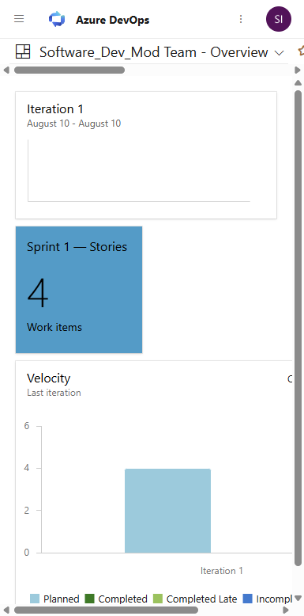
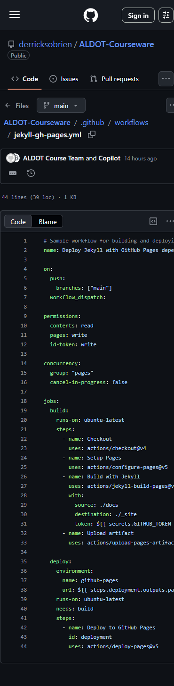

# Lab 10: Capstone End-to-End Modernization — Visual Walkthrough

**Course:** Software Development Modernization  
**Module:** 10 — Capstone End-to-End Modernization  
**Execution path shown:** Capstone Challenge Day with timed rounds and final team demo  
**Screenshots taken:** 2026-08-10/11 across live course pages, GitHub, Azure, and ADO  
**Audience:** Students using this as a step-by-step guide or instructor reference  
**Tier:** Optional or Stretch MVP Lab

---

> **How to use this document**  
> This walkthrough turns Lab 10 into a live challenge format, not a passive wrap-up.  
> Use it to run a high-energy finale where teams ship, prove, and present one modernization slice.

---

## Why This Lab Matters — App Modernization Context

Labs 01–09 built capabilities. Lab 10 proves your team can deliver them under time pressure as one system.

1. **Traceability:** Requirements, code, pipeline, deployment, and operations are linked.
2. **Reliability:** Quality gates and operational checks are demonstrated, not assumed.
3. **Communication:** Teams explain technical choices clearly to stakeholders.

> **Key concept:** The capstone is a delivery simulation with measurable outcomes, not just artifact collection.

---

## Capstone Challenge Day Format (90-120 minutes)

| Round | Timebox | Objective | Output |
|---|---:|---|---|
| Mission Brief | 15 min | Define one thin vertical slice and ownership model | Criteria + owner map |
| Build and Gate | 20 min | Prove quality controls in CI | Pass + fail gate evidence |
| Deploy and Operate | 25 min | Prove runtime health and operability | Deploy + health + ops evidence |
| Demo Showdown | 20-30 min | Present end-to-end story to class | 5-minute team demo |

---

## Prerequisites

| Item | How to verify |
|---|---|
| Core labs complete | Labs 1, 3, 4, 6, 7, 8 artifacts exist |
| Optional artifacts collected | Labs 2, 5, 9 evidence available when possible |
| Team ownership model | Roles assigned for scope/build/platform/ops/demo |
| Shared artifact location | Repo folder or board links defined |

---

## Round 1 — Mission Brief (15 min)

**What you are looking at:**  
The capstone objective and boundaries for a single modernization slice.

**Team actions:**
1. Pick one realistic change request.
2. Write 3-5 acceptance criteria.
3. Assign team roles (Delivery, Build, Platform, Ops, Storyteller).
4. Create a mini board with named owners.

**Exit criteria:**  
A clearly scoped mission everyone can explain in under 30 seconds.

---

## Round 2 — Build and Gate (20 min)

**What you are looking at:**  
The CI/CD controls that validate your slice before release.

**Minimum CI evidence:**
- Successful run URL
- Failed gate run URL
- Required checks enabled
- Commit SHA that links change to run

---

## Round 3 — Deploy and Operate (25 min)

## Part 3.1 — Validate Cloud Deployment Context


**What you are looking at:**  
An active deployment-capable Azure context for the capstone environment.

> ⚠️ **Snag — scope drift:** Always verify tenant/subscription before deployment steps to avoid wrong-environment evidence.

---

## Part 3.2 — Validate Team Delivery Context in ADO



**What you are looking at:**  
The shared dashboard where tasks and outcomes can be tracked through completion.

**Recommended board lanes:**
- Capstone scope
- Build/test
- Deploy
- Ops validation
- Demo package

---

## Part 3.3 — Capture Actions Run History for Traceability


**What you are looking at:**  
Run history proving the capstone slice moved through automated validation.

**Attach to final package:**
- Run IDs/URLs
- Commit SHA
- Pass/fail status summary

---

## Part 3.4 — Include Workflow Definition as Reproducibility Evidence



**What you are looking at:**  
The executable workflow definition that makes the capstone repeatable.

**Reproducibility checklist:**
- Workflow file path
- Trigger conditions
- Job dependency chain
- Environment/deploy step references

---

## Round 4 — Demo Showdown (20-30 min)

Each team gets 5 minutes:

1. What changed and why
2. How quality was enforced
3. How runtime behavior was validated
4. One lesson learned and one next improvement

**Judge focus areas:**
- End-to-end traceability
- Technical rigor of gates and runtime checks
- Clarity and confidence of delivery story

---

## Scoring Rubric (Instructor)

| Dimension | Points | Full-credit signal |
|---|---:|---|
| End-to-end traceability | 25 | Clean link from criteria -> commit -> pipeline -> deploy -> ops |
| CI/CD quality gates | 25 | Correct required checks and meaningful failure handling |
| Runtime reliability | 25 | Health, telemetry, and operational readiness are demonstrated |
| Demo clarity | 15 | Coherent narrative and role handoffs |
| Retrospective quality | 10 | Honest lessons and concrete next actions |

Total: 100 points

### Bonus missions (optional, +10 each)

- Chaos check: break one dependency intentionally and demonstrate recovery.
- Cost check: identify one optimization that reduces runtime/cloud cost.
- Security check: remove one secret from config using identity/secret-store pattern.

---

## Capstone Package Template (Deliverable)

```text
capstone-package/
  01-demo-notes.md
  02-architecture-summary.md
  03-runbook.md
  04-retrospective.md
  evidence/
    pipeline-success-url.txt
    pipeline-failure-url.txt
    deploy-output.txt
    monitoring-screenshot.png
    alerts-screenshot.png
```

---

## Validation Checklist (Student Submission)

- [ ] Acceptance criteria are explicit and met
- [ ] End-to-end evidence chain is complete (plan → code → pipeline → deploy → ops)
- [ ] Pipeline quality gates are demonstrated
- [ ] Deployment and runtime health are demonstrated
- [ ] Final package can be reproduced from published artifacts
- [ ] Team can explain tradeoffs and next-step improvements in the final demo

---

## Common Snags and Fixes

| Snag | Symptom | Fix |
|---|---|---|
| Scope too large | Team stalls mid-lab | Reduce to one vertical slice |
| Missing evidence links | Demo cannot be verified | Assign one evidence owner to collect URLs/screens |
| Optional lab dependency blocked | Gaps in flow | Use remediated published MVP artifacts and document substitution |
| Pipeline/deploy mismatch | Build passes but deploy unclear | Align artifact version/tag and deployment target explicitly |
| Retrospective skipped | No lessons captured | Reserve final 15 minutes for structured retrospective notes |

---

## Summary

Lab 10 now closes the course as a live capstone challenge: teams ship a real slice, defend technical decisions, and finish with a high-confidence modernization story.
