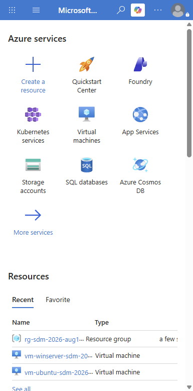

# Intro to Azure for App Modernization — Visual Walkthrough

**Course:** Software Development Modernization  
**Audience:** Students new to Azure — no prior cloud experience assumed  
**Reference App:** `dotnet-architecture/eShopOnWeb` (ASP.NET Core 8)  
**Screenshots taken:** 2026-08-11 against live instructor Azure account  
**Purpose:** Supplemental orientation — read this before Labs 06, 08, 09

---

> **How to use this document**  
> This walkthrough introduces Azure concepts in the exact order you encounter them during the modernization labs.  
> Every section answers three questions: **What is it? What does it look like? Why does it matter for eShopOnWeb?**  
> Where the UI can be confusing for first-timers, a **⚠️ Watch out** callout explains the trap.

---

## Why You Need Azure in This Course

eShopOnWeb is a real ASP.NET Core 8 web application. It has:

- A web frontend (ASP.NET Razor pages)
- A REST API backend
- A SQL Server database
- Background services

When this app lived on a Windows Server VM, someone had to patch the OS, configure IIS, manage SQL Server installations, and handle hardware. That is expensive and fragile.

Azure is a cloud platform that replaces those manual operations with managed services. Your job in this course is to migrate eShopOnWeb off the old model and onto Azure-hosted, containerized, monitored services.

> **The core idea:** You stop managing servers. Azure manages the runtime, and you manage the application.

---

## The Azure Mental Map (Read This First)

Everything in Azure lives in a hierarchy. Understanding this avoids confusion throughout the labs.

```
Azure Account (your login)
  └── Subscription (billing boundary — "who pays?")
        └── Resource Group (logical container — "what belongs together?")
              └── Resources (the actual services — VMs, databases, apps, etc.)
```

Think of it this way:
- **Account** = your Microsoft identity
- **Subscription** = your credit card / billing account
- **Resource Group** = a project folder
- **Resource** = a specific service you created (a database, a container, an app)

Everything you build in labs 06, 08, and 09 lives in a Resource Group inside a Subscription.

---

## Part 1 — The Azure Portal Home



**What you are looking at:**  
The Azure Portal home at `https://portal.azure.com`. This is your main dashboard.

The top section shows **Azure services** tiles — shortcuts to the services used most often. For this course, the ones that matter are:

| Tile | What it is | When you use it |
|---|---|---|
| **App Services** | Managed web hosting for .NET apps and containers | Lab 09 — deploying eShopOnWeb |
| **Virtual machines** | Traditional VM-style compute | Cohort fallback VMs already set up |
| **Kubernetes services (AKS)** | Managed Kubernetes cluster | Lab 07 advanced path |
| **SQL databases** | Managed SQL Server | eShopOnWeb database host |
| **Storage accounts** | Blob/file/queue storage | CI/CD artifact storage |
| **Azure Cosmos DB** | NoSQL document database | Not in MVP labs — FYI |

The **Resources** section shows recently viewed resources. After you complete Lab 09, your App Service and database will appear here.

> ⚠️ **Watch out — the portal changes often:** Microsoft updates the portal UI frequently. The tile layout and labels may look slightly different from what you see here. The concepts stay the same; just use the search bar at the top if you cannot find a service.

---

## Part 2 — Subscriptions: Who Is Paying?

**What it is:**  
A subscription is the billing and access boundary in Azure. Every resource you create belongs to one subscription. In this course, your instructor has set up a subscription for the cohort.

**How to find it:**  
From the portal home, click **Subscriptions** in the Navigate section.

**What you see:**  
One row per subscription. The name and ID matter when running Azure CLI commands.

**Example CLI usage:**

```bash
# Check which subscription you are currently targeting
az account show

# List all subscriptions available to your account
az account list --output table

# Set the active subscription by ID
az account set --subscription "<subscription-id>"
```

**Why it matters for eShopOnWeb:**  
Before running `az deployment group create` in Lab 09, you must confirm you are targeting the right subscription. Deploying to the wrong subscription means your resources are invisible to the rest of your team and may generate unexpected costs.

> ⚠️ **Watch out — student subscriptions may have quota limits:** The `iis-student-az-<cohort>` subscription may restrict VM sizes, region choices, or resource counts. If a deployment fails with a quota error, ask the instructor before changing to a different region or SKU.

---

## Part 3 — Resource Groups: Your Project Folder

**What it is:**  
A Resource Group is a logical container for all the Azure resources that belong together. It is the single most important organizational concept in Azure.

For this cohort the instructor already created:

```
RG-SDM-2026-AUG10-DEMO
```

This holds the two demo VMs you use for lab fallback paths.

**What a resource group overview looks like:**

From the portal home, click `rg-sdm-2026-aug10-demo` in your Recent resources list (or navigate to **Resource groups** and search for it).

You will see:
- All resources inside the group listed in a table
- Tags, location, and subscription shown at the top
- **Delete resource group** button — which deletes everything inside at once

**Why it matters for eShopOnWeb:**  
In Lab 09, you will create your own resource group for the deployment:

```bash
az group create \
  --name rg-eshop-lab09 \
  --location eastus
```

Putting all your Lab 09 resources (App Service, SQL, App Insights) in the same group means:
1. You can see everything in one place
2. Deleting the group at the end of class removes all charges at once

> ⚠️ **Watch out — the region you pick matters:** Some services are only available in certain regions. Use `eastus` or `eastus2` for lab work unless the instructor specifies otherwise.

---

## Part 4 — App Service: Running eShopOnWeb in Azure

**What it is:**  
Azure App Service is a managed hosting platform for web apps. You give it a container image or code package; it runs the app, handles TLS, and scales automatically. You never touch a web server.

For eShopOnWeb, App Service is the primary deployment target in Lab 09.

**The four things App Service manages for you:**

| Thing you used to do manually | What App Service does instead |
|---|---|
| Install IIS on a Windows VM | Managed runtime — you choose .NET 8 |
| Configure HTTPS certificates | Free managed TLS certificate per app |
| Set up load balancing | Built-in scale-out and auto-scale rules |
| Apply OS patches | Microsoft patches the underlying host |

**How to create one from the CLI (Lab 09 pattern):**

```bash
# Create an App Service Plan (the compute tier)
az appservice plan create \
  --name asp-eshop-lab09 \
  --resource-group rg-eshop-lab09 \
  --sku B1 \
  --is-linux

# Create the web app from a container image
az webapp create \
  --name eshop-lab09 \
  --resource-group rg-eshop-lab09 \
  --plan asp-eshop-lab09 \
  --deployment-container-image-name <your-registry>/eshopweb:latest
```

**What the App Service overview blade shows:**

| Section | What to look at |
|---|---|
| **URL** | The public HTTPS address for your app |
| **Status** | Running / Stopped |
| **App Service Plan** | The compute size (B1 = 1 core, 1.75 GB RAM) |
| **Deployment Center** | How new code gets deployed (container registry, CI/CD) |
| **Log stream** | Live stdout from your running container |
| **Configuration** | Environment variables and connection strings |

> ⚠️ **Watch out — the app starts stopped by default after container errors:** If your container fails to start (wrong port, missing env var), App Service shows the URL but returns a 503. Always check **Log stream** first when the app does not respond.

---

## Part 5 — Azure SQL Database: eShopOnWeb's Data Layer

**What it is:**  
Azure SQL Database is a managed SQL Server instance. Microsoft handles backups, patches, high availability, and scaling. You connect to it exactly like SQL Server — same connection string format, same T-SQL queries.

eShopOnWeb has two databases:
- **CatalogDb** — product catalog
- **Identity** — user authentication

**Connection string format (same as local SQL Server):**

```
Server=tcp:<server>.database.windows.net,1433;
Initial Catalog=CatalogDb;
User ID=<admin>;
Password=<password>;
Encrypt=True;
```

**Lab 09 pattern:**

```bash
# Create the SQL Server
az sql server create \
  --name sql-eshop-lab09 \
  --resource-group rg-eshop-lab09 \
  --location eastus \
  --admin-user sqladmin \
  --admin-password '<password>'

# Create the database
az sql db create \
  --resource-group rg-eshop-lab09 \
  --server sql-eshop-lab09 \
  --name CatalogDb \
  --service-objective Basic
```

**Firewall rule — you must allow your app to connect:**

```bash
# Allow Azure services through the firewall
az sql server firewall-rule create \
  --resource-group rg-eshop-lab09 \
  --server sql-eshop-lab09 \
  --name AllowAzureServices \
  --start-ip-address 0.0.0.0 \
  --end-ip-address 0.0.0.0
```

> ⚠️ **Watch out — the firewall blocks everything by default:** The most common student error in Lab 09 is deploying the app but forgetting to open the Azure SQL firewall. Your app shows a database connection error in logs. The fix is the firewall rule above.

---

## Part 6 — Azure Container Registry: Storing Your eShopOnWeb Image

**What it is:**  
Azure Container Registry (ACR) is a private Docker registry hosted by Azure. In Lab 06 you push your eShopOnWeb container image here. In Lab 08 your CI/CD pipeline builds and pushes automatically.

**Why not just use Docker Hub?**  
Docker Hub is public by default. ACR is private, integrated with Azure identity, and keeps your images in the same region as your app.

**How to use it (Lab 06 pattern):**

```bash
# Create the registry
az acr create \
  --resource-group rg-eshop-lab09 \
  --name acr<yourinitials>lab \
  --sku Basic

# Log Docker into ACR
az acr login --name acr<yourinitials>lab

# Tag and push your image
docker tag eshopweb:local acr<yourinitials>lab.azurecr.io/eshopweb:v1.0
docker push acr<yourinitials>lab.azurecr.io/eshopweb:v1.0

# List images stored in the registry
az acr repository list --name acr<yourinitials>lab --output table
```

> ⚠️ **Watch out — ACR names must be globally unique:** If your chosen name is taken, add your initials or a random number. The registry name becomes part of your image URL so it cannot be changed after creation.

---

## Part 7 — Application Insights: Seeing What Your App Is Doing

**What it is:**  
Application Insights is Azure's built-in APM (Application Performance Monitoring) service. Once connected to eShopOnWeb, it automatically captures:

- Every HTTP request (URL, duration, response code)
- Every database query (SQL text, duration, errors)
- Every unhandled exception (with stack trace)
- Custom metrics you define in code

**Why this matters for modernization:**  
Legacy apps running on VMs typically have zero visibility once deployed. You find out about problems when users call. Application Insights turns your app into a system that tells you about problems before users notice.

**How to enable it (Lab 09 pattern):**

```bash
# Create a Log Analytics workspace (required for Application Insights)
az monitor log-analytics workspace create \
  --resource-group rg-eshop-lab09 \
  --workspace-name law-eshop-lab09

# Create Application Insights connected to it
az monitor app-insights component create \
  --app ai-eshop-lab09 \
  --location eastus \
  --resource-group rg-eshop-lab09 \
  --workspace law-eshop-lab09

# Get the connection string (paste into your app config)
az monitor app-insights component show \
  --app ai-eshop-lab09 \
  --resource-group rg-eshop-lab09 \
  --query connectionString
```

**Connect eShopOnWeb to it:**

In `appsettings.json` or as an App Service environment variable:

```json
{
  "ApplicationInsights": {
    "ConnectionString": "InstrumentationKey=...;IngestionEndpoint=..."
  }
}
```

**What you see in the portal after traffic flows:**

| Panel | What it shows |
|---|---|
| **Live Metrics** | Real-time request rate, failure rate, CPU |
| **Failures** | All exceptions and failed requests grouped by type |
| **Performance** | Slowest operations and dependency calls |
| **Application Map** | Visual topology of app components and their dependencies |

> ⚠️ **Watch out — data takes 2-5 minutes to appear:** After adding the connection string and restarting the app, wait a few minutes before checking the portal. Refreshing immediately will show an empty dashboard.

---

## Part 8 — Managed Identity: Removing Secrets from Your Code

**What it is:**  
Managed Identity is Azure's answer to the problem of storing passwords in code or config files. Instead of giving your App Service a SQL password, you give it an identity that Azure trusts automatically.

**The problem it solves:**  
Without Managed Identity, a connection string looks like:

```
Server=...; User ID=sqladmin; Password=SuperSecret123!
```

That password lives in your app's config — and often gets committed to Git by accident.

**With Managed Identity:**

```
Server=...; Authentication=Active Directory Default;
```

No password. Azure's infrastructure proves the identity at runtime.

**How to enable it for eShopOnWeb in Lab 09:**

```bash
# Enable system-assigned managed identity on your App Service
az webapp identity assign \
  --name eshop-lab09 \
  --resource-group rg-eshop-lab09

# Get the principal ID
az webapp identity show \
  --name eshop-lab09 \
  --resource-group rg-eshop-lab09 \
  --query principalId

# Grant the identity SQL access (may require Owner role in your subscription)
az sql server ad-admin set \
  --server sql-eshop-lab09 \
  --resource-group rg-eshop-lab09 \
  --object-id <principalId> \
  --display-name eshop-lab09-identity
```

> ⚠️ **Watch out — student roles may not have permission to create role assignments:** In the lab environment, Contributor role can do most things but cannot create role assignments (that requires Owner). If role assignment fails, document the error as evidence and proceed with connection string authentication for the remainder of Lab 09. The instructor can demonstrate Managed Identity at class level.

---

## Part 9 — Azure Alerts: Being Notified When Things Break

**What it is:**  
Azure Alerts let you define thresholds that trigger notifications or automated actions. For eShopOnWeb, the minimum setup for Lab 09 is:

| Alert | Metric | Threshold | Why |
|---|---|---|---|
| High error rate | Failed requests | > 5 per 5 min | App is returning errors to users |
| Slow response | Request duration | > 3000ms P95 | App is degraded |
| High CPU | CPU percentage | > 80% for 10 min | App is overloaded |

**How to create one from the portal:**

1. Open your App Service
2. In the left menu: **Monitoring -> Alerts**
3. Click **+ Create -> Alert rule**
4. Set the signal (metric), threshold, and action group (email)
5. Give the rule a name and save

**Or from CLI:**

```bash
# Create an action group (where the alert goes)
az monitor action-group create \
  --name ag-eshop-lab09 \
  --resource-group rg-eshop-lab09 \
  --short-name eshopag \
  --action email admin admin@example.com

# Create a metric alert for failed requests
az monitor metrics alert create \
  --name alert-eshop-errors \
  --resource-group rg-eshop-lab09 \
  --scopes <app-service-resource-id> \
  --condition "count requests/failed > 5" \
  --window-size 5m \
  --evaluation-frequency 1m \
  --action ag-eshop-lab09
```

> ⚠️ **Watch out — alerts fire on production traffic only:** In a lab with low traffic, alerts may never trigger. Generate a test signal by hitting a bad URL or intentionally misconfiguring a dependency to prove the alert chain works.

---

## Quick Reference: Which Azure Service Is Used in Which Lab

| Azure Service | Lab 06 | Lab 08 | Lab 09 | Lab 10 |
|---|:---:|:---:|:---:|:---:|
| Azure Container Registry | Build/push | Pipeline push | Pull for deploy | Evidence |
| App Service | -- | Deploy target (optional) | Primary deploy | Prove live |
| Azure SQL Database | -- | -- | Database host | Prove running |
| Application Insights | -- | -- | Connect + verify | Monitoring evidence |
| Azure Alerts | -- | -- | Create + test | Ops evidence |
| Managed Identity | -- | -- | Enable / document | Security evidence |
| Resource Groups | Create | Reference | Deploy target | Package |

---

## Common First-Timer Mistakes (and How to Avoid Them)

| Mistake | What happens | Prevention |
|---|---|---|
| Wrong subscription targeted | Resources created in the wrong billing account | Always run `az account show` before deploying |
| Firewall not opened on SQL | App cannot connect to database | Add firewall rule immediately after SQL creation |
| Container port mismatch | App Service returns 503 | Set `WEBSITES_PORT` environment variable to match your Dockerfile EXPOSE port |
| Forgot to delete resources | Azure charges accumulate | At end of lab, delete the entire resource group |
| Wrong region | Quota errors or service not available | Use `eastus` by default unless told otherwise |
| App Insights connection string missing | No telemetry data | Set it as an App Service app setting, not just in appsettings.json |

---

## What Next

Once you have read this guide:

- **Lab 06:** Build eShopOnWeb as a container and push to ACR (Parts 6)
- **Lab 08:** Add a CI/CD pipeline that builds and deploys automatically (Parts 4, 6)
- **Lab 09:** Deploy the full stack to Azure with monitoring and alerting (All parts)
- **Lab 10:** Use all of the above as capstone evidence

You do not need to be an Azure expert before starting Lab 06. You need to know:
1. Where to find your resource group
2. How to check which subscription you are using
3. That `az login` is the first step before any CLI command

Everything else is in the lab guides.
