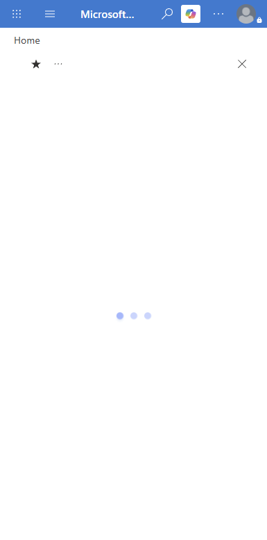
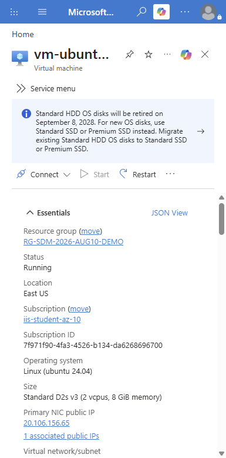
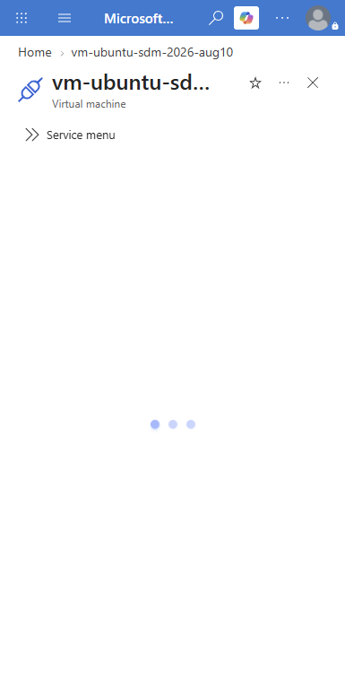
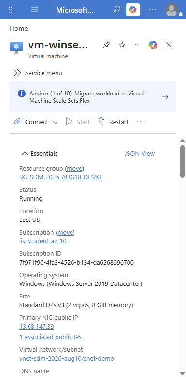

# Student VM Access Crib Sheet (SDM Cohort `sdm-2026-aug10`)

Use this guide to connect to the two Azure VMs and choose the right VM per lab.

---

## 1) Which VM should I use?

| VM | Best for | Not ideal for |
|---|---|---|
| `vm-ubuntu-sdm-2026-aug10` (Ubuntu 24.04) | Docker/container work, Linux CLI, GitHub Actions fallback execution | Windows-only GUI tasks |
| `vm-winserver-sdm-2026-aug10` (Windows Server 2019) | RDP-based tasks, Windows admin/demo workflows, browser-based Azure/ADO work | Primary Docker Desktop workflow |

### Recommended by lab

| Lab | Primary VM | Why |
|---|---|---|
| Lab 06 (Containerization) | Ubuntu | Docker engine is installed and validated. |
| Lab 07 (OpenShift/Kubernetes) | Local + cloud sandbox | VM optional; use VM browser/CLI only as support. |
| Lab 08 (CI/CD) | Ubuntu (fallback path) | Good for building/running containers and validating workflow steps. |
| Lab 09 (Azure Ops) | Windows or Ubuntu | Azure portal/CLI tasks work on both. |
| Lab 10 (Capstone) | Ubuntu + Windows (optional) | Ubuntu for runtime/container validation; Windows for documentation/demo support. |

---

## 2) Azure portal views (reference screenshots)







---

## 3) Connect to Ubuntu VM (SSH)

Host:
- VM name: `vm-ubuntu-sdm-2026-aug10`
- Username: `labadmin`

Authentication currently enabled:
- SSH key
- Password auth (for this cohort)

Example from PowerShell:

```powershell
ssh labadmin@<UBUNTU_PUBLIC_IP>
```

If prompted for password, use the cohort-provided value from the instructor.

### Quick checks after login

```bash
whoami
hostname
docker --version
docker compose version
```

If Docker commands fail with permission denied, log out and SSH back in.

---

## 4) Connect to Windows VM (RDP)

Host:
- VM name: `vm-winserver-sdm-2026-aug10`

Steps:
1. In Azure, open the VM and select **Connect -> RDP**.
2. Download the `.rdp` file.
3. Launch the file in Remote Desktop client.
4. Sign in with the Windows credentials provided by the instructor.

---

## 5) Troubleshooting

### SSH issues (Ubuntu)
- Timeout/refused: verify VPN/firewall and that port 22 is allowed in NSG.
- Auth failed: confirm username is `labadmin` and re-enter credentials carefully.
- Connected but Docker blocked: reconnect the SSH session.

### RDP issues (Windows)
- Timeout: verify port 3389 NSG rule.
- Certificate warning: expected in lab environments; continue if VM name/IP matches instructor guidance.
- Login denied: verify account is in Remote Desktop Users / local Administrators.

---

## 6) Security note for class operations

Password-based SSH is convenient for classroom onboarding but less secure than key-only access.  
After class, instructor should rotate credentials and consider restoring key-only SSH.
