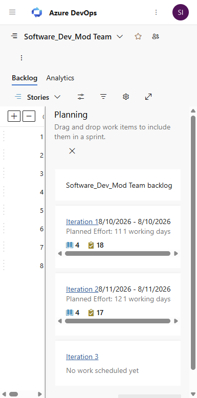
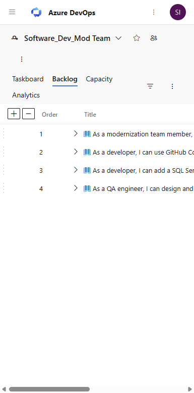
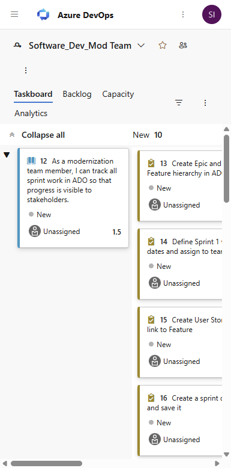
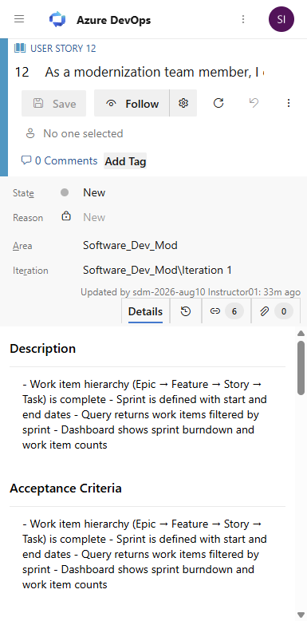
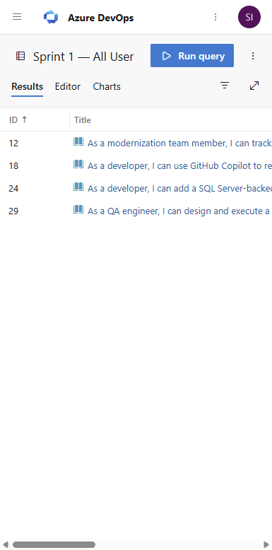

---
layout: default
title: "Lab 02 — ADO Visual Walkthrough"
parent: Labs
nav_order: 12
---

# Lab 02: Azure DevOps Work Tracking — Visual Walkthrough

**Course:** Software Development Modernization  
**Module:** 02 — Azure DevOps Work Tracking  
**Environment:** `https://dev.azure.com/iis-labs/Software_Dev_Mod`  
**Screenshots taken:** 2026-08-10 against live tenant  
**Audience:** Students using this as a step-by-step guide or instructor reference

---

> **How to use this document**  
> This walkthrough mirrors every step of the lab in the exact order students encounter the UI.  
> Each screenshot is followed by an explanation of what you are looking at **and why it matters to app modernization teams**. Where the live environment behaves unexpectedly, a **⚠️ Snag** callout explains the issue and the workaround.

---

## Why This Lab Matters — App Modernization Context

Moving legacy applications to modern platforms is not just a technical challenge — it is a *planning and coordination* challenge. Legacy projects are often managed with spreadsheets, email chains, and tribal knowledge. Modern teams use tools like **Azure DevOps (ADO)** to bring that work into a structured, traceable system.

In this lab you are stepping into the role of a modernization team lead. You will build the exact backlog structure a real team would use to plan a migration sprint: Epics → Features → User Stories → Tasks. The two-sprint structure mirrors a realistic Day 1 / Day 2 delivery model where infrastructure comes first and application migration follows.

> **Key concept:** Every work item you create here maps to a real deliverable on a modernization project. "Set up CI/CD pipeline" is not an abstract exercise — it is the gate that determines whether your app can be deployed safely.

---

## Prerequisites

Before starting, confirm:

| Item | How to verify |
|---|---|
| ADO login | Open `https://dev.azure.com/iis-labs` — your student account appears in the top-right corner |
| Project access | Navigate to `https://dev.azure.com/iis-labs/Software_Dev_Mod` — you see the project home |
| Iteration structure | Go to **Boards → Sprints** — you should see Iteration 1, Iteration 2, Iteration 3 already created |

---

## Part 1 — Orient Yourself in the Project

### Step 1.1 — Open the Project Dashboard

Navigate to:
```
https://dev.azure.com/iis-labs/Software_Dev_Mod/_dashboards/dashboard/2ff10c18-a57a-438d-b096-ef9716cdf3d0
```


**What you are looking at:**  
The team **Overview Dashboard** for `Software_Dev_Mod Team`. This is the command center for the modernization project. Notice three live widgets:

| Widget | What it shows | Why it matters |
|---|---|---|
| **Sprint Burndown (Legacy)** *(top)* | Work remaining in Iteration 1 plotted over time | Lets the team see at a glance whether the sprint is on track or at risk |
| **Sprint 1 — Stories** *(middle, blue tile)* | **4** — the number of User Stories in Iteration 1 | A quick health check: are the right stories assigned to this sprint? |
| **Velocity** *(bottom)* | Bar chart showing planned vs. completed story points per iteration | Helps the team forecast how much they can take on in future sprints based on historical throughput |

> **App modernization connection:** On a real migration project, the dashboard is the first thing a stakeholder sees in a status meeting. Velocity tells you whether the team can realistically complete the migration before a contract end date or cloud commitment deadline.

---

## Part 2 — The Backlog Hierarchy: Epics → Features → Stories

Modern teams organize work in a hierarchy that flows from *why* to *what* to *how*:

```
Epic        — A large strategic goal ("Migrate Legacy App to Azure")
  └─ Feature     — A deliverable capability ("Set up CI/CD Pipeline")
       └─ Story       — A piece of user-facing value ("As a dev, I can push code and trigger a deploy")
            └─ Task        — A concrete piece of technical work ("Install Azure Pipelines agent")
```

This hierarchy is exactly how the `Software_Dev_Mod` project is structured. You will explore it now.

### Step 2.1 — View the Feature Backlog

In the left sidebar, click **Boards → Backlogs**, then use the backlog level picker to select **Features**.

Alternatively, navigate directly to:
```
https://dev.azure.com/iis-labs/Software_Dev_Mod/_backlogs/backlog/Software_Dev_Mod%20Team/Feature
```



**What you are looking at:**  
The **Feature-level backlog** displays the 8 lab modules organized under two Epics. The left-hand expand arrows (`▶`) let you drill into child items.

| Epic | Features contained | What these represent |
|---|---|---|
| **Day 1 — Foundation** | Labs 01–04 | The infrastructure work that must happen *before* any code migrates — project setup, ADO boards, source control, CI/CD scaffolding |
| **Day 2 — Migration & Modernization** | Labs 05–08 | The actual application migration work — containerization, cloud deploy, observability, capstone |

> **⚠️ Snag — Epics not visible in the backlog dropdown:** By default, the team backlog is configured to show Features as the top level. To add Epics to the dropdown: **Project Settings → Boards → Team Configuration → Backlogs → check "Epics"**. You can still *see* Epics by clicking into a Feature and viewing its parent.

> **App modernization connection:** This two-day structure is intentional. Many modernization projects fail because teams try to migrate applications before the infrastructure is ready. Day 1 deliberately forces teams to get the "plumbing" right — version control, pipelines, monitoring — before touching a single line of application code.

### Step 2.2 — View the Stories Backlog

Switch the backlog level picker to **Stories** (or navigate to the default backlog URL).


**What you are looking at:**  
The **Story-level backlog** shows all 8 User Stories in the project. Each row represents a unit of student deliverable work:

| Story | Iteration | Story Points | What the student delivers |
|---|---|---|---|
| Set up ADO Project & Team | Iteration 1 | 2 pts | A configured ADO org, team structure, and project areas |
| Configure Work Item Boards | Iteration 1 | 3 pts | A working Kanban board with custom columns mirroring a real dev workflow |
| Initialize Git Repository | Iteration 1 | 2 pts | A repo with branching strategy and `.gitignore` committed |
| Build a CI/CD Pipeline | Iteration 1 | 4 pts | A pipeline that lints, tests, and deploys on every push |
| Containerize the Application | Iteration 2 | 3 pts | A working Dockerfile and local container image |
| Deploy to Azure App Service | Iteration 2 | 4 pts | A live URL in Azure hosting the modernized application |
| Implement Monitoring | Iteration 2 | 3 pts | Application Insights connected, an alert rule firing |
| Capstone E2E Validation | Iteration 2 | 5 pts | Full end-to-end smoke test of the entire modernized stack |

> **Notice the story point totals:** Iteration 1 = **11 points**, Iteration 2 = **15 points**. This is intentional — Day 2 work is heavier because it builds on the foundation laid in Day 1. A properly functioning CI/CD pipeline from Story 4 is a *prerequisite* for Stories 6, 7, and 8 to succeed.

> **⚠️ Snag — Planning panel auto-opens:** When you first visit the backlog, a right-side **Planning** panel opens showing your sprint iterations. This is useful but eats screen space. Toggle it with **View Options → Planning** in the toolbar.

---

## Part 3 — Sprint Planning View

### Step 3.1 — Open Sprint Planning

Navigate to:
```
https://dev.azure.com/iis-labs/Software_Dev_Mod/_sprints/backlog/Software_Dev_Mod%20Team/Software_Dev_Mod/Iteration%201
```



**What you are looking at:**  
The **Sprint Planning** view for **Iteration 1 (August 10)**. This view shows only the stories committed to this sprint along with their child tasks. The right panel shows:

- **Work** tab: total hours of tasks remaining in this sprint
- **Capacity** tab: team member capacity (hours per day × days in sprint)

> **App modernization connection:** Sprint planning is where the team answers the question: *"Can we actually finish what we committed to?"* On a modernization project this is critical — if the team is over-capacity in the sprint that includes container deployment, the deadline for the cloud cutover will slip. Capacity planning in ADO lets you spot this *before* the sprint starts, not during a post-mortem.

> **⚠️ Snag — Sprint board is empty on first visit:** The task board is empty until stories are assigned to the correct iteration *and* tasks are created under those stories. The board shows tasks, not stories. If you see a blank board, check that your stories have tasks and that the iteration path is set correctly on each task.

---

## Part 4 — Sprint Task Board

### Step 4.1 — Open the Task Board

Navigate to:
```
https://dev.azure.com/iis-labs/Software_Dev_Mod/_sprints/taskboard/Software_Dev_Mod%20Team/Software_Dev_Mod/Iteration%201
```



**What you are looking at:**  
The **Sprint Task Board** (Kanban-style) for Iteration 1. Each column represents a state:

| Column | Meaning in modernization context |
|---|---|
| **To Do** | Work not yet started — tasks waiting for a dependency or not yet assigned |
| **In Progress** | Actively being worked — someone is writing code, configuring a pipeline, or running a deployment |
| **Done** | Completed and verified — the acceptance criteria have been met |

Each card shows the task title, the assignee avatar, and the remaining hours. When a task is moved to **Done**, the sprint burndown chart automatically updates.

> **App modernization connection:** This board is the daily standup view. In a real modernization sprint, the question *"What blocked you yesterday?"* maps directly to tasks stuck in **To Do** or **In Progress** longer than expected. The board makes blockers visible instantly — if "Deploy to Azure App Service" has been **In Progress** for 2 days with no movement, something is wrong and the team lead needs to intervene.

---

## Part 5 — Work Item Detail View

### Step 5.1 — Open a User Story

Click any story on the backlog, or navigate directly:
```
https://dev.azure.com/iis-labs/Software_Dev_Mod/_workitems/edit/12
```



**What you are looking at:**  
The **Work Item Detail** form for Story #12: *"Set up ADO Project & Team"*. Key fields:

| Field | Value | Why it matters |
|---|---|---|
| **Type** | User Story | Sits between Feature (parent) and Tasks (children) in the hierarchy |
| **State** | New → Active → Resolved → Closed | Tracks progress through the development lifecycle |
| **Iteration Path** | `Software_Dev_Mod\Iteration 1` | Assigns this story to Sprint 1 — determines which sprint board it appears on |
| **Story Points** | 2 | The team's estimate of relative effort — used to calculate velocity |
| **Acceptance Criteria** | Checked list of done conditions | The definition of done — a story is not "Done" until *every* acceptance criterion is met |
| **Parent** | Feature: "ADO Project Setup" | Links this story upward to the strategic capability it delivers |

> **App modernization connection:** Acceptance criteria on a modernization project are not optional. "The app is deployed" is not an acceptance criterion. A good criterion is: *"Given a push to the `main` branch, the pipeline runs in under 5 minutes and the deployed URL returns HTTP 200."* This precision is what separates a successful migration from a "we think it's working" deployment.

> **⚠️ Snag — Backlog picker tooltip blocks clicks:** A "Backlog picker" bubble tooltip sometimes appears over the work item form's iteration picker. Click **Got it** to dismiss it, then try again.

---

## Part 6 — Saved Queries

### Step 6.1 — Run the Sprint 1 Stories Query

Navigate to:
```
https://dev.azure.com/iis-labs/Software_Dev_Mod/_queries/query/c4dd6e53-9c15-429d-91a3-396828f31eff/
```



**What you are looking at:**  
The **Flat List Query** "Sprint 1 — All User Stories" located in **Shared Queries**. This query returns all User Stories assigned to Iteration 1, ordered by ID. Columns show:

- **ID** — unique work item number
- **Title** — the story name
- **State** — current lifecycle state (New, Active, Resolved, Closed)
- **Iteration Path** — confirms the story is in the right sprint
- **Story Points** — effort estimate

> **Important:** This query lives in **Shared Queries** so any team member can run it. If you save a query to **My Queries**, it is private — other team members cannot see it, and it will *not* appear in the Query Tile widget picker on the dashboard.

> **App modernization connection:** Queries are the reporting backbone of ADO. On a modernization project, a team lead might have saved queries for:  
> - "All stories blocked by infrastructure dependencies" (to catch Day 1 blockers before Day 2 starts)  
> - "All tasks with remaining work > 8 hours" (to spot stories that are bigger than estimated)  
> - "All stories in the current sprint not yet closed" (the daily status report)

---

## Part 7 — Dashboard Widgets

### Step 7.1 — View the Completed Team Dashboard

Navigate to:
```
https://dev.azure.com/iis-labs/Software_Dev_Mod/_dashboards/dashboard/2ff10c18-a57a-438d-b096-ef9716cdf3d0
```


**What you are looking at:**  
The completed **Software_Dev_Mod Team — Overview** dashboard with all three widgets configured and showing live data.

#### Widget 1: Sprint Burndown (Legacy)
Shows the burndown chart for **Iteration 1 (August 10 – August 10)**. At the start of a sprint, the burndown line starts at the total committed work and should slope down to zero by the sprint end date. A flat or rising burndown line is an early warning sign that work is not getting done.

> **How to read it:** The chart plots remaining work (story count or hours) on the Y axis against calendar days on the X axis. The *ideal* line is a straight diagonal from top-left to bottom-right. Real teams almost never match the ideal — the goal is to end near zero by sprint close.

#### Widget 2: Sprint 1 — Stories (Query Tile)
Shows **4** — the count of User Stories returned by the "Sprint 1 — All User Stories" shared query. This is a live number: if a story is added or removed from the sprint, this tile updates automatically on refresh.

> **Tip for students:** You can create Query Tiles for any query you care about — "Stories in progress right now," "Tasks assigned to me," "Bugs opened this week." They are the fastest at-a-glance summary in ADO.

#### Widget 3: Velocity
Shows a bar chart where each bar represents one completed iteration. Within each bar:
- **Light blue (Planned):** story points committed at sprint start
- **Dark green (Completed):** story points actually finished by sprint close
- **Yellow (Completed Late):** finished after the sprint end date

At sprint start, only the Planned bar is visible. As students complete and close stories, the Completed bar grows. After all stories are closed, the Completed bar should equal the Planned bar (4 stories planned = a team that delivered exactly what they committed to).

> **App modernization connection:** Velocity is the team's *forecast engine*. If Day 1 (Iteration 1) delivers all 4 stories, the team has evidence they can handle Iteration 2's 4 stories. If only 2 stories are completed in Iteration 1, the team lead needs to have a conversation about scope reduction or timeline extension *before* the cloud cutover date is missed.

---

## Part 8 — How to Add Widgets to a Dashboard

### Step 8.1 — Enter Edit Mode

On the dashboard page, click the **Edit** button (pencil icon, top right).

A **+ Add a widget** button and drag handles appear on every existing widget. You are now in edit mode.

### Step 8.2 — Open the Widget Catalog

Click **+ Add a widget**. The widget catalog slides open from the right, listing 30+ available widget types.

> **Key widgets for modernization teams:**
>
> | Widget | Best used for |
> |---|---|
> | Sprint Burndown (Legacy) | Daily sprint health check |
> | Velocity | Sprint-over-sprint throughput trend |
> | Query Tile | Single count KPI (bugs open, stories done) |
> | Query Results | A live inline table from a saved query |
> | Build History | Pipeline pass/fail trend |
> | Deployment Status | Latest environment deployment state |
> | Lead Time / Cycle Time | Advanced flow metrics (requires Analytics) |

### Step 8.3 — Key Tip: Queries Must Be in Shared Queries

> **⚠️ Critical snag documented during testing:**  
> The **Query Tile** and **Query Results** widgets only show queries saved in **Shared Queries**. Queries saved to **My Queries** are private and will *not appear* in the widget configuration picker even if you can see them in your own query list.  
>
> **Fix:** When saving a query you intend to put on a dashboard, always save it to **Shared Queries → [your folder]** rather than My Queries.

### Step 8.4 — Click Done Editing

After adding and configuring all widgets, click **Done Editing** (blue button, top right). The dashboard exits edit mode and saves automatically.

---

## Summary: What You Built and Why It Matters

| ADO Artifact | What you created | App modernization purpose |
|---|---|---|
| **2 Epics** | Day 1 — Foundation / Day 2 — Migration | Strategic goals — the "north star" that every feature and story traces back to |
| **8 Features** | One per lab module | Deliverable capabilities — each Feature represents something a real modernization team would ship |
| **8 User Stories** | Acceptance criteria + story points | User-facing value increments — the smallest unit of work a stakeholder cares about |
| **37 Tasks** | Hour estimates per story | Technical work breakdown — how the team actually executes the stories |
| **2 Iterations** | Sprint 1 (Day 1) / Sprint 2 (Day 2) | Time-boxed delivery containers — forces the team to commit to a scope and honor it |
| **1 Saved Query** | Sprint 1 — All User Stories | Reusable filter — shared across the team, powers dashboard widgets |
| **Dashboard (3 widgets)** | Burndown + Query Tile + Velocity | Management visibility — answers "are we on track?" without opening a single work item |

> **Final thought:** Every structure you built in this lab exists on real modernization projects at scale. The discipline of writing acceptance criteria, assigning iteration paths, and tracking velocity is what separates teams that deliver on time from teams that discover scope problems the week before go-live.

---

## Documented Snags Reference

| # | Where it happens | What students see | Fix |
|---|---|---|---|
| 1 | Backlog → backlog level picker | Epics not in the dropdown | Go to **Project Settings → Boards → Team Configuration → Backlogs** and enable the Epics backlog level |
| 2 | Backlog → first visit | "Backlog picker" tooltip bubble blocks clicks | Click **Got it** to dismiss |
| 3 | Backlog → any visit | Planning panel auto-opens on the right | Toggle off with **View Options → Planning** |
| 4 | Boards → Sprint board | Sprint board is blank | Ensure stories have the correct Iteration Path AND have tasks created under them |
| 5 | Boards → Create work item | Epic not in the "+ New Work Item" dropdown | Navigate directly to `/_workitems/create/Epic` |
| 6 | Sprints → Iteration names | Iterations named "Iteration 1/2/3" instead of "Sprint 1/2/3" | Rename them via **Project Settings → Boards → Project Configuration → Iterations** |
| 7 | Dashboard → Widget config | No queries visible in Query Tile picker | Move query from My Queries to **Shared Queries** (widget picker only shows Shared Queries) |
| 8 | Dashboard → Sprint Burndown (Analytics) | "No iterations were found for this team" | Use **Sprint Burndown (Legacy)** widget instead — it works without Analytics provisioning |

