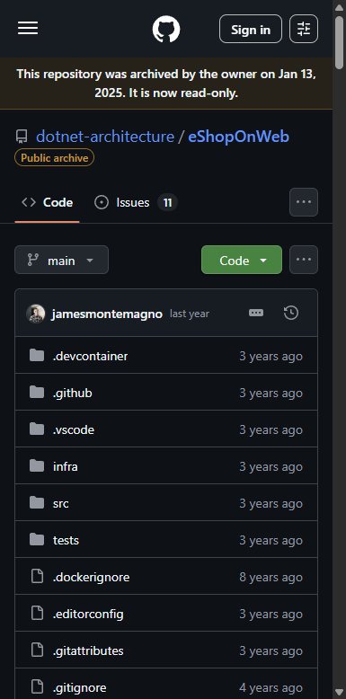
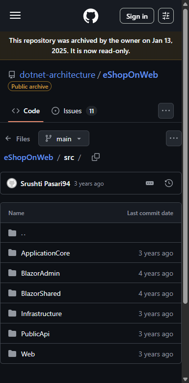
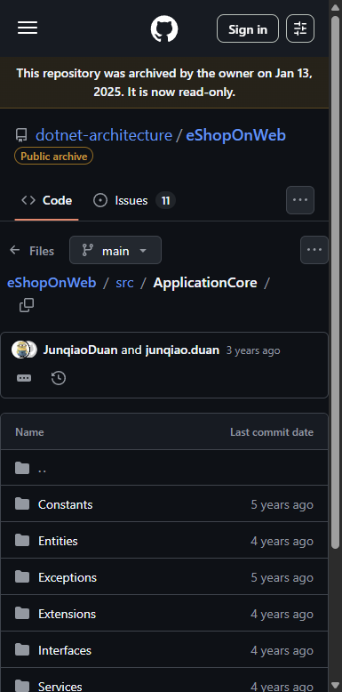
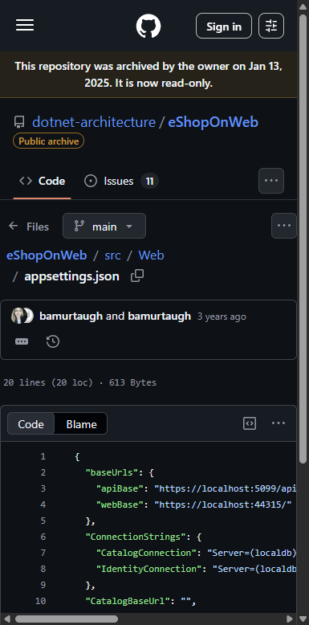
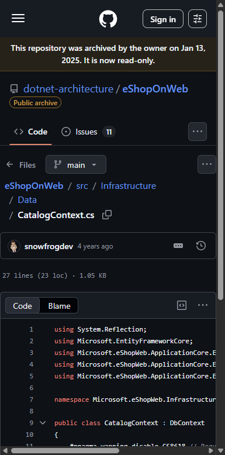
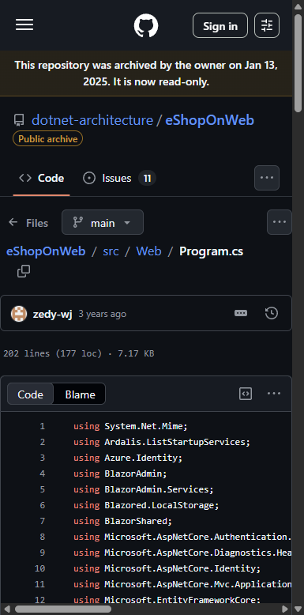
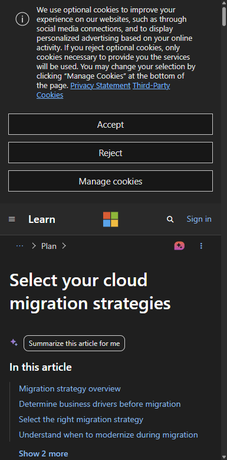
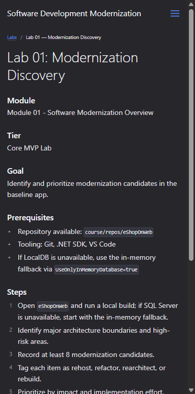

# Lab 01: Modernization Discovery — Visual Walkthrough

**Course:** Software Development Modernization  
**Module:** 01 — Software Modernization Overview  
**Reference App:** `dotnet-architecture/eShopOnWeb` (ASP.NET Core 8 reference app)  
**Screenshots taken:** 2026-08-10 against live GitHub repository  
**Audience:** Students using this as a step-by-step guide or instructor reference

---

> **How to use this document**  
> This walkthrough mirrors every step of the lab in the exact order students encounter the codebase.  
> Each screenshot is followed by an explanation of what you are looking at **and why it matters to app modernization teams**. Where the live environment behaves unexpectedly, a **⚠️ Snag** callout explains the issue and the workaround.

---

## Why This Lab Matters — App Modernization Context

Before a team can modernize a legacy application, they need to *understand* what they are working with. This is called **discovery** — and it is the most critical phase of any modernization project.

Skipping discovery is how modernization projects fail. Teams that jump directly to rewriting code without first cataloguing what the system does, how it connects to other systems, and what the risk is of touching each component routinely underestimate effort by 2–5× and break dependencies they did not know existed.

In this lab you are stepping into the role of a **modernization architect** conducting discovery on `eShopOnWeb` — a realistic ASP.NET Core e-commerce application built with legacy patterns. Your job is to:

1. Understand the application's architecture
2. Identify at least **8 modernization candidates**
3. Classify each one using the **4 R's** framework (Rehost, Refactor, Rearchitect, Rebuild)
4. Prioritize by **impact** and **implementation risk**

> **Key concept:** Not every part of a legacy system needs to change. The 4 R's framework lets teams make deliberate, defensible decisions about *what* to change, *how*, and *in what order* — rather than rewriting everything and hoping for the best.

---

## The 4 R's Modernization Framework

Before touching any code, make sure you understand the four strategies you will assign to each candidate:

| Strategy | Description | Example |
|---|---|---|
| **Rehost** | Move the app to cloud infrastructure with no code changes ("lift and shift") | Deploy the existing IIS app to Azure App Service without modification |
| **Refactor** | Make targeted code changes to use cloud-native patterns while keeping the same architecture | Replace `SqlConnection` with Entity Framework Core; move secrets to Azure Key Vault |
| **Rearchitect** | Restructure the application significantly to unlock cloud-native capabilities | Split the monolith into independent microservices; add an event bus |
| **Rebuild** | Discard and rewrite from scratch using modern patterns and frameworks | Replace a legacy ASP.NET WebForms admin panel with a new Blazor or React SPA |

> **App modernization connection:** Most real projects use a *mix* of all four. Infrastructure is rehosted first (fastest, lowest risk), then the most painful pieces are refactored, then key bounded contexts are rearchitected, and only components with no salvageable value are rebuilt.

> **⚠️ Snag — Students often overuse "Rebuild":** First-time modernizers tend to classify everything as "Rebuild" because the legacy code looks messy. Push back on this. "Rebuild" is the highest-risk, highest-cost option. A working piece of code that just needs to move to a cloud database is a "Refactor," not a "Rebuild." Use the prioritization matrix to anchor decisions in business value.

---

## Prerequisites

Before starting, confirm:

| Item | How to verify |
|---|---|
| eShopOnWeb repo cloned | `git clone https://github.com/dotnet-architecture/eShopOnWeb.git` |
| .NET SDK installed | `dotnet --version` ‚Üí should show 8.x |
| VS Code open | Open the `eShopOnWeb` folder — you should see Solution Explorer in the left sidebar |
| Fallback mode ready | If LocalDB is not available: set `UseOnlyInMemoryDatabase=true` in `appsettings.Development.json` |

---

## Part 1 — Orient Yourself in the Repository

### Step 1.1 — Open the eShopOnWeb Repository

Navigate to:
```
https://github.com/dotnet-architecture/eShopOnWeb
```



**What you are looking at:**  
The root of the `dotnet-architecture/eShopOnWeb` public GitHub repository. Key observations:

| Element | What it tells you |
|---|---|
| **"This repository was archived"** banner | The Microsoft team has handed ownership to the community (`NimblePros/eShopOnWeb`). The code is stable — not actively developed — which makes it a safe, realistic discovery target |
| **`src/` folder** | Contains all application source code — this is where you will spend most of your time |
| **`tests/` folder** | Integration and unit tests — important for understanding what the team considered "done" |
| **`infra/` folder** | Azure Bicep infrastructure-as-code — already partially modernized |
| **`devcontainer/` and `.vscode/`** | Developer experience files — shows the team invested in consistency |
| **Language bar: C# 71.1%, HTML 19.5%** | This is a server-rendered .NET app with significant HTML templating — a classic MVC monolith |

> **App modernization connection:** The language distribution tells you what kind of modernization path is practical. A codebase that is 71% C# and uses server-rendered HTML is a strong candidate for **Refactor** (move to modern .NET patterns) or **Rearchitect** (extract APIs, add a SPA frontend) rather than **Rebuild** from scratch. The existing C# business logic has value — don't throw it away without good reason.

---

## Part 2 — Explore the Source Code Architecture

### Step 2.1 — View the `src/` Folder Structure

Navigate to:
```
https://github.com/dotnet-architecture/eShopOnWeb/tree/main/src
```



**What you are looking at:**  
The `src/` directory contains **6 C# projects**. This is a classic **Clean Architecture** layout where each project has a specific responsibility:

| Project | Role | Architecture layer |
|---|---|---|
| **ApplicationCore** | Business logic, entities, interfaces — no framework dependencies | Domain |
| **Infrastructure** | Database access (EF Core), external services, file storage | Infrastructure |
| **Web** | ASP.NET Core MVC web frontend — the main user-facing application | Presentation |
| **PublicApi** | REST API layer for programmatic access and mobile clients | API |
| **BlazorAdmin** | Admin dashboard built with Blazor WebAssembly | Admin UI |
| **BlazorShared** | DTOs and models shared between BlazorAdmin and the server | Shared |

> **App modernization connection:** The fact that `eShopOnWeb` already uses Clean Architecture is a *modernization advantage*. The `ApplicationCore` project contains pure business logic with no dependency on SQL Server, IIS, or any specific framework. This means you can replace the database, the web framework, or the deployment target without touching the business rules. Legacy apps that don't separate concerns like this require significantly more work to modernize safely.

> **⚠️ Snag — Students confuse "Clean Architecture" with "already modernized":** Clean Architecture is a *design pattern*, not a technology. `eShopOnWeb` still has modernization candidates: it uses LocalDB SQL Server, has hard-coded connection strings, lacks containerization, has no cloud observability, and deploys as a monolith. Good architecture makes modernization *easier* — it does not mean the work is done.

---

### Step 2.2 — Inspect the `ApplicationCore` Domain Layer

Navigate to:
```
https://github.com/dotnet-architecture/eShopOnWeb/tree/main/src/ApplicationCore
```



**What you are looking at:**  
The **domain layer** of the application — the most important folder for understanding what the business actually does:

| Subfolder | Contents | What to look for |
|---|---|---|
| **Entities** | Core domain objects: `CatalogItem`, `Order`, `Basket`, `CatalogBrand` | These are the business concepts — understand what the app *is* before modernizing it |
| **Interfaces** | Abstractions like `IRepository<T>`, `IOrderService`, `IEmailSender` | Every interface is an *injection point* — it's where you can swap implementations without breaking business logic |
| **Services** | `OrderService`, `BasketService` — business workflows | Understanding what happens during an "order" tells you what can go async, what needs a saga, etc. |
| **Specifications** | Query filters using the Specification pattern | Abstracts query logic — important for database migration candidates |

> **App modernization connection:** Start your candidate discovery in `Entities/`. Every entity with a complex lifecycle (stateful transitions, multiple relationships, audit needs) is a modernization candidate. An entity that is currently stored in SQL Server but is only ever read by one service might be a candidate for **Rearchitect** to a document database — or it might be fine where it is. The Specification pattern in `ApplicationCore/Specifications/` is particularly interesting: it means query logic is already separated from persistence, making a database technology swap lower-risk than a typical ORM-tightly-coupled codebase.

---

## Part 3 — Identify the Infrastructure Pain Points

### Step 3.1 — Inspect `appsettings.json` for Infrastructure Dependencies

Navigate to:
```
https://github.com/dotnet-architecture/eShopOnWeb/blob/main/src/Web/appsettings.json
```



**What you are looking at:**  
The application's base configuration file reveals critical infrastructure dependencies:

| Configuration key | Current value | Modernization implication |
|---|---|---|
| **`CatalogConnection`** | `Server=(localdb)\\mssqllocaldb;...` | Hard-wired to LocalDB — cannot deploy to a container or cloud without changing this |
| **`IdentityConnection`** | `Server=(localdb)\\mssqllocaldb;...` | Identity data is in the *same SQL Server instance* as catalog — tightly coupled, makes independent scaling impossible |
| **`apiBase`** | `https://localhost:5099/api/` | Hard-coded localhost URL — breaks in any deployment where API and web are separate hosts |
| **`CatalogBaseUrl`** | `""` (empty) | Product images have no CDN — currently served directly from the app server |

> **Discovery finding #1 — Hard-coded connection strings (Refactor candidate):**  
> Connection strings in `appsettings.json` mean credentials are potentially committed to source control and cannot vary by environment without code changes. The fix is to move secrets to **Azure Key Vault** or **App Configuration** and reference them via environment variables at runtime. This is a **Refactor** — no architectural change, just better secret management.

> **Discovery finding #2 — LocalDB as the database engine (Refactor candidate):**  
> LocalDB is a developer-only feature of SQL Server Express. It cannot run in a Docker container, on Linux, or in Azure. Migrating to **Azure SQL Database** or **PostgreSQL** (via EF Core provider swap) is a **Refactor** that unblocks containerization and cloud deployment.

> **⚠️ Snag — The `appsettings.Development.json` override:** There is a second file `appsettings.Development.json` that overrides these values in the local development environment. Run `git ls-files src/Web/appsettings*` to see both files. The Development file may contain `"UseOnlyInMemoryDatabase": true` which bypasses SQL Server entirely for local testing.

---

### Step 3.2 — Inspect `CatalogContext.cs` — The Data Access Layer

Navigate to:
```
https://github.com/dotnet-architecture/eShopOnWeb/blob/main/src/Infrastructure/Data/CatalogContext.cs
```



**What you are looking at:**  
The `CatalogContext` is the EF Core **DbContext** — the gateway between C# objects and the SQL Server database:

| DbSet | Entity | What data this holds |
|---|---|---|
| `Baskets` | Shopping carts in progress | Session-scoped, transient data — prime candidate for Redis cache |
| `CatalogItems` | Product catalog (name, price, image URL) | Read-heavy, relatively static — prime candidate for caching or CDN |
| `CatalogBrands` / `CatalogTypes` | Reference data | Changes rarely — excellent candidate for in-memory cache |
| `Orders` / `OrderItems` | Completed order history | Write-once, append-heavy — would benefit from event sourcing pattern at scale |

> **Discovery finding #3 — Basket stored in SQL Server (Rearchitect candidate):**  
> Shopping baskets are per-session data. Storing them in a relational database is fine for low traffic but creates unnecessary load at scale. This is an **Rearchitect** opportunity: move basket state to **Azure Cache for Redis**. This also decouples basket from order lifecycle, letting each scale independently.

> **Discovery finding #4 — No database migration history (Refactor candidate):**  
> Check `src/Infrastructure/Data/Migrations/`. If migrations are checked in but not versioned with a strategy (e.g., no rollback scripts, no baseline), the team has no safe way to evolve the schema in production. This is a **Refactor** — introduce a proper migration deployment strategy using EF Core Migrations with a deployment pipeline gate.

> **App modernization connection:** The `OnModelCreating` call `builder.ApplyConfigurationsFromAssembly(...)` is a sign of good EF Core hygiene — configuration is separated from entity classes using `IEntityTypeConfiguration<T>`. This makes it significantly easier to add new database providers (e.g., switching to PostgreSQL) without touching entity classes.

---

## Part 4 — Understand the Application Entry Point

### Step 4.1 — Inspect `Program.cs` — Service Registration and Startup

Navigate to:
```
https://github.com/dotnet-architecture/eShopOnWeb/blob/main/src/Web/Program.cs
```



**What you are looking at:**  
The application entry point registers all services and middleware. The `using` directives at the top reveal key architectural choices:

| `using` import | What it tells you |
|---|---|
| `Ardalis.ListStartupServices` | Debug tooling to list registered services — shows the team values observability in development |
| `Azure.Identity` | Already importing Azure Identity — the team intended Azure deployment |
| `BlazorAdmin` / `BlazorShared` | The Blazor admin panel is already integrated at startup |
| `Microsoft.EntityFrameworkCore` | EF Core is registered at startup — confirms the EF dependency |
| `Microsoft.AspNetCore.Authentication` | ASP.NET Core Identity is used for auth — not Azure AD B2C, not OAuth directly |

> **Discovery finding #5 — ASP.NET Core Identity vs. cloud-native identity (Refactor candidate):**  
> The app uses built-in ASP.NET Core Identity with the SQL Server IdentityDb. In a cloud-native modernization, this is replaced with **Microsoft Entra ID (formerly Azure AD)** or **Azure AD B2C** for external users. The benefit: no more managing password hashing, account lockout, token expiry — the identity provider does it all. This is a **Refactor** affecting `Program.cs` auth registration, `IdentityConnection` config, and the login/register Razor pages.

> **Discovery finding #6 — Monolithic startup (Rearchitect candidate):**  
> All services (catalog, basket, orders, admin, identity) register in a single `Program.cs`. This is a monolith. At scale, this means you cannot deploy a new version of just the basket service — you deploy everything. This is an **Rearchitect** candidate if the team's goal is independent deployability. However, for an initial cloud migration, this can be deferred — get the monolith running in a container first, then extract services.

---

## Part 5 — Review the Microsoft Learn CAF Migration Strategies

### Step 5.1 — Open the Cloud Adoption Framework Reference

Navigate to:
```
https://learn.microsoft.com/en-us/azure/cloud-adoption-framework/plan/select-cloud-migration-strategy
```



**What you are looking at:**  
The **Cloud Adoption Framework (CAF)** is Microsoft's prescriptive guidance for planning and executing cloud migrations. This specific page covers the 4 R's (and expands them to the "5 R's" or "6 R's" depending on your scenario).

> **How to use this during discovery:**  
> When you identify a modernization candidate, open this page and ask:
> 1. What is the *business driver* for changing this? (cost, agility, compliance, risk)
> 2. What is the *minimum change* that achieves that driver?
> 3. Does the change need to happen *before* or *after* the initial cloud move?
>
> The CAF framework answers these questions systematically. Many teams skip this step and spend months rearchitecting things that didn't need to change.

> **App modernization connection:** The CAF distinguishes between **migration** (moving what exists) and **modernization** (improving while moving). For `eShopOnWeb`, the initial goal should be a **migration** (get it running in Azure App Service), followed by selective **modernization** (add Key Vault, containerize, add Redis for basket). Trying to do both at once is a common cause of project failure.

---

## Part 6 — View the Course Site Lab Reference

### Step 6.1 — Open the GitHub Pages Course Site for Lab 01

Navigate to:
```
https://derricksobrien.github.io/ALDOT-Courseware/labs/lab-01-modernization-discovery
```



**What you are looking at:**  
The published **Lab 01** page on the course's GitHub Pages site. This is the student-facing lab card used during instructor-led sessions. Key sections:

| Section | Purpose |
|---|---|
| **Module** | Links this lab to Module 01 courseware |
| **Tier** | "Core MVP Lab" — this lab runs in every course delivery, not just advanced tracks |
| **Goal** | "Identify and prioritize modernization candidates in the baseline app" — the deliverable |
| **Prerequisites** | What students need before starting |
| **Steps** | The 5 lab tasks in order |
| **Validation** | How the instructor confirms the lab is complete |
| **Evidence** | Output artifacts students must produce: `modernization-candidate-matrix.md` and `initial-modernization-roadmap.md` |

> **App modernization connection:** The two evidence artifacts — the candidate matrix and the roadmap — are not academic exercises. In a real modernization engagement, these are the deliverables from the Discovery phase that a client signs off on before the team writes a single line of code. Getting good at producing these artifacts in the lab prepares students for the real Discovery conversations they will lead on the job.

---

## Part 7 — Complete the Modernization Candidate Matrix

Based on your exploration in Parts 1–5, you should now have identified at least 8 candidates. Use this template:

### Required Output: `modernization-candidate-matrix.md`

```markdown
# Modernization Candidate Matrix — eShopOnWeb

| # | Area | File(s) | Issue / Opportunity | Strategy | Priority | Risk |
|---|---|---|---|---|---|---|
| 1 | Database connection | appsettings.json | Hard-coded LocalDB connection strings — cannot deploy to cloud | Refactor | High | Low |
| 2 | Secret management | appsettings.json | Credentials in source-controlled config file | Refactor | High | Low |
| 3 | Basket storage | CatalogContext.cs | Session data stored in SQL Server — poor scaling characteristics | Rearchitect | Medium | Medium |
| 4 | Identity provider | Program.cs | ASP.NET Core Identity on-prem — no SSO, no MFA out of box | Refactor | Medium | Medium |
| 5 | Static assets | appsettings.json | Product images served from app server — no CDN | Refactor | Low | Low |
| 6 | Containerization | Entire app | No Dockerfile — cannot deploy to containers or Kubernetes | Refactor | High | Low |
| 7 | Observability | Program.cs | No Application Insights, no structured logging to cloud | Refactor | High | Low |
| 8 | Deployment model | Program.cs | Monolithic startup — all services deploy together | Rearchitect | Low | High |
```

> **Note:** Priority "High" means it blocks cloud deployment. "Medium" means it limits scalability. "Low" means it limits advanced features but is not a blocker. Risk reflects implementation complexity.

---

## Summary: What You Discovered and Why It Matters

| Discovery | Strategy | What to do first? |
|---|---|---|
| LocalDB connection strings | Refactor | **Yes — blocks cloud deployment** |
| Secrets in config | Refactor | **Yes — security blocker** |
| No Dockerfile | Refactor | **Yes — blocks containerization** |
| No observability | Refactor | **Yes — can't operate in cloud blind** |
| ASP.NET Identity (local) | Refactor | Defer to Phase 2 |
| Basket in SQL | Rearchitect | Defer to Phase 2 |
| Product image CDN | Refactor | Defer to Phase 2 |
| Monolithic startup | Rearchitect | Defer to Phase 3 (if ever) |

> **Final thought:** A modernization roadmap is not a wish list — it is a *sequenced delivery plan* where each step enables the next. Getting the app into a container (Labs 06) requires fixing the connection strings (this lab) and adding a CI/CD pipeline (Lab 04). Every candidate you identified today maps to a lab in this course. By the end of Lab 10, you will have addressed all of them.

---

## Documented Snags Reference

| # | Where it happens | What students see | Fix |
|---|---|---|---|
| 1 | `appsettings.json` | `LocalDB` connection string — app fails to start without SQL Server | Set `UseOnlyInMemoryDatabase=true` in `appsettings.Development.json` |
| 2 | VS Code Solution Explorer | eShopOnWeb shows as a Git submodule with `.git` file, not folder | Run `git submodule update --init` in the course repo root before opening in VS Code |
| 3 | `dotnet build` | Missing NuGet packages — restore fails | Run `dotnet restore` first, then `dotnet build` |
| 4 | `dotnet run` (Web project) | Port 44315 already in use | Change `applicationUrl` in `launchSettings.json` or kill the conflicting process |
| 5 | Candidate matrix | Students can't find 8 candidates | Walk them through `appsettings.json` (strings), `Program.cs` (auth, startup), `Infrastructure/` (DB access), and the missing `Dockerfile` — that's already 6 right there |
| 6 | GitHub repo access | Repo shows "archived" banner | Reassure students: archived = stable + read-only. The code works exactly as intended for this discovery exercise. The active fork is at `NimblePros/eShopOnWeb` if they want to contribute upstream. |

