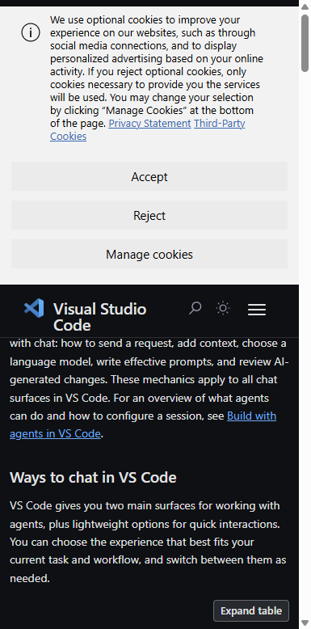
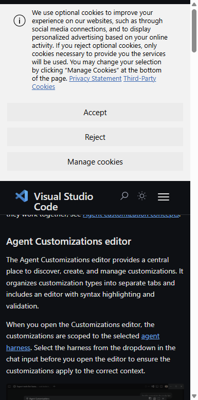
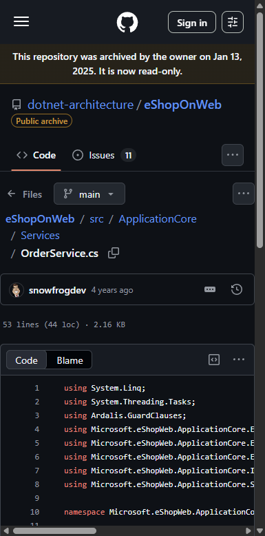
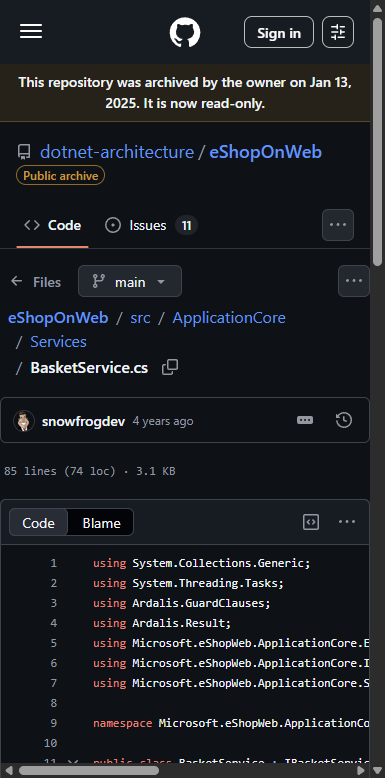
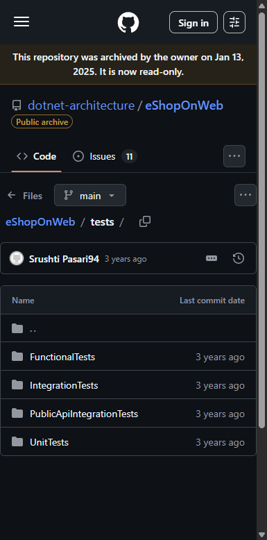
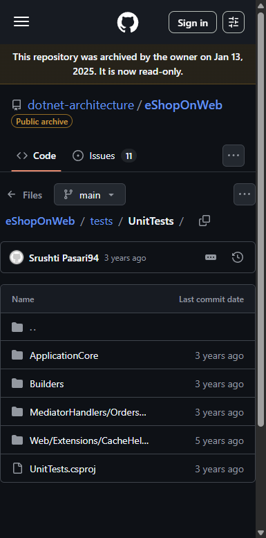
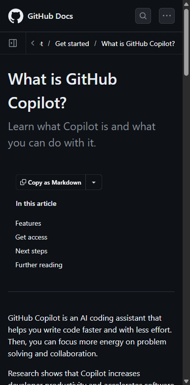
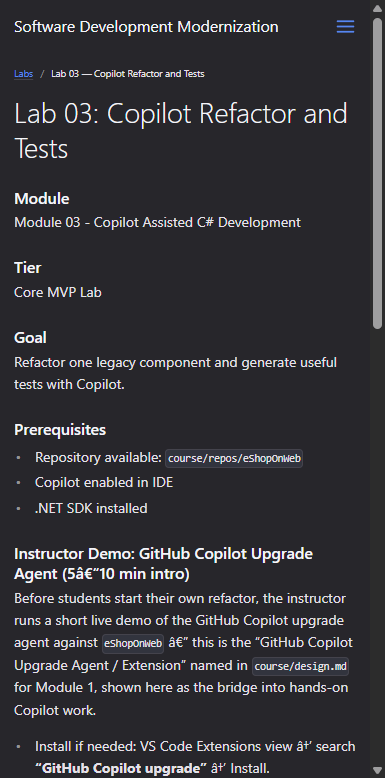

# Lab 03: Copilot Refactor and Tests — Visual Walkthrough

**Course:** Software Development Modernization  
**Module:** 03 — Copilot Assisted C# Development  
**Reference App:** `dotnet-architecture/eShopOnWeb` (ASP.NET Core 8 reference app)  
**Screenshots taken:** 2026-08-10 against live GitHub and VS Code docs  
**Audience:** Students using this as a step-by-step guide or instructor reference

---

> **How to use this document**  
> This walkthrough mirrors every step of the lab in the exact order students encounter the tools and codebase.  
> Each screenshot is followed by an explanation of what you are looking at **and why it matters to app modernization teams**. Where the live environment behaves unexpectedly, a **⚠� Snag** callout explains the issue and the workaround.

---

## Why This Lab Matters — App Modernization Context

Legacy codebases are large. A typical app modernization project involves hundreds of classes, thousands of methods, and years of accumulated technical debt. A developer working alone reading through that code and manually refactoring it would spend months before the first test passes.

**GitHub Copilot changes that equation.**

In this lab you use Copilot not as an autocomplete tool, but as a **pair programming partner with full codebase awareness** — one that can read an entire service class, identify its code smells, propose a refactor plan, and generate tests for behavior you might otherwise forget to cover.

The critical skill this lab builds is *judgment* — knowing when to accept Copilot's output, when to push back, and how to review AI-generated code the same way you would review a pull request from a junior developer.

> **Key concept:** Copilot accelerates *safe* modernization when you use it in the right mode, with the right prompt, and with a review mindset. The biggest risk is not that Copilot generates bad code — it is that developers accept bad code without reading it. This lab teaches you to be a reviewer, not just a consumer.

---

## The Three Copilot Modes — Choose the Right Tool

Before writing a single prompt, you need to understand which Copilot mode to use. This is the most commonly missed concept by first-time Copilot users.

| Mode | What it does | When to use it in Lab 03 |
|---|---|---|
| **Ask** | Answers questions, explains code, suggests snippets — **no file edits** | Step 1: Understanding what `OrderService` does before touching it |
| **Plan** | Reads codebase, produces step-by-step plan — **no edits until you approve** | Step 2: Getting Copilot's proposed refactor approach to review first |
| **Agent** | Autonomously edits files, runs terminal commands, iterates on errors | Steps 3–5: Executing the approved refactor and generating tests |

> **⚠� Snag — Students jump straight to Agent mode:** The most common mistake is opening Copilot, typing "refactor this class," and accepting whatever comes back. This bypasses the planning step and often produces code that compiles but breaks important behaviors. **Always use Ask → Plan → Agent in sequence.** The Plan step is a checkpoint where you as the developer stay in control.

---

## Prerequisites

Before starting, confirm:

| Item | How to verify |
|---|---|
| VS Code installed | `code --version` in terminal |
| GitHub Copilot extension active | VS Code status bar shows Copilot icon; no red warning |
| eShopOnWeb repo open | VS Code Explorer shows `eShopOnWeb` root folder |
| .NET SDK 8.x installed | `dotnet --version` → `8.x.x` |
| Project builds clean | `dotnet build` in the `src/` folder — zero errors |

---

## Part 1 — Orient Yourself in the Copilot Chat Interface

### Step 1.1 — Open the VS Code Copilot Chat Documentation

Navigate to:
```
https://code.visualstudio.com/docs/copilot/copilot-chat
```



**What you are looking at:**  
The official VS Code documentation for the **Copilot Chat** feature. Key sections to read before starting the lab:

| Section | What it covers | Why it matters for this lab |
|---|---|---|
| **Chat view** | The sidebar chat panel — persistent, context-aware | This is your primary surface for Ask and Plan mode work in Lab 03 |
| **Inline chat** | `Ctrl+I` overlay on a selection | For quick, targeted edits inside a method without switching windows |
| **Chat modes** | Ask / Plan / Agent mode descriptions | Choosing the wrong mode is the #1 lab failure point |
| **Chat participants** | `@workspace`, `@vscode`, `@terminal` | `@workspace` gives Copilot full visibility across all files — use it when asking about architecture |
| **Model picker** | Which AI model powers the response | The default model (GPT-4o or Claude Sonnet) is fine for this lab; do not change it |

> **App modernization connection:** During a modernization project, Copilot Chat in Ask mode replaces reading documentation and Stack Overflow for understanding unfamiliar legacy patterns. The `@workspace` participant is particularly powerful: when you ask "what does the basket domain do?" it reads `BasketService`, its interfaces, and all callers to give you a complete picture — something that would take 30 minutes to do manually.

> **⚠� Snag — Chat history does not persist across VS Code restarts:** Each time you close VS Code, your chat history is lost. If you want to refer back to a refactor plan from the previous session, save the Copilot output to a `.md` file before closing. Students who close VS Code and then cannot remember what Copilot proposed should treat this as a reminder to document their work.

---

## Part 2 — Understand the Copilot Customization Options

### Step 2.1 — Review the Customization Documentation

Navigate to:
```
https://code.visualstudio.com/docs/copilot/copilot-customization
```



**What you are looking at:**  
The VS Code documentation for **customizing Copilot** — the same system described in the Module 03 Customizations Panel guide. Key concepts visible on this page:

| Customization | File location | What it does in Lab 03 |
|---|---|---|
| **Instructions** | `.github/copilot-instructions.md` | Tell Copilot the coding standards to follow — use this to enforce your team's refactoring style |
| **Prompt files** | `.github/prompts/*.prompt.md` | Reusable prompt templates — e.g., a "refactor-service.prompt.md" you can invoke in any session |
| **Custom agents** | `.github/agents/*.agent.md` | Custom Copilot personas — e.g., a read-only "planner" agent |
| **MCP Servers** | `.vscode/mcp.json` | Connect to external systems — not needed for this lab but useful later |

> **Before starting the lab:** Create a `.github/copilot-instructions.md` file with your coding standards. This ensures Copilot's generated code matches your project's conventions rather than generic patterns.

```markdown
# .github/copilot-instructions.md (example for eShopOnWeb)
- Target framework: net8.0 — do not use any API not available in .NET 8
- Test framework: xUnit with FluentAssertions
- All public methods must have XML doc comments
- Never use `var` — always use explicit types
- Follow Clean Architecture: no direct database references in ApplicationCore
- Async methods must use `CancellationToken` parameters
```

> **App modernization connection:** The instructions file is how you encode your team's migration standards into every Copilot session. On a real project this file would specify: "target Azure App Service, not on-prem IIS," "use managed identity, not connection string passwords," "all new code must have Application Insights telemetry." Once it's in the file, Copilot enforces it automatically in every chat.

---

## Part 3 — Identify the Refactor Target

### Step 3.1 — Inspect `OrderService.cs` — The Primary Refactor Target

Navigate to:
```
https://github.com/dotnet-architecture/eShopOnWeb/blob/main/src/ApplicationCore/Services/OrderService.cs
```



**What you are looking at:**  
`OrderService.cs` is the **recommended primary refactor target** for Lab 03. It is a good candidate because:

| Code smell | Why it's a problem | Modernization connection |
|---|---|---|
| **Multiple responsibilities** | The `CreateOrderAsync` method orchestrates pricing, inventory, address validation, and order persistence in one method | A method that does 4 things is a method that can fail in 4 places — and you cannot test each failure independently |
| **Direct EF Core dependency** | The service takes `IOrderRepository` and `IBasketRepository` — good — but the exception handling is tightly coupled to implementation details | If you swap the database (Refactor candidate #1 from Lab 01), the exception paths may need to change |
| **No `CancellationToken`** | Long-running database operations have no cancellation path | In cloud environments (Azure Functions, API with timeout policies), methods without `CancellationToken` cannot be cleanly cancelled |
| **Silent failure paths** | Missing guard clauses — if basket is null, behavior is undefined | Tests that don't cover failure paths let bugs reach production |

> **Ask mode prompt to understand it first:**
> ```
> @workspace Explain what OrderService.CreateOrderAsync does step by step.
> What are the single responsibility principle violations?
> What behaviors would be lost if I split this into smaller methods?
> ```

> **App modernization connection:** `OrderService` is the class that runs every time a customer places an order. On a modernization project, this is a *high-risk refactor* — it must be backed by tests *before* you touch it. The most dangerous kind of modernization is moving code to the cloud and discovering in production that the order creation path has an untested edge case. This lab exists precisely to teach the discipline of test coverage *before* refactoring.

---

### Step 3.2 — Inspect `BasketService.cs` — The Secondary Target

Navigate to:
```
https://github.com/dotnet-architecture/eShopOnWeb/blob/main/src/ApplicationCore/Services/BasketService.cs
```



**What you are looking at:**  
`BasketService.cs` is the **secondary refactor target** — simpler than `OrderService` but still has teachable issues:

| Method | Code smell | Suggested prompt |
|---|---|---|
| `AddItemToBasket` | Does not validate that `quantity > 0` | "Add guard clauses and throw `ArgumentOutOfRangeException` for invalid quantity" |
| `DeleteBasketAsync` | No return value — caller cannot tell if the basket existed | "Refactor to return `bool` indicating whether a basket was found and deleted" |
| `TransferBasketAsync` | Complex happy-path logic with no tests in the existing suite | "Generate xUnit tests for TransferBasketAsync covering empty basket, non-existent user, successful transfer" |

> **Which target to choose:**
> - **Beginners / short session:** Use `BasketService.cs` — simpler, more targeted, faster to test
> - **Advanced / full session:** Use `OrderService.cs` — richer code smells, more interesting test scenarios

> **⚠� Snag — Students get overwhelmed by `OrderService`:** If students spend more than 20 minutes trying to understand what `CreateOrderAsync` does before prompting Copilot, redirect them to Ask mode with `@workspace` — Copilot can summarize the entire method in 30 seconds. The goal is not to become an expert in the legacy code; it is to *use Copilot to become an expert faster*.

---

## Part 4 — Run the Ask → Plan → Agent Workflow

### Step 4.1 — Use Ask Mode to Understand the Target Class

In VS Code:
1. Open the Copilot Chat sidebar (`Ctrl+Alt+I`)
2. Ensure mode is set to **Ask** (dropdown at bottom of chat)
3. Run this prompt:

```
@workspace Explain what BasketService.cs does.
List any code smells, missing guard clauses, or areas that would be difficult to unit test.
Format your response as a numbered list.
```

**What a good Ask response includes:**
- Summary of each public method's purpose
- Identification of missing null checks
- Identification of methods with no tests in the existing test suite
- Suggestions for which methods are highest-priority to cover

> **App modernization connection:** The Ask prompt above mirrors the Discovery work from Lab 01 — except instead of a human architect reading the code, Copilot reads it and surfaces the issues. On a team with 50+ services, this is the difference between a 6-month discovery phase and a 6-week one.

---

### Step 4.2 — Use Plan Mode to Generate a Refactor Plan

Switch mode to **Plan** (dropdown at bottom of chat), then run:

```
Plan a refactor of BasketService to:
1. Add a guard clause validating quantity > 0 in AddItemToBasket
2. Change DeleteBasketAsync to return bool indicating success
3. Add CancellationToken parameters to all async methods
Do not edit any files yet — just show me the plan.
```

**What a good Plan response includes:**
- Which files will be modified
- The specific changes to each method (before/after snippets)
- Which callers need to be updated (if `DeleteBasketAsync` return type changes, callers must handle the new bool)
- A list of tests to write for the changed behavior

> **Review the plan critically before proceeding.** Ask yourself:
> - Does changing `DeleteBasketAsync` to return `bool` break any existing callers?
> - Does adding `CancellationToken` require passing it all the way up through the call chain?
> - Are there any steps in the plan that seem risky or unclear?
>
> If anything looks wrong, push back in the chat: "Step 3 would break the controller — revise to keep the existing signature and add an overload instead."

> **⚠� Snag — Plan mode sometimes proposes too many changes:** Copilot in Plan mode tends to be ambitious. A plan that touches 12 files is a plan that is likely to introduce regression bugs. Narrow the scope: "Only change `BasketService.cs` and its unit tests for now. Do not modify any controllers or callers."

---

## Part 5 — Explore the Existing Test Structure

### Step 5.1 — Open the `tests/` Folder

Navigate to:
```
https://github.com/dotnet-architecture/eShopOnWeb/tree/main/tests
```



**What you are looking at:**  
The `tests/` directory contains **3 test projects** following a standard separation:

| Project | What it tests | How it tests |
|---|---|---|
| **UnitTests** | Individual classes in isolation | No database, no HTTP — pure C# with mocked dependencies |
| **FunctionalTests** | End-to-end HTTP flows through the web app | Starts an in-memory ASP.NET Core test server, sends real HTTP requests |
| **IntegrationTests** | Cross-layer behaviors involving EF Core and real data | Requires database (uses in-memory EF provider for CI) |

> **For Lab 03, focus on `UnitTests`.** This is where you add tests for `BasketService` or `OrderService`. Unit tests are:
> - Fast (milliseconds, not seconds)
> - Independent (no database required)
> - The first safety net for refactored code

> **App modernization connection:** The test project structure here is a model for what every modernization target needs *before* you touch it. A class with no unit tests is a class where you cannot verify that the refactor preserved the existing behavior. Many legacy systems have low test coverage precisely because the code was never designed to be testable. Clean Architecture (as used here) makes unit testing significantly easier because business logic has no framework dependencies.

---

### Step 5.2 — Inspect the Existing Unit Tests

Navigate to:
```
https://github.com/dotnet-architecture/eShopOnWeb/tree/main/tests/UnitTests
```



**What you are looking at:**  
The `UnitTests` project structure. Key observations:

| Subfolder | Tests what | What's missing |
|---|---|---|
| **ApplicationCore/** | Services, entities, specifications | `BasketService` tests are limited — good target for Copilot test generation |
| **Infrastructure/** | Repository implementations | EF Core tests use in-memory provider |
| **Web/** | Controller and page model tests | Thin — most controller logic delegates to services |

> **Before writing tests, run the existing suite:**
> ```bash
> cd tests/UnitTests
> dotnet test
> ```
> If all tests pass, you have a clean baseline. Any test that fails *after* your refactor is a regression you introduced.

> **Agent mode prompt to generate tests:**
> ```
> Generate xUnit unit tests for BasketService.AddItemToBasket covering:
> 1. Happy path: valid item added to existing basket
> 2. Guard clause: quantity <= 0 throws ArgumentOutOfRangeException
> 3. Guard clause: null basket throws ArgumentNullException
> 4. Edge case: adding the same item twice increases quantity
> Use FluentAssertions for assertions. Mock IBasketRepository with Moq.
> Place the tests in tests/UnitTests/ApplicationCore/Services/BasketServiceTests.cs
> ```

> **⚠� Snag — Copilot generates tests that don't compile:** The most common issue is Copilot generating tests for a method signature that doesn't match the actual code (e.g., using the wrong parameter name or a return type that doesn't exist yet). **Always compile the test project after Copilot generates tests:** `dotnet build tests/UnitTests`. Fix any compilation errors before running the tests.

---

## Part 6 — What is GitHub Copilot for Business?

### Step 6.1 — Review the Copilot Product Overview

Navigate to:
```
https://docs.github.com/en/copilot/about-github-copilot/what-is-github-copilot
```



**What you are looking at:**  
The GitHub Copilot product overview page. Key distinctions relevant to this course:

| Feature | Individual / Free | Business / Enterprise |
|---|---|---|
| Code completion in editor | ✅ | ✅ |
| Copilot Chat (Ask/Plan/Agent) | ✅ | ✅ |
| `@workspace` participant | ✅ | ✅ |
| **Policy controls** (block suggestions matching public code) | � | ✅ |
| **Audit logs** (who used what prompt) | � | ✅ |
| **Seat management** (IT-provisioned) | � | ✅ |
| **IP indemnification** | � | ✅ (Enterprise) |

> **For this lab:** You need at minimum a **GitHub Copilot Individual** or **Business** seat. If your seat shows as unavailable, check with your instructor — the classroom environment is provisioned with Business seats. See the deployment plan at `assess-labs/copilot-for-business-deployment-plan-2026-08-09_1427.md`.

> **App modernization connection:** On a real modernization project involving government or regulated industry code (like ALDOT), **Copilot Business** is the minimum acceptable tier — because you need the policy controls to prevent the model from matching suggestions against public code repos, and the audit logs to satisfy compliance requirements. "Copilot Individual" on a regulated project creates IP and data exposure risks that procurement and legal will not accept.

> **⚠� Snag — VS Code shows Copilot icon but features are unavailable:** If the Copilot status bar icon shows a spinner or "Limited" badge, your seat is not yet activated. Steps: (1) Open `github.com/settings/copilot` and verify your plan is active; (2) In VS Code, run `GitHub Copilot: Sign Out` then `Sign In` from the Command Palette to refresh the token; (3) Restart VS Code. If still not working, contact your org admin — it may be a seat assignment issue.

---

## Part 7 — The Instructor Demo: Copilot Upgrade Agent

### Step 7.1 — What the Upgrade Agent Does

The **GitHub Copilot Upgrade Agent** (`@upgrade`) is a specialized Copilot extension that runs a structured assessment of your codebase for upgrade compatibility. For this course's intro demo, the instructor runs it against `eShopOnWeb` to show a real automated version of the Lab 01 discovery work.

**How to run the demo:**

```
1. In VS Code Extensions view, search "GitHub Copilot upgrade" and install
2. Open Copilot Chat sidebar
3. Type: @upgrade Upgrade my solution to .NET 9
4. Choose "Guided" mode when prompted
5. The agent creates: .github/upgrades/{scenarioId}/assessment.md
                     .github/upgrades/{scenarioId}/plan.md
6. Walk through the generated plan with students — stop before "Execute"
```

**What the assessment output shows:**

| Section | What students learn |
|---|---|
| **Compatibility issues** | APIs removed in .NET 9 that `eShopOnWeb` uses — these are mandatory changes |
| **Suggested migrations** | Packages that have modern replacements (e.g., `Newtonsoft.Json` → `System.Text.Json`) |
| **Breaking changes** | Places where behavior changes between versions |
| **Estimated effort** | How many files need to change and how complex each change is |

> **Connect to Lab 01:** Point out to students that the Upgrade Agent's `assessment.md` is a machine-generated version of the `modernization-candidate-matrix.md` they produced in Lab 01. The difference: Lab 01 found *architectural* candidates; the Upgrade Agent finds *framework compatibility* candidates. Both are needed for a complete modernization plan.

---

## Part 8 — View the Course Site Lab Reference

### Step 8.1 — Open the GitHub Pages Course Site for Lab 03

Navigate to:
```
https://derricksobrien.github.io/ALDOT-Courseware/labs/lab-03-copilot-refactor-and-tests
```



**What you are looking at:**  
The published **Lab 03** page on the course's GitHub Pages site. Note the structure matches the other lab cards:

| Section | Content for Lab 03 |
|---|---|
| **Module** | Module 03 — Copilot Assisted C# Development |
| **Tier** | Core MVP Lab — runs in every course delivery |
| **Goal** | "Refactor one legacy component and generate useful tests with Copilot" |
| **Instructor Demo** | 5–10 minute Copilot Upgrade Agent demo before students start |
| **Steps** | 6 steps: select target → Ask → Plan → refactor → generate tests → run coverage → review |
| **Validation** | Project compiles + tests pass after refactor |
| **Evidence** | Refactor commit + test run output + prompt and review notes |

> **Instructor note on the evidence items:** The **prompt and review notes** are the most important evidence artifact. They demonstrate that the student was an active reviewer, not a passive consumer. A student who can say "Copilot proposed X, I pushed back because Y, and we ended up with Z" has demonstrated the judgment that matters on a real project.

---

## Part 9 — Run the Tests and Review Coverage

### Step 9.1 — Execute the Full Test Suite with Coverage

After generating tests with Copilot, run:

```bash
cd tests/UnitTests
dotnet test --collect:"XPlat Code Coverage" --results-directory ./TestResults
```

**What to look for in the output:**

| Output element | What it means |
|---|---|
| `Passed!` | All tests pass — refactor preserved existing behavior |
| `Failed: X` | A test caught a regression — investigate before committing |
| `Coverage report` | A `.xml` file in `TestResults/` — open with `reportgenerator` to view HTML |
| `Test run for ...` | The specific assemblies tested — confirm your new tests are included |

> **Generate a human-readable coverage report:**
> ```bash
> dotnet tool install -g dotnet-reportgenerator-globaltool
> reportgenerator -reports:./TestResults/**/coverage.cobertura.xml -targetdir:./TestResults/coverage-report
> # Then open: ./TestResults/coverage-report/index.html
> ```

> **App modernization connection:** Coverage reports on a modernization project are not about hitting an arbitrary percentage. They are about *risk mapping*. High coverage on `OrderService.CreateOrderAsync` means you can move that code to the cloud with confidence. Low coverage on the basket checkout flow means a cloud outage at 2pm on Black Friday is your fault, not Azure's.

> **⚠� Snag — Coverage report shows 0% for new tests:** This usually means the new test file was not included in the test project (missing from `.csproj`) or the test class does not have the correct namespace. Check: (1) Is the `.cs` file inside the `tests/UnitTests/` folder? (2) Does the test class have `[Fact]` or `[Theory]` attributes? (3) Run `dotnet build tests/UnitTests` — if the file isn't compiled, it won't run.

---

## Summary: What You Built and Why It Matters

| Lab 03 Artifact | What you created | App modernization purpose |
|---|---|---|
| **Copilot instructions file** | `.github/copilot-instructions.md` | Encodes team coding standards — Copilot enforces them in every future session |
| **Refactored service class** | `BasketService.cs` or `OrderService.cs` | Safer, more testable, cloud-ready code — no behavior lost |
| **New unit tests** | `*Tests.cs` in `tests/UnitTests/` | Safety net that proves the refactor preserved behavior |
| **Coverage report** | `TestResults/coverage-report/` | Risk map showing which code paths are verified before cloud deployment |
| **Prompt and review notes** | A `.md` file or chat log | Documents your decision-making — the professional artifact that differentiates a thoughtful engineer from someone who just accepted AI output |

> **Final thought:** Every refactor you do in this lab directly unlocks work in later labs. `OrderService` with `CancellationToken` support can run in Azure Functions (Lab 09). `BasketService` with proper validation can be extracted to its own service in a Rearchitect effort (Capstone Lab 10). The tests you write today are the tests that catch bugs when Lab 06 containerizes the app and Lab 08 puts it in a CI/CD pipeline. Clean code and good tests are not polish — they are the foundation that makes the rest of the modernization possible.

---

## Documented Snags Reference

| # | Where it happens | What students see | Fix |
|---|---|---|---|
| 1 | Copilot Chat sidebar | Copilot icon shows "Limited" or spinner | Sign out and sign back in via Command Palette; check `github.com/settings/copilot` for active seat |
| 2 | Plan mode | Plan proposes changes to 10+ files | Narrow scope in follow-up prompt: "Only change BasketService.cs and its direct unit test file" |
| 3 | Agent mode | Refactored code doesn't compile | Run `dotnet build` immediately; paste the error back into Copilot Chat — it will fix it |
| 4 | Test generation | Generated test class has `using` errors | Copilot sometimes guesses wrong package names; run `dotnet build tests/UnitTests` and paste errors back |
| 5 | `dotnet test` | "No test assemblies found" | Ensure you are running from `tests/UnitTests/` not from the repo root; check `.csproj` includes new test files |
| 6 | Coverage report | `reportgenerator` command not found | Run `dotnet tool install -g dotnet-reportgenerator-globaltool` first |
| 7 | `@upgrade` agent | "Extension not found" | Install from VS Code Marketplace: search "GitHub Copilot upgrade" (by GitHub) |
| 8 | Copilot Chat | Response cuts off mid-plan | Type "continue" in the next message — Copilot will resume from where it stopped |

