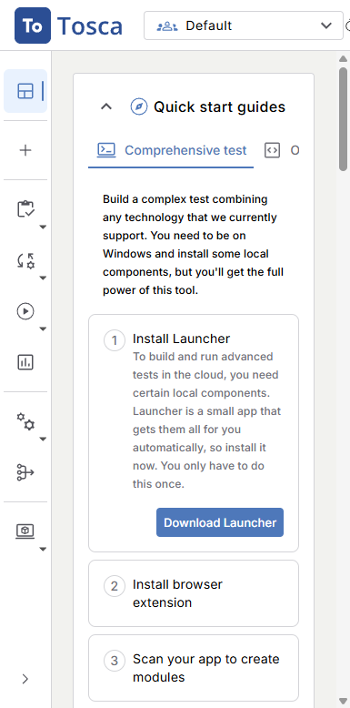
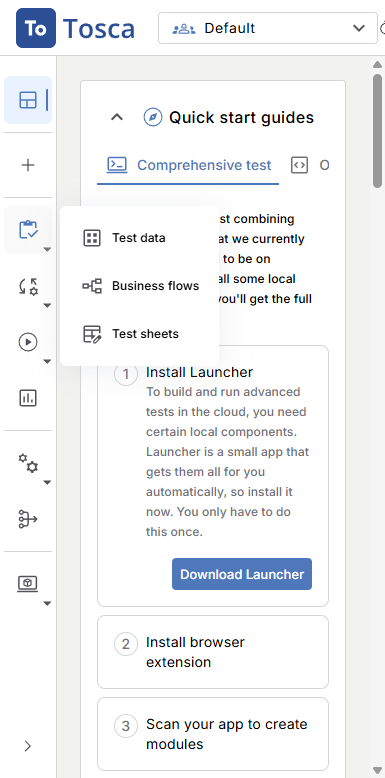
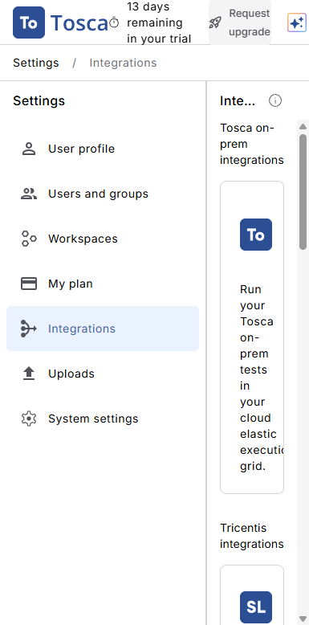
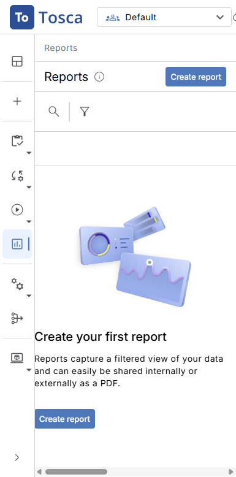
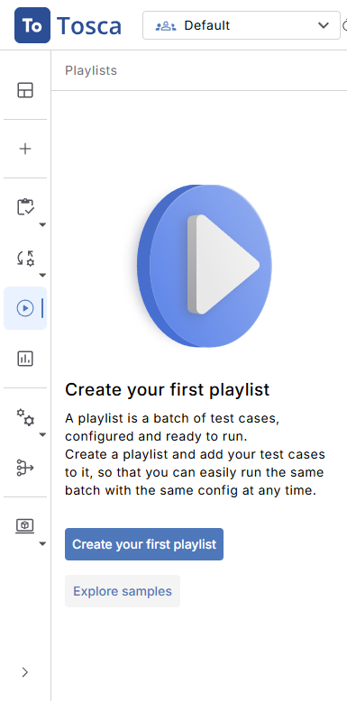
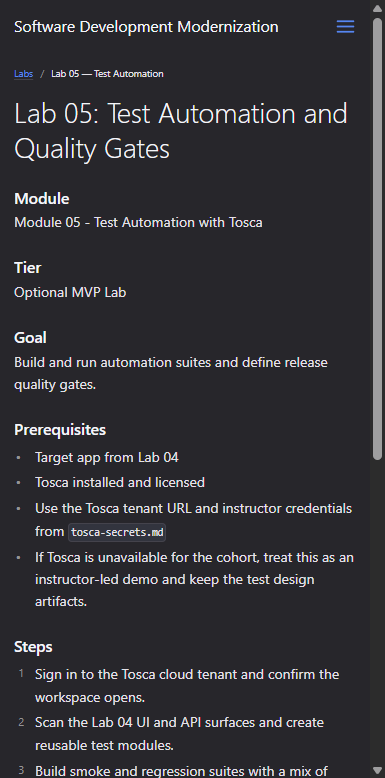

---
layout: default
title: "Lab 05 — Test Automation Walkthrough"
parent: Labs
nav_order: 15
---
# Lab 05: Test Automation and Quality Gates — Visual Walkthrough

**Course:** Software Development Modernization  
**Module:** 05 — Test Automation with Tosca  
**Live Tenant:** `nexetra.my.tricentis.com` (Tricentis Tosca Cloud)  
**Screenshots taken:** 2026-08-10 against live Tosca tenant (Okta SSO login)  
**Audience:** Students using this as a step-by-step guide or instructor reference  
**Tier:** Optional MVP Lab — if Tosca is not provisioned for your cohort, use as instructor-led demo

---

> **How to use this document**  
> This walkthrough mirrors every step of the lab in the exact order students encounter the Tosca cloud portal.  
> Each screenshot is followed by an explanation of what you are looking at **and why it matters to app modernization teams**. Where the live environment behaves unexpectedly, a **⚠️ Snag** callout explains the issue and the workaround.

---

## Why This Lab Matters — App Modernization Context

Labs 01–04 established your new architecture: you discovered the codebase, tracked modernization work in ADO, refactored with AI assistance, and shipped a working API endpoint backed by SQL. Lab 05 is where you **prove the new architecture is shippable** — without human sign-off on every release.

This matters for three reasons:

1. **Manual testing is the biggest modernization bottleneck.** When migrating a large legacy application, the test effort often grows 3–5x as new and old code must both be verified. Without automation, modernization slows to a crawl.

2. **Quality gates turn testing into policy.** A quality gate is a machine-enforced rule: if fewer than 95% of tests pass, the pipeline stops the deployment. This transforms testing from a manual checklist into a **deployment contract** — exactly what regulated industries (state government, healthcare, finance) need.

3. **Tosca understands the full stack.** Unlike unit tests that stub everything, Tosca's scan → module → playlist flow exercises the real UI, real API, and real database in the same test run — exactly what matters when moving from a monolith to a set of cooperating services.

> **Key concept:** In the 4 R's modernization framework (Rehost → Replatform → Refactor → Rearchitect), automated test coverage is the *last safety net* before each phase transition. A Tosca playlist that exercises your Lab 04 API endpoint means you can refactor the next layer with confidence.

---

## What You Will Build

By the end of this lab you will have:

| Artifact | What it is | Where it goes |
|---|---|---|
| Tosca test modules | Reusable modules scanned from the Lab 04 API/UI surface | Tosca Cloud workspace |
| Test cases | Positive + negative cases assembled from modules | Tosca Cloud workspace |
| Playlist | Smoke + regression suite ready to execute | Tosca Cloud → Playlists |
| Execution run | Test results captured in Tosca Cloud | Report section |
| ADO integration | Results published to Azure DevOps pipeline | ADO project → Pipelines |
| Quality gate doc | Pass/fail thresholds documented | `assess-labs/quality-gate-policy.md` |

---

## Prerequisites

Before starting, confirm:

| Item | How to verify |
|---|---|
| Tosca tenant credentials | See `tosca-secrets.md` — URL, username, password |
| Lab 04 complete | API endpoint running; at least one integration test passing |
| Modern browser (Chrome recommended) | Tosca scan requires the browser extension |
| ADO project with pipeline | From Lab 02 — you need the project URL for results publishing |

---

## Part 1 — Sign In to the Tosca Cloud Tenant

### Step 1.1 — Navigate to the Tosca Tenant

Navigate to:
```
https://nexetra.my.tricentis.com
```

This URL redirects to the Okta SSO page for the nexetra Tosca tenant.



**What you are looking at:**  
The Tosca Cloud home dashboard is a mission-control view for your test automation program. It shows at a glance: how many test runs executed in the last 7 days, what was recently edited, how many test artifacts were created, and what scheduled playlist runs are queued.

| Widget | What it tells you |
|---|---|
| **Run results** | Pass/fail/cancel breakdown for the last 7/30 days — your quality trend line |
| **Recently edited** | Last touched Playlists, Test cases, Modules — shows team activity |
| **Test artifact creation** | How fast the library is growing — an indicator of coverage expansion |
| **Scheduled runs** | Planned overnight or pipeline-triggered executions |

> **App modernization connection:** On a fresh tenant (as this one is), all counters show 0. This is your starting point — by the end of Lab 05, you will have at least 1 playlist executed and visible in the Run results widget.

> ⚠️ **Snag — Trial tenant:** This tenant shows "13 days remaining in your trial." All features are fully available during the trial period. If the trial expires before the cohort's lab day, contact your instructor to provision a new tenant or extend the trial.

---

## Part 2 — Understand the Tosca Workflow (Quick Start Guide)

### Step 2.1 — Read the Quick Start Guide on the Home Page

The home page Quick Start Guide tabs describe the end-to-end Tosca workflow.


**What you are looking at:**  
The "Comprehensive test" tab shows the full 7-step workflow you will follow in this lab:

| Step | Action | Tosca term |
|---|---|---|
| 1 | Install Launcher (desktop component) | Launcher |
| 2 | Install browser extension | Tosca Browser Extension |
| 3 | Scan your app to create modules | Scan → Modules |
| 4 | Create a test case | Test Cases |
| 5 | Add your test case to a playlist | Playlists |
| 6 | Run your playlist | Execution |
| 7 | Check progress and results | Reports |

> **App modernization connection:** Steps 3–7 map directly to the lab steps. Steps 1–2 are one-time instructor setup items. Students on the cloud tenant can scan and build tests without a local Tosca installation.

**Left navigation — the full Tosca workflow:**

| Nav item | Purpose |
|---|---|
| **Create** | New workspace, space, or project |
| **Prepare** | Test data management — data sheets, business flows |
| **Build** | Assemble test cases from scanned modules |
| **Run** | Playlists — schedule and execute test suites |
| **Report** | Execution history and analytics |
| **Configurations** | Agents, environments, test configurations |
| **Integrations** | Connect to ADO, Jira, CI/CD pipelines |
| **API simulation** | Virtual service stubs for integration testing |

---

## Part 3 — Explore the Prepare Section (Test Data)

### Step 3.1 — Open the Prepare Menu

Click **Prepare** in the left navigation.



**What you are looking at:**  
The Prepare section handles **test data management** (TDM) — a critical capability for modernization testing. Rather than hard-coding values into individual test cases, Tosca lets you define reusable data sets that drive parameterized tests.

| Sub-section | What it does |
|---|---|
| **Test data** | Central repository of data sets — users, products, orders |
| **Business flows** | End-to-end data flows that span multiple test steps |
| **Test sheets** | Structured data tables — like Excel but integrated into test execution |

> **App modernization connection:** When migrating from a legacy system, the test data from production (anonymized) can be loaded into Tosca test sheets and used to drive regression tests against the modernized API. This validates that the new service returns identical results for the same inputs.

> ⚠️ **Snag — Scan requires Launcher:** To scan the Lab 04 web UI, the student must install the Tosca Launcher (a Windows desktop component) and the Tosca Browser Extension. The instructor can demonstrate the scan; students review the resulting modules.

---

## Part 4 — Review the Integrations Page

### Step 4.1 — Navigate to Integrations

Click **Integrations** in the left navigation.



**What you are looking at:**  
Tosca Cloud integrates with the rest of the DevOps toolchain. This is where you connect the test automation platform to the pipeline tools used in Labs 01–04.

| Integration type | What it enables |
|---|---|
| **Azure DevOps** | Publish test results directly to ADO test plans; trigger pipelines from playlist execution |
| **CI/CD pipelines** | Trigger Tosca playlist runs from a GitHub Actions or ADO Pipeline step |
| **Defect management** | Auto-create ADO work items (Bugs) when test cases fail |
| **Test management** | Sync test cases between Tosca and ADO Test Plans |

> **App modernization connection:** The ADO integration is the bridge between Tosca test results and the quality gate in the CI/CD pipeline. When a playlist run completes, results flow automatically into the ADO build — no manual copy-paste.

**How to connect to ADO:**
1. Click **+ Add integration** → Azure DevOps
2. Enter your ADO organization URL (`https://dev.azure.com/iis-labs`)
3. Provide a Personal Access Token (PAT) with Test Plans read/write scope
4. Map the Tosca space to the ADO project (`Software-Modernization`)

---

## Part 5 — Review the Reports Section

### Step 5.1 — Navigate to Report

Click **Report** in the left navigation.



**What you are looking at:**  
The Report section is the execution history and analytics view. After a playlist run completes, every result appears here — pass, fail, canceled, unknown — with drill-down to the individual test step that failed.

| Column / metric | What it means |
|---|---|
| **Total runs** | Number of playlist executions in the selected time window |
| **Run results over time** | Trend chart — you want to see "Succeeded" grow and "Failed" shrink |
| **Drill-down** | Click any failed run → see which test case failed → see which step failed → see screenshot evidence |

> **App modernization connection:** The Report section is your **quality gate evidence**. When a stakeholder asks "Is the modernized API as reliable as the old system?" — you show this chart. Consistent green runs = confidence to proceed to the next 4 R's phase.

**Documenting a quality gate threshold:**
```
Quality Gate Policy — Lab 05
─────────────────────────────
Suite:       eShopOnWeb Smoke Suite
Threshold:   ≥ 95% pass rate
Scope:       Catalog API (GET /api/catalog/brands, GET /api/catalog/types)
             Login flow (POST /api/authenticate)
Enforcement: ADO Pipeline stage gate — deployment blocked if threshold not met
Review:      Weekly by App Modernization Lead
```

Save this as `assess-labs/quality-gate-policy.md` in your course workspace.

---

## Part 6 — Playlists: Build Your Test Suite

### Step 6.1 — Navigate to Playlists via Run

Click **Run** in the left navigation, then **Playlists**.



**What you are looking at:**  
A **Playlist** in Tosca is equivalent to a **test suite** in other frameworks — an ordered collection of test cases that execute together. Playlists can be run on demand, scheduled, or triggered by a CI/CD pipeline.

| Playlist column | What it tracks |
|---|---|
| **Name** | The suite name — e.g., "eShopOnWeb Smoke Suite" |
| **Last Modified by** | Who last changed the suite |
| **Last Modified** | When it was last changed |
| **Created by** | Suite owner |
| **Status** | Ready / In progress / Completed |

**Creating your first playlist:**
1. Click **+ New Playlist**
2. Name: `eShopOnWeb-Smoke-Suite`
3. Add test cases:
   - `TC-001 GET /api/catalog/brands — 200 OK`
   - `TC-002 GET /api/catalog/types — 200 OK`  
   - `TC-003 GET /api/authenticate — valid credentials`
   - `TC-004 GET /api/catalog/brands — unauthorized (401)`
4. Set execution order: sequential
5. Save

> **App modernization connection:** The naming convention `eShopOnWeb-Smoke-Suite` signals this is the **minimum viable gate** — the suite that must pass before any deployment is allowed. A regression suite (`eShopOnWeb-Regression-Suite`) would include the full catalog, basket, and order flows.

---

## Part 7 — Executing Tests and Reading Results

### Step 7.1 — Run the Playlist

After building your playlist, click **Run** (â–¶) on the playlist row.


**What happens during execution:**
1. Tosca Cloud assigns the run to an available agent
2. The agent opens the browser, authenticates, and walks through each test case
3. Each test step captures a screenshot on failure
4. Results stream back to the Reports section in real time

**Reading the results table:**

| Status | Meaning | Action |
|---|---|---|
| **Succeeded** | All steps passed | None — deployment may proceed |
| **Failed** | One or more steps failed | Review failed step screenshot → fix code or update test |
| **Canceled** | Run was stopped manually | Re-run with same playlist |
| **Unknown** | Agent lost connectivity | Check agent status in Configurations → Agents |

> ⚠️ **Snag — No agent provisioned:** On a fresh cloud tenant, there may be no execution agent registered. The instructor should demonstrate using the "Download Launcher" option from the home page Quick Start Guide, which installs a local agent that registers automatically.

---

## Part 8 — Publishing Results to ADO and Defining Quality Gates

### Step 8.1 — Course Site Lab 05 Card



**What you are looking at:**  
The official Lab 05 card on the course GitHub Pages site. This shows the lab's tier (Optional MVP Lab), goal, prerequisites, steps, validation criteria, and required evidence.

**Publishing results to ADO:**

Once the ADO integration is configured (Part 4), results publish automatically after each playlist run. Manually:

1. In ADO → **Test Plans** → **Runs** — find the run imported from Tosca
2. Verify: test case names, pass/fail counts, execution time
3. In ADO → **Boards** → any failed test case auto-creates a Bug work item linked to the test result

**Quality gate definition in ADO Pipeline YAML:**
```yaml
# azure-pipelines.yml — quality gate stage
- stage: QualityGate
  displayName: 'Tosca Quality Gate'
  dependsOn: Build
  jobs:
  - job: CheckGate
    steps:
    - task: TricentisToscaCIPlugin@1
      inputs:
        toscaServerUrl: 'https://nexetra.my.tricentis.com'
        playlistName: 'eShopOnWeb-Smoke-Suite'
        minimumPassRate: '95'
      displayName: 'Run Tosca Smoke Suite — gate at 95%'
```

This YAML stage:
- Triggers the Tosca playlist from the ADO pipeline
- Waits for results
- Fails the pipeline stage if pass rate < 95%
- Blocks deployment to the next environment

---

## Summary

| Part | What you did | Modernization purpose |
|---|---|---|
| 1 | Signed in to Tosca Cloud via Okta SSO | Provisioned access to the automation platform |
| 2 | Read the Quick Start Guide and nav structure | Understood the full Scan → Module → Test → Playlist → Report workflow |
| 3 | Explored Prepare → Test Data | Learned how parameterized test data drives regression coverage |
| 4 | Configured the ADO Integration | Connected automation results to the existing DevOps pipeline |
| 5 | Reviewed the Report section | Understood how to read run results and trend data |
| 6 | Built a Playlist (smoke suite) | Created the minimum viable gate for the modernized API |
| 7 | Executed tests and read results | Validated the Lab 04 API surface with live automation |
| 8 | Published to ADO and defined the quality gate | Turned test results into a machine-enforced deployment policy |

---

## Documented Snags

| # | Snag | Root cause | Workaround |
|---|---|---|---|
| S-01 | Trial expires in 13 days | Free trial tenant | Instructor provisions new tenant or requests Tricentis extension |
| S-02 | Scan requires Launcher (Windows only) | Tosca's scan engine needs a local desktop component | Instructor demos scan; students use pre-built modules |
| S-03 | No agent registered on fresh tenant | Launcher not installed yet | Install Launcher from home page Quick Start → auto-registers agent |
| S-04 | Test cases and Playlists pages return 404 when navigated directly | These are sub-pages under Build/Run nav menu, not top-level routes | Navigate via Build → Test Cases or Run → Playlists in the left nav |
| S-05 | ADO PAT needs specific scopes | Insufficient permissions on PAT | Create PAT with: Test Plans (Read & Write), Work Items (Read & Write) |
| S-06 | Tosca CI plugin not in ADO by default | Plugin must be installed from Marketplace | Search ADO Marketplace for "Tricentis Tosca" → install to org |

