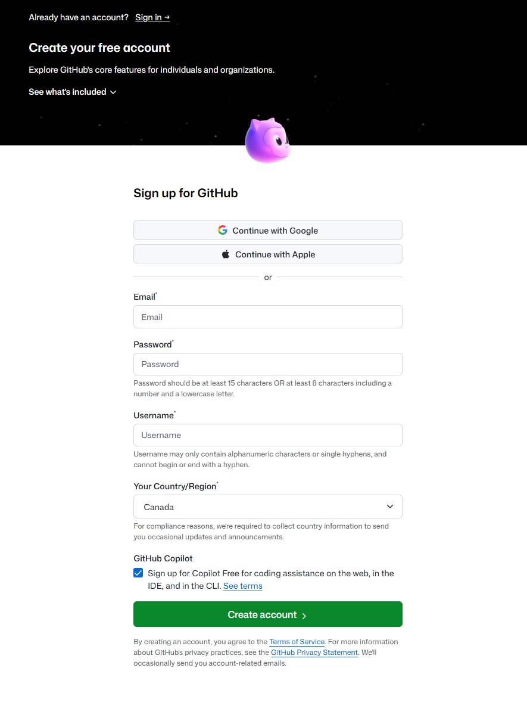
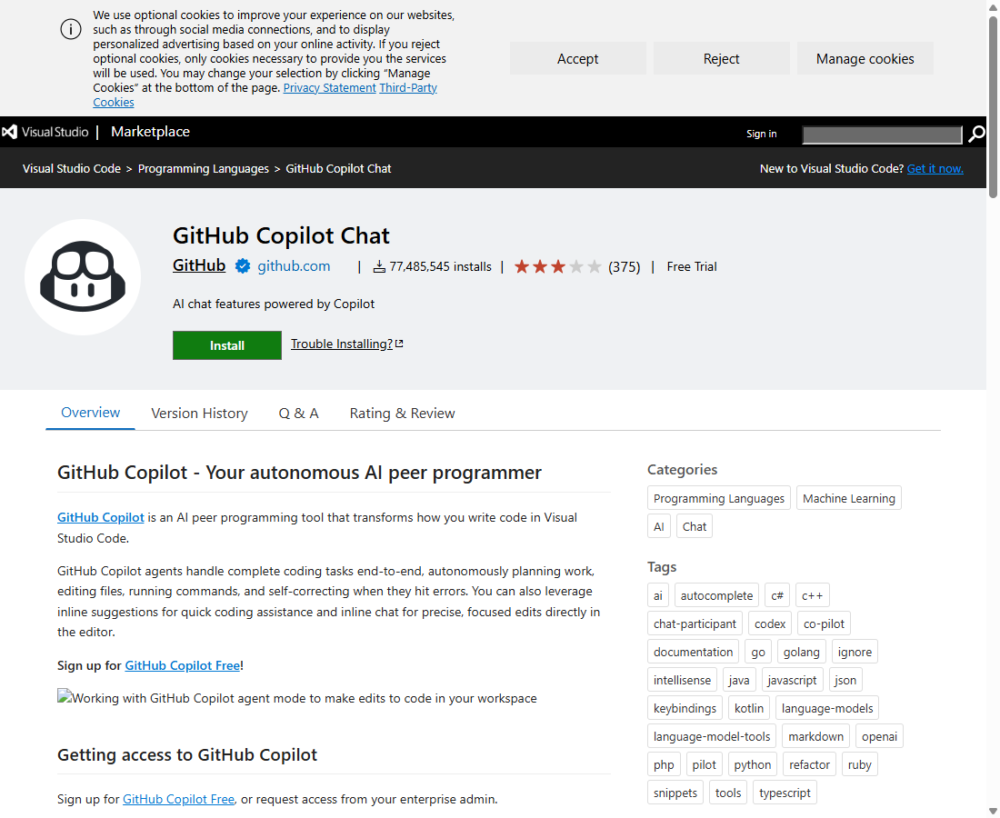

# Free GitHub Copilot Walkthrough — Getting Copilot Running in VS Code at No Cost

**Use this if:** you've never had a GitHub account, never used GitHub Copilot, and want the exact click-by-click path to get real AI coding help running in VS Code without paying anything or entering a credit card. Written for absolute beginners — if you already have a GitHub account, skip to [Step 4](#step-4--confirm-copilot-free-is-actually-on-or-turn-it-on-afterward).

**What you'll end up with:** a personal, free GitHub account, GitHub Copilot's **Free** plan active on it (no credit card, no trial that auto-charges you later), and the Copilot Chat extension working in VS Code.

**A note on "free," honestly:** GitHub Copilot Free is a real, permanent free tier — not a trial. It's limited (2,000 code completions and a smaller amount of chat use per month, refreshed monthly), not unlimited like the paid plans. That's plenty for coursework and personal projects. Sign up once, with your own real email — you don't need more than one account, and creating multiple/throwaway accounts to grab extra free allowances violates GitHub's terms of service, so don't do that.

**If you're a student:** GitHub also offers **Copilot Student**, a separate free plan with higher limits than Copilot Free, available once your school email or student ID is verified through GitHub Education. That's a better fit than Copilot Free if you qualify — see the callout at the end of this walkthrough for the link. This walkthrough covers Copilot Free because it works for everyone immediately, no verification wait required.

---

## What you'll need before starting

- A real email address you can check (Gmail, Outlook, school email, whatever you already use — it just needs to receive a verification code).
- VS Code installed. If you don't have it yet, see [Lab 1.1's Step 0a](lab1.1-walkthrough.md#step-0--before-you-start-setting-up-your-environment) for how to open it — or download it fresh from [code.visualstudio.com](https://code.visualstudio.com).
- About 10 minutes.

---

## Step 1 — Go to the GitHub sign-up page

Open a browser and go to **[github.com/signup](https://github.com/signup)**.

You'll land on a page that looks like this:



> **What is GitHub, and why do you need an account there at all?** GitHub is the company that makes Copilot (they're both owned by Microsoft). A GitHub account is what Copilot checks against to know who you are and which plan you're on — you can't use Copilot without one, the same way you can't use Gmail without a Google account.

---

## Step 2 — Fill in the sign-up form

Working down the form in the screenshot above:

1. **Email** — type a real email you can check. This does not need to be a special or new email — your everyday personal email is fine and is exactly what it's meant for.
2. **Password** — GitHub requires either 15+ characters, or 8+ characters with at least one number and one lowercase letter. A password manager's suggestion works well here.
3. **Username** — this becomes part of your public GitHub identity (`github.com/yourusername`). Letters, numbers, and single hyphens only — no spaces, no starting or ending with a hyphen. Pick something you don't mind classmates or an instructor seeing; you can change it later in settings if needed.
4. **Your Country/Region** — GitHub auto-detects this; correct it if it's wrong.
5. **GitHub Copilot checkbox** — look for **"Sign up for Copilot Free for coding assistance on the web, in the IDE, and in the CLI."** It's checked by default (visible in the screenshot above). **Leave it checked.** This is the entire trick to this walkthrough — it turns on Copilot Free automatically as part of account creation, with no separate purchase step.

Click **Create account**.

> **Why not just use "Continue with Google" or "Continue with Apple" instead?** Either of those works fine too and skips picking a password — pick whichever is more convenient. The Copilot Free checkbox still appears either way. This walkthrough shows the email/password path because it's the one every student can do without a Google or Apple account already logged into the browser.

---

## Step 3 — Verify your email and finish account setup

GitHub will send a verification code to the email you entered — a puzzle/CAPTCHA step may appear first, which is normal (it's just proving you're not a bot signing up thousands of accounts). Steps from here:

1. Check your email for a message from GitHub with a short numeric code.
2. Type that code into the box GitHub shows you.
3. GitHub may ask a couple of quick setup questions (how many people on your team, what you're using GitHub for, etc.). These are just onboarding surveys — answer honestly or pick "Just me" / "Learning" style options; nothing here affects whether Copilot Free is active.

Once you're through, you're looking at your new GitHub account's homepage. Copilot Free is already active — the checkbox in Step 2 handled it. There's no separate "activate Copilot" button to click.

---

## Step 4 — Confirm Copilot Free is actually on (or turn it on afterward)

If you skipped the checkbox by accident, or you already had a GitHub account from before this walkthrough existed, do this instead:

1. Go to **[github.com/settings/copilot](https://github.com/settings/copilot)** while signed in.
2. Look for your current plan. If it says **Copilot Free**, you're done — skip to Step 5.
3. If it shows no plan active, click **Get Copilot Free** (or equivalent enable button on that page) and confirm. No payment information is requested for the Free plan.

> **What exactly do you get on Copilot Free, in concrete numbers?** 2,000 code completions per month (the gray "ghost text" suggestions as you type), a smaller monthly allowance of Copilot Chat use, access to a rotating set of models through GitHub's automatic model picker (currently includes models like Claude Haiku 4.5 and GPT-5 mini), and Copilot CLI in the terminal. No credit card is ever requested for this plan.

---

## Step 5 — Install the Copilot Chat extension in VS Code

Open VS Code, then either:

- **Inside VS Code:** click the Extensions icon in the left sidebar (four squares), search `GitHub Copilot Chat`, click **Install**.
- **Or from a browser:** go to the extension's Marketplace page and click **Install** there — VS Code will open and prompt you to confirm.



> **Do you need to install anything else?** No — installing "GitHub Copilot Chat" also pulls in the base GitHub Copilot extension automatically as a dependency. One install covers both inline suggestions and the chat panel.

---

## Step 6 — Sign in to GitHub from inside VS Code

The first time you open Copilot Chat (a chat icon appears in VS Code's title bar or sidebar after installing), VS Code will prompt you to sign in:

1. Click **Sign in to GitHub** when prompted (or, if it doesn't prompt automatically, click the Accounts icon at the bottom-left of the VS Code window and choose **Sign in with GitHub to use GitHub Copilot**).
2. Your browser opens to a GitHub page asking you to authorize "Visual Studio Code" to access your account. Click **Authorize Visual-Studio-Code**.
3. Your browser will ask to switch back to (open) VS Code — allow it.
4. Back in VS Code, you should see a confirmation that you're signed in, and Copilot's icon in the bottom status bar should no longer show a "sign in" warning.

> **Is this safe — am I giving VS Code my GitHub password?** No. This uses OAuth (the "Authorize" screen you saw) — VS Code never sees your password, only a token that lets it act as you for Copilot specifically, which you can revoke any time from `github.com/settings/applications` without changing your password.

---

## Step 7 — Confirm it's actually working

Open any code file (or create a new one — e.g. a `.py` or `.js` file), type a comment describing what you want, like:

```python
# function that returns the square of a number
```

Press **Enter** and pause for a second. Gray "ghost text" should appear suggesting a function — that's Copilot's inline completions, working. Press **Tab** to accept it, or keep typing to ignore it.

Then open Copilot Chat (chat bubble icon, usually top-right of the editor or in the sidebar) and type a question like `Explain what this file does` — you should get a real response within a few seconds.

If neither happens: recheck Step 4 (plan actually active) and Step 6 (signed in) before troubleshooting further.

---

## If you qualify as a student: a better free option exists

GitHub Copilot **Student** gives verified students higher usage limits than Copilot Free, still at no cost. It requires verifying your student status once (school email, or uploading a photo of your student ID/enrollment proof if your school email isn't recognized), through **[github.com/education/students](https://github.com/education/students)**. Verification can take anywhere from minutes to a few days depending on your school. Copilot Free (this walkthrough) works immediately with zero waiting, so it's a reasonable way to get started today while a Student verification request processes in the background.

---

## Troubleshooting

| Problem | Likely cause / fix |
|---|---|
| No verification email arrives | Check spam/junk folder; GitHub sends from `noreply@github.com`. |
| Copilot Chat icon never appears in VS Code | Fully restart VS Code after installing the extension (same lesson as [Lab 1.2's PATH issue](lab1.2-walkthrough.md) — a running app doesn't always notice new installs until it restarts). |
| "Sign in to GitHub" loops without completing | Make sure your browser isn't blocking the redirect back to VS Code (`vscode://` link) — try a different default browser, or copy the code shown and paste it manually if VS Code offers a device-code fallback. |
| Ghost text / chat never respond | Confirm Step 4's plan page actually shows **Copilot Free** active, not just a GitHub account with no plan. |
