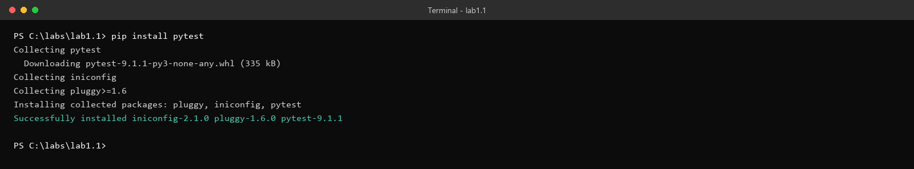
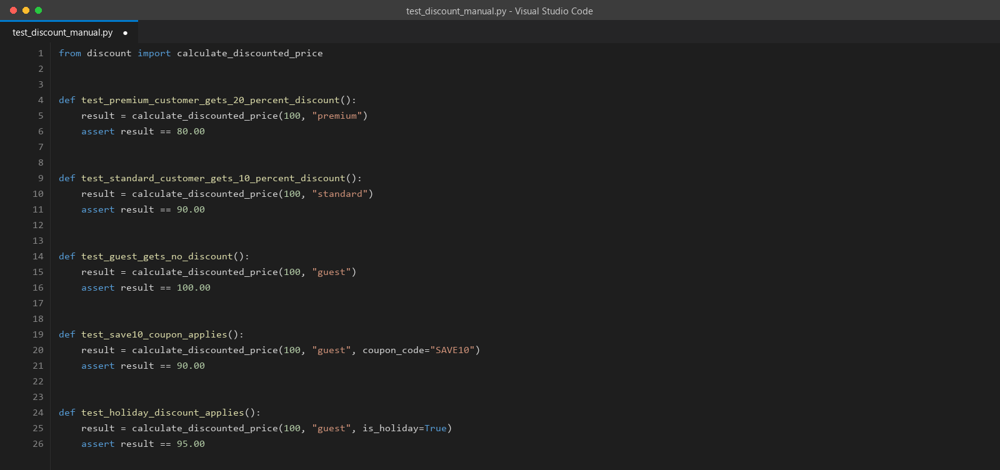
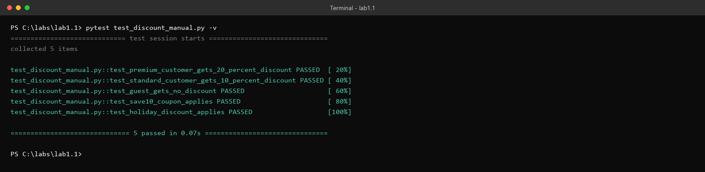
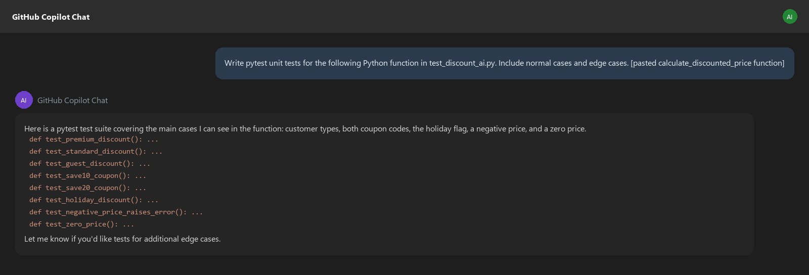
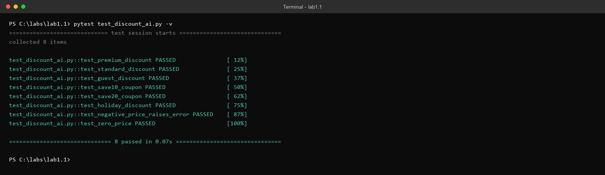
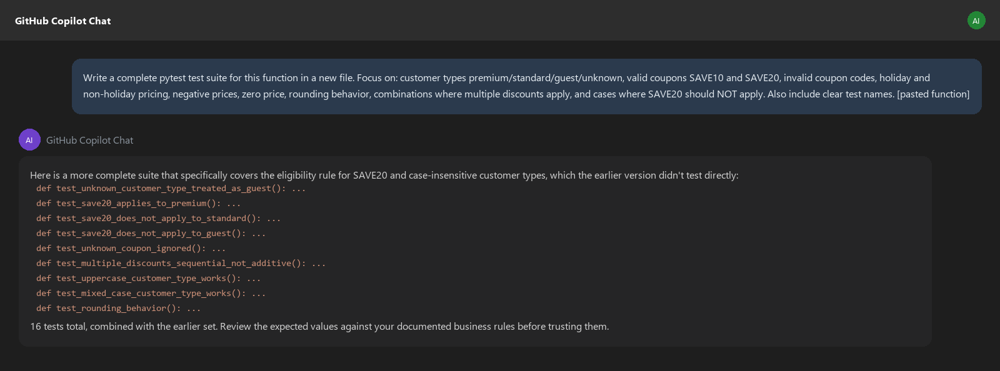
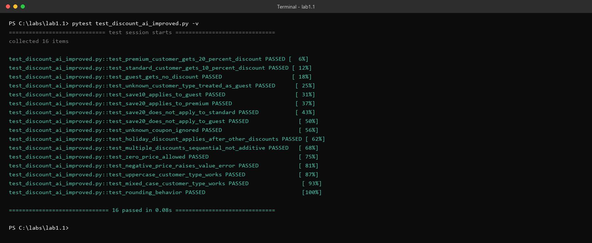

# Lab 1.1 Walkthrough — Manual Testing vs. AI-Assisted Testing

**Use this if:** you want to see exactly what this lab looks like, click for click, before you sit down at a lab machine — or if you're reviewing it afterward and don't have access to one anymore. Every screenshot below shows real, verified output: the code actually ran, the tests actually passed, in this exact form.

**Original lab:** `sample_coursware/AI-In-Software-Testing-main/1.1-testing-manual-vs-ai.md`

---

## What you're building toward

By the end you'll have three separate test files for the same function — one you wrote by hand, one an AI wrote from a quick prompt, and one an AI wrote from a better prompt — and a side-by-side sense of what each one is actually good for. The point of the lab isn't the function itself; it's noticing *where* your manual tests and the AI's tests diverge, and why.

---

## Step 1 — Create `discount.py`

Create a new file named `discount.py` and paste in the starter function exactly as given.


> **Why this function, specifically?** A simpler discount function — one that only checks customer type — would let you write three tests and call it done. This one stacks five separate behaviors on top of each other: customer tier, two different coupon codes (one of which only works for one tier), a holiday flag, rounding, and negative-price rejection. That stacking is deliberate. It's what creates the gap between "tests that make the obvious cases pass" and "tests that actually pin down the business rules" — which is the entire thing this lab is trying to show you. A trivial function can't produce that gap.

**Read the docstring before you write anything.** Notice these two rules in particular, because they're the ones almost everyone misses on a first pass:
- `SAVE20` only applies **if the customer is premium** — a standard customer with a `SAVE20` code just... doesn't get it. No error, no warning, it's silently ignored.
- Unknown customer types (a typo, a new tier someone forgot to add) fall through to guest pricing rather than raising an error.

---

## Step 2 — Install pytest

Open a terminal in the same folder and run:

```bash
pip install pytest
```



> **Why pytest and not `unittest`?** No real reason specific to this lab — it's just the standard for Python testing at this point, and its `assert`-based syntax (no `self.assertEqual(...)` boilerplate) keeps the tests readable, which matters more than usual here since you're about to compare them side by side against AI output.

---

## Step 3 — Write your manual tests, *before* touching any AI tool

Create `test_discount_manual.py`. The lab gives you one example test to start from:

```python
from discount import calculate_discounted_price


def test_premium_customer_gets_20_percent_discount():
    result = calculate_discounted_price(100, "premium")
    assert result == 80.00
```

Now extend it yourself. Here's a representative set a careful student might write in the first pass — five tests covering the obvious cases:



> **Why write these before using AI at all?** This is the actual experiment, not busywork. If you use AI first, you'll anchor on whatever it suggests and lose the ability to notice what *you* would have thought of on your own versus what it caught that you didn't. The comparison only means something if your manual pass happens in isolation.
>
> Notice what's *not* in this list yet: nothing about `SAVE20` being premium-only, nothing about case sensitivity (`"PREMIUM"` vs `"premium"`), nothing about negative prices, nothing about rounding. That's not a mistake in this walkthrough — it's realistic. Those are exactly the cases the lab's "Common Missed Cases" section calls out, and they're the ones worth watching for when you get to the comparison step.

---

## Step 4 — Run your manual tests

```bash
pytest test_discount_manual.py -v
```



All 5 pass — which tells you the tests are *correct*, not that they're *complete*. That distinction is the whole lesson of this lab.

---

## Step 5 — Use AI with a zero-shot prompt

Now bring in ChatGPT, Copilot Chat, or whatever AI tool you have access to. Use the lab's suggested zero-shot prompt — just the instruction, no extra guidance:

> *"Write pytest unit tests for the following Python function in `test_discount_ai.py`. Include normal cases and edge cases. [paste the function]"*



Save whatever it gives you as `test_discount_ai.py` and run it:

```bash
pytest test_discount_ai.py -v
```



> **Why does the zero-shot version land at 8 tests instead of 5 or 20?** A bare "include edge cases" prompt gets you broad-but-shallow coverage — the AI reliably thinks of negative price and zero price (classic edge cases it's seen a thousand times), and it does test both coupon codes. What it typically *doesn't* do without being told is verify the **eligibility rule** — that `SAVE20` should silently fail for a standard customer, not just succeed for a premium one. It tested that SAVE20 works; it didn't test that SAVE20 *doesn't* work when it shouldn't. That's a subtle but real gap, and it's exactly the kind of thing a zero-shot prompt tends to skip: the AI doesn't know which parts of your docstring are the parts that actually matter until you tell it.

---

## Step 6 — Improve the prompt and try again

This time, name the specific things you want covered — including the negative case (SAVE20 *not* applying):

> *"Write a complete pytest test suite for this function in a new file. Focus on: customer types premium/standard/guest/unknown, valid coupons SAVE10 and SAVE20, invalid coupon codes, holiday and non-holiday pricing, negative prices, zero price, rounding behavior, combinations where multiple discounts apply, and cases where SAVE20 should NOT apply. Also include clear test names. [paste the function]"*



Save the result as `test_discount_ai_improved.py` and run it:

```bash
pytest test_discount_ai_improved.py -v
```



> **Why did naming the cases explicitly roughly double the test count?** Every phrase in that improved prompt maps to a test the zero-shot version was missing: "cases where SAVE20 should NOT apply" → the two negative-eligibility tests; "customer types ... unknown" → the case-insensitivity and unknown-type tests; "combinations where multiple discounts apply" → the sequential-not-additive test. This is the core prompting lesson of the whole course, not just this lab: **the AI didn't get smarter between these two prompts — you got more specific.** Everything it produced the second time was implicit in the function all along; it just needed to be asked for by name.

---

## Step 7 — Compare, honestly

Fill in the checklist from the lab yourself, using the three files you now have. Here's how the run above actually breaks down, if you want a reference point:

| Test Case | Manual (5 tests) | Zero-shot AI (8 tests) | Improved AI (16 tests) |
|---|:---:|:---:|:---:|
| Premium / standard / guest discount | ✅ | ✅ | ✅ |
| SAVE10 applies | ✅ | ✅ | ✅ |
| SAVE20 applies to premium | — | ✅ | ✅ |
| **SAVE20 does *not* apply to standard/guest** | — | — | ✅ |
| Holiday discount | ✅ | ✅ | ✅ |
| Negative price raises `ValueError` | — | ✅ | ✅ |
| Zero price allowed | — | ✅ | ✅ |
| **Unknown customer type → guest** | — | — | ✅ |
| **Unknown coupon code ignored** | — | — | ✅ |
| **Case-insensitive customer type** | — | — | ✅ |
| **Rounding behavior verified** | — | — | ✅ |
| **Multiple discounts apply sequentially, not additively** | — | — | ✅ |

> **Why does this table matter more than the pass/fail counts?** Because "16 tests passed" and "5 tests passed" both *sound* like success. A green checkmark tells you your tests didn't find a bug — it says nothing about whether your tests were even capable of finding one. The bold rows above are the ones where a genuinely wrong implementation could slip through the manual and zero-shot suites without either one noticing. That's the real risk this lab is trying to make visible: not "did the tests pass," but "what could break without any of these tests catching it."

---

## Discussion questions (for your own notes, or the group)

1. Which cases did you think of manually that the table above didn't predict?
2. Did the zero-shot AI find anything you'd genuinely missed, or just formalize things you'd have gotten to eventually?
3. Look at the bold rows in the table — would you have caught that gap in a code review, without running mutation testing or coverage tools first?
4. Now that you've seen the improved prompt's output, would you trust it without reading every assertion first? What would make you check one twice?

---

## Key takeaway

AI is fast at generating breadth once you tell it what breadth you need. It is not naturally good at inferring which of your business rules are the ones with a trap in them — that's still a reading-comprehension task, and it's still yours. The manual pass isn't a step you do *instead of* using AI; it's what teaches you which questions to ask it.
