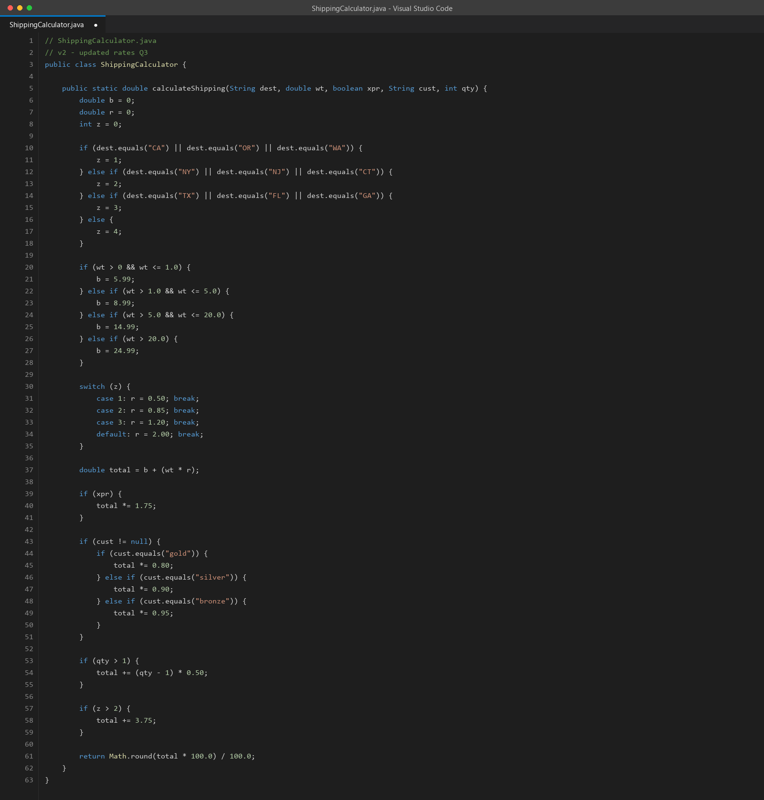
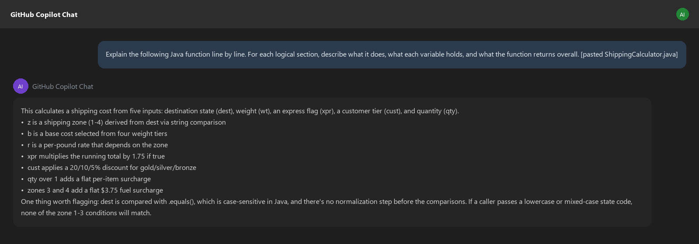
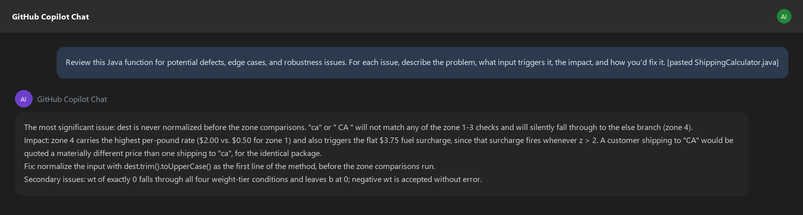
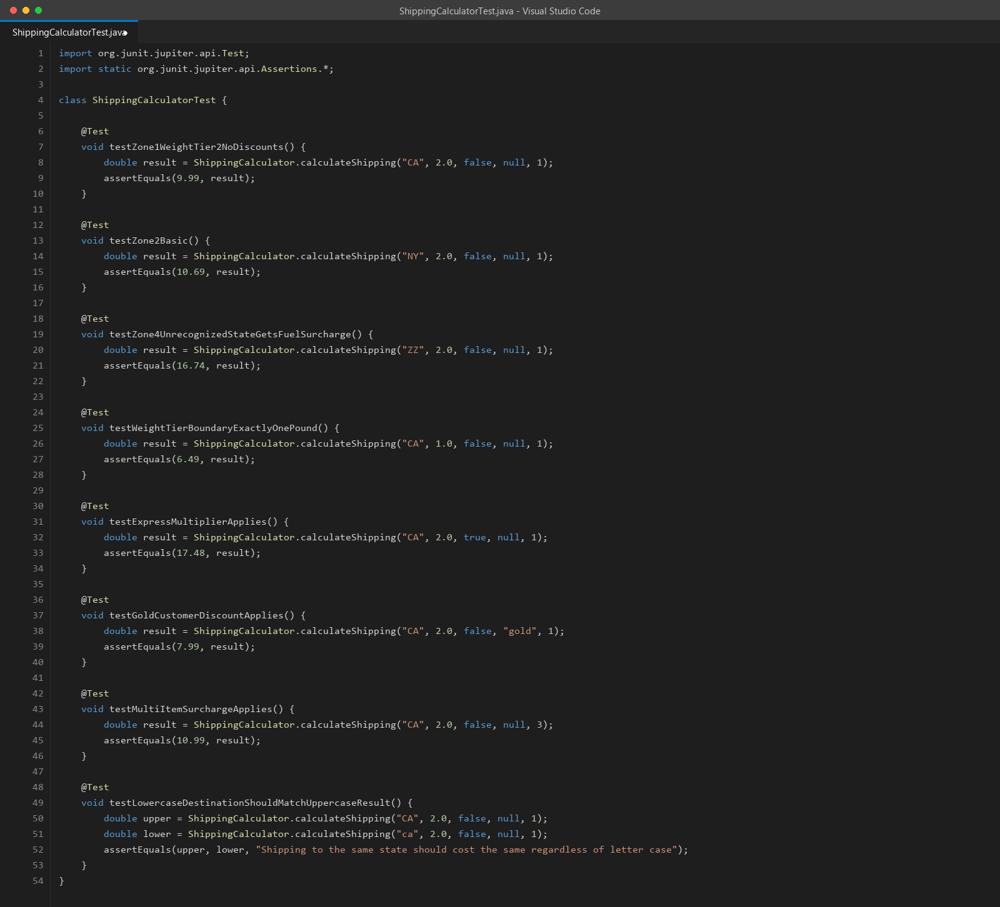
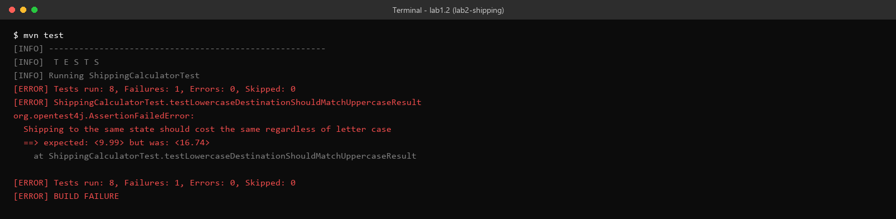
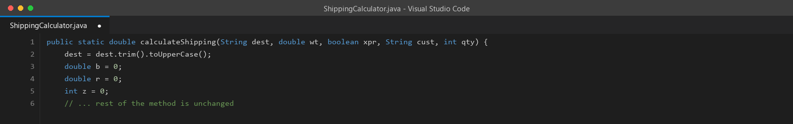
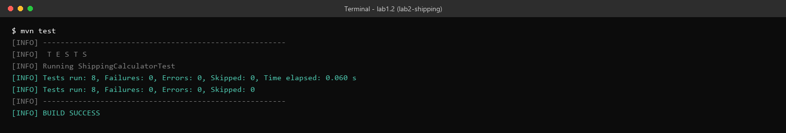

# Lab 1.2 Walkthrough — Reverse Engineering Legacy Code with AI

**Use this if:** you want to see exactly what this lab looks like, click for click, before sitting down at a lab machine — or if you're reviewing it afterward. Every result below is real: the Java code actually compiled, the tests actually ran against it (via a real JDK 21 + Maven 3.9 setup), and the bug reveal you'll read about genuinely happened, to the exact dollar amount the lab describes.

**Original lab:** `sample_coursware/AI-In-Software-Testing-main/1.2-reverse-engineer-legacy-code.md`

**New to Maven or Java projects?** This lab switches languages from Lab 1.1 (Python) to Java, and Java projects need a specific folder layout plus a `pom.xml` config file before anything will compile. **Step 0** below covers all of that, click for click. If you've built a Maven project before, skip to [Step 1](#step-1--read-the-code-yourself-first-before-any-ai-tool).

---

## What you're building toward

You've inherited a shipping calculator with no documentation, no tests, and no one left who remembers what it's supposed to do. The goal isn't just to understand it — it's to find the one input that makes it quietly charge the wrong price, without an error, without a crash, without anything flagging it. That's the class of bug this lab is built around: not the kind that breaks loudly, the kind that ships.

---

## Step 0 — Before You Start: Setting Up the Java/Maven Project

If Lab 1.1 was your first time in VS Code, this lab adds two new tools on top of that: **Java** (the language) and **Maven** (the tool that compiles the code and runs the tests). Here's everything needed before Step 1 makes sense.

### 0a. Confirm Java and Maven are installed

Open a terminal in VS Code (**Terminal → New Terminal**, same as Lab 1.1) and run:

```powershell
java -version
mvn -version
```

You should see version output for both — something like `openjdk version "21..."` and `Apache Maven 3.9...`. If both print version numbers, skip straight to **0b**.

**If `java -version` or `mvn -version` errors with "not recognized as an internal or external command"**, one or both tools genuinely aren't installed on this machine. That's happened on some lab machines — it's not something you did wrong, and it's fixable yourself in a few minutes without needing admin help, using Windows' built-in package manager, `winget`.

#### Installing Java (if `java -version` failed)

In the terminal, run:

```powershell
winget install Microsoft.OpenJDK.21
```

Type `Y` and press **Enter** if it asks you to accept a license agreement. This installs a free, Microsoft-maintained build of Java 21.

#### Installing Maven (if `mvn -version` failed)

```powershell
winget install Apache.Maven
```

Same deal — accept any license prompt with `Y`.

#### Making the new tools show up

Installers update your system's `PATH` (the list of places Windows looks for commands), but a terminal that was already open won't notice until it's restarted:

1. **Close every terminal panel in VS Code** (click the trash-can/bin icon on each, or click into the panel and press Ctrl+Shift+`` ` `` to open a fresh one after closing).
2. Fully close and reopen VS Code itself — this matters, not just the terminal, since VS Code also caches the PATH it started with.
3. Reopen your `lab2-shipping` folder, open a new terminal, and re-run both checks:
   ```powershell
   java -version
   mvn -version
   ```
   Both should now print version numbers.

**If `winget` itself isn't recognized, or the installs fail:** don't keep troubleshooting solo — flag your instructor or ProTech support (see [Lab Access & Credentials](../../docs/ai-software-testing/lab-access.md)) so they can either fix it or swap you to a working machine. `winget` ships with Windows 10/11 by default, so its absence usually means something unusual about that specific machine's image.

> **Why two separate tools?** Java is the *language* the code is written in — it needs a compiler to turn `.java` files into something the computer can run. Maven is a *build tool* that handles calling that compiler for you, downloads any libraries your code depends on (like JUnit, the testing library this lab uses), and gives you a single command (`mvn test`) that compiles everything and runs the tests in one step. You could do all of this by hand, but nobody does — Maven is the standard way.

### 0b. Create the project folder structure

Java (and Maven specifically) expect files in an exact folder layout — not just "all files in one folder" like Lab 1.1's Python setup. Rather than creating each nested folder one click at a time in the Explorer panel, it's faster to let the terminal do it:

1. First, open (or create) an empty folder called `lab2-shipping` the same way you did in Lab 1.1 Step 0b (**File → Open Folder…** → **New Folder**).
2. With that folder open in VS Code, open a terminal (**Terminal → New Terminal**) and run this single command, which creates every nested folder the project needs at once:

```powershell
mkdir src\main\java, src\test\java
```

3. Confirm it worked by looking at the **Explorer** panel on the left — you should now see `src`, and expanding it should show `main\java` and `test\java` as nested folders.

> **Why does the folder layout matter so much here, but not in Lab 1.1?** Maven has a hard-coded convention: it looks for your actual program code in `src/main/java` and your test code in `src/test/java`, always, with no exceptions. Get the path wrong — an extra folder, a typo, code sitting directly in the project root — and Maven will report zero source files found rather than telling you where you went wrong. Python (Lab 1.1) doesn't enforce a layout like this; Java's build tools do.

### 0c. Create `pom.xml`

`pom.xml` is Maven's configuration file — it tells Maven the project's name, which Java version to compile against, and which libraries to download (here, JUnit 5, the testing framework this lab's tests are written in). It lives at the top level of `lab2-shipping`, next to the `src` folder, not inside it.

Create it the same way you created `discount.py` in Lab 1.1 (hover `LAB2-SHIPPING` in Explorer → **New File** icon → type `pom.xml` → **Enter**), then paste in:

```xml
<?xml version="1.0" encoding="UTF-8"?>
<project xmlns="http://maven.apache.org/POM/4.0.0"
         xmlns:xsi="http://www.w3.org/2001/XMLSchema-instance"
         xsi:schemaLocation="http://maven.apache.org/POM/4.0.0 http://maven.apache.org/xsd/maven-4.0.0.xsd">
    <modelVersion>4.0.0</modelVersion>

    <groupId>com.lab</groupId>
    <artifactId>shipping-calculator</artifactId>
    <version>1.0-SNAPSHOT</version>

    <properties>
        <maven.compiler.source>11</maven.compiler.source>
        <maven.compiler.target>11</maven.compiler.target>
    </properties>

    <dependencies>
        <dependency>
            <groupId>org.junit.jupiter</groupId>
            <artifactId>junit-jupiter</artifactId>
            <version>5.10.0</version>
            <scope>test</scope>
        </dependency>
    </dependencies>

    <build>
        <plugins>
            <plugin>
                <groupId>org.apache.maven.plugins</groupId>
                <artifactId>maven-surefire-plugin</artifactId>
                <version>3.1.2</version>
            </plugin>
        </plugins>
    </build>
</project>
```

Save it (**Ctrl+S**). You don't need to understand every line — just know it's what makes `mvn test` in Step 5 and 7 actually work.

### 0d. Install the Java extension (if VS Code prompts you)

The first time you open a `.java` file, VS Code will likely show a popup in the bottom-right suggesting the **Extension Pack for Java**. Click **Install**. This adds Java-aware autocomplete, error-checking, and a "Run Test" button above each test method — none of it required to finish the lab from the terminal, but it makes the editor a lot more helpful. If the popup doesn't appear and you want it anyway, click the Extensions icon in the left sidebar (four squares), search `Extension Pack for Java`, and click **Install**.

You're now set up to create `ShippingCalculator.java` in Step 1, inside `src/main/java`.

---

## Step 1 — Read the code yourself first, before any AI tool

Create the Maven project structure and paste in `ShippingCalculator.java` exactly as given.



> **Why does the lab insist on a manual read first?** Because the entire second half of this lab depends on you having a "before" state to compare against. If you let AI explain this code first, you'll never know which parts you genuinely couldn't follow versus which parts you'd have eventually worked out yourself. The variable names (`b`, `r`, `z`, `wt`, `xpr`, `cust`) are abbreviated on purpose — this is what actual inherited code looks like, and the discomfort of reading it cold is part of the exercise.
>
> Before moving on, try to answer honestly: what does `z` represent? What happens if `dest` is `"ca"` instead of `"CA"`? Don't look ahead — that second question is the whole lab.

---

## Step 2 — Ask AI to explain the code

Paste the function into your AI tool with the lab's suggested prompt:



> **Notice what the explanation surfaced without being asked to hunt for bugs specifically** — it flagged the case-sensitivity gap as part of a plain "explain this" prompt. That's not guaranteed; a less specific prompt, or a different AI tool, might describe the same code correctly without ever mentioning that `.equals()` is case-sensitive in Java. Compare this against your own answer to "what happens if `dest` is `'ca'`" from Step 1 — did you catch it, did the AI catch it, or did neither of you until the next step made it explicit?

---

## Step 3 — Ask AI to find defects specifically

A more targeted prompt, asking specifically for problems rather than an explanation:



> **Why does asking for defects specifically surface more than asking for an explanation did?** An "explain this" prompt optimizes for a correct summary of what the code does. A "find defects" prompt optimizes for what's *wrong* with it — different task, different attention. This is the same lesson Lab 1.1 taught with test generation: the AI doesn't spontaneously audit code for you as a side effect of describing it. You have to ask for the audit directly.

---

## Step 4 — Generate tests, including one that targets the case-sensitivity gap directly

Create `ShippingCalculatorTest.java`. Alongside the usual zone/weight/discount tests, include one that compares uppercase and lowercase input directly against each other:



> **Why write `testLowercaseDestinationShouldMatchUppercaseResult` as a comparison between two calls, instead of hard-coding an expected dollar amount?** Because the test's whole point is to check a *relationship* — "the same package to the same place should cost the same regardless of how the state code was typed" — not a specific number. A test that just asserts `calculateShipping("ca", ...) == 9.99` would require you to already know the correct answer, which defeats the purpose of using the test to *discover* that the two calls disagree.

---

## Step 5 — Run the tests against the original code

```bash
mvn test
```



> **This is the actual bug, caught in the act.** Seven tests pass. One doesn't — and the failure message tells you exactly what the lab's "Hidden Bug Reveal" section describes in prose: the same shipment, same weight, same everything except the letter case of the destination, comes back **$9.99 for `"CA"` and $16.74 for `"ca"`** — a $6.75, 68% difference, for input that any reasonable person would consider identical. This is exactly why the lab picked this specific bug to teach with: nothing crashes, nothing throws an exception, nothing looks wrong in a casual code review. It just quietly charges some customers more, based entirely on whether whatever system called this function happened to send uppercase or lowercase state codes.

---

## Step 6 — Trace it manually, then apply the one-line fix

**Never traced code by hand before?** "Tracing manually" just means: pick one specific input, then go through the function line by line, writing down what each variable equals *at that point*, the same way you'd follow a recipe — instead of guessing or running it. It's slower than just running the code, but it's how you find *why* a bug happens, not just *that* it happens. Here's the full trace for both inputs, spelled out line by line so you can see the technique, not just the conclusion:

**Trace 1 — `dest = "CA"`** (everything else held constant: `wt = 2.0`, `xpr = false`, `cust = null`, `qty = 1` — the same inputs behind the `$9.99` result from Step 5)

| Line in the code | What happens | Variable state after |
|---|---|---|
| `if (dest.equals("CA") ...)` | `"CA".equals("CA")` → `true` | `z = 1` |
| `if (wt > 1.0 && wt <= 5.0)` | `2.0` is in this range | `b = 8.99` |
| `switch (z) { case 1: ... }` | `z` is `1` | `r = 0.50` |
| `total = b + (wt * r)` | `8.99 + (2.0 * 0.50)` | `total = 9.99` |
| `if (xpr)` | `false` — skipped | `total` unchanged |
| `if (cust != null)` | `null` — skipped | `total` unchanged |
| `if (qty > 1)` | `1 > 1` is `false` — skipped | `total` unchanged |
| `if (z > 2)` | `1 > 2` is `false` — skipped | `total` unchanged |
| `return Math.round(total * 100.0) / 100.0` | rounds `9.99` | **returns `9.99`** |

**Trace 2 — `dest = "ca"`** (same other inputs: `wt = 2.0`, `xpr = false`, `cust = null`, `qty = 1` — the same inputs behind the `$16.74` result from Step 5)

| Line in the code | What happens | Variable state after |
|---|---|---|
| `if (dest.equals("CA") ...)` | `"ca".equals("CA")` → **`false`** (Java string comparison is case-sensitive) | `z` still `0` |
| `else if (dest.equals("NY") ...)` | `"ca".equals("NY")` → `false` | `z` still `0` |
| `else if (dest.equals("TX") ...)` | `"ca".equals("TX")` → `false` | `z` still `0` |
| `else { z = 4; }` | none of the three conditions matched, so this runs | `z = 4` |
| `if (wt > 1.0 && wt <= 5.0)` | same as before | `b = 8.99` |
| `switch (z) { default: ... }` | `z` is `4`, no `case` matches it, so `default` runs | `r = 2.00` |
| `total = b + (wt * r)` | `8.99 + (2.0 * 2.00)` | `total = 12.99` |
| `if (xpr)` / `if (cust != null)` / `if (qty > 1)` | all skipped, same as before | `total` unchanged |
| `if (z > 2)` | `4 > 2` is `true` this time | `total = 12.99 + 3.75 = 16.74` |
| `return Math.round(total * 100.0) / 100.0` | rounds `16.74` | **returns `16.74`** |

Same package, same weight, same everything — `"CA"` returns `$9.99`, `"ca"` returns `$16.74`, matching the failing test from Step 5 exactly. The only difference between the two traces is which branch `dest.equals(...)` took, and that one branch decision cascades into two more (the shipping rate `r` *and* the fuel surcharge), which is exactly why the dollar gap ends up so much larger than "one wrong `if`" might suggest.

> **Why bother tracing by hand instead of just trusting the failing test from Step 5?** The failing test tells you *that* the two calls disagree. It doesn't tell you *why* — and without the why, the "fix" in this step could easily be the wrong one (patching the fuel surcharge instead of the actual root cause). Tracing by hand forces you to find the exact line where the two paths diverge, which is what tells you where the real fix belongs.

Add one line, as the first line inside the method, before the zone comparisons:



> **Why `.trim()` in addition to `.toUpperCase()`?** The lab's fix line does both, and it's worth noticing why: `.toUpperCase()` alone fixes the case problem, but a stray leading or trailing space (`" CA"` from a copy-paste, a CSV export, a form field) would *still* fail every `.equals()` check even after uppercasing. Fixing exactly the bug you found, and not the adjacent one sitting right next to it, is how bugs like this survive a "fix" and come back a month later under a slightly different input.

---

## Step 7 — Re-run and confirm all 8 pass

```bash
mvn test
```



All 8 tests pass, including the one that was failing — confirming the fix resolves the exact discrepancy it was written to catch, not just a related symptom.

---

## Discussion questions (for your own notes, or the group)

1. Would this bug have survived a code review? Reading the original function top to bottom, is there anything that visually signals "this input isn't normalized"?
2. This bug never throws an exception or logs an error — it just returns a wrong-but-plausible number. What kind of test *category* (not this specific test) is designed to catch that class of bug in general?
3. The fix touches one line and adds `.trim()` alongside `.toUpperCase()` for a reason that isn't obvious from the bug report alone. What does that suggest about fixing a bug based only on the *specific* failing input you found, versus the general *class* of input the fix needs to handle?
4. If you'd only asked AI to "explain this code" and never asked it to "find defects," would you have caught this before writing tests?

---

## Key takeaway

The most dangerous bugs in inherited code aren't the ones that crash — they're the ones that return a wrong answer confidently and quietly. AI is genuinely good at recognizing this specific pattern (unnormalized string comparison) because it's seen it thousands of times before, but it surfaces reliably only when you ask the right question — "explain this" and "find defects in this" are different prompts that produce different depths of review, even against the exact same code.
