# Lab 1.3 Walkthrough — Coverage Gap Analysis and Mutation Testing

**Use this if:** you want to see exactly what this lab looks like, click for click, before sitting down at a lab machine — or if you're reviewing it afterward. This is also the one lab in the course with a real, confirmed rough edge: **mutation testing does not run at all on native Windows.** This walkthrough shows you that failure honestly, exactly as it happens, and then shows the real fix — so you're not caught off guard mid-lab.

**Original lab:** `sample_coursware/AI-In-Software-Testing-main/1.3-coverage-mutation-testing.md`

---

## What you're building toward

Two passing tests is not the same as two tests that actually cover the code. You'll start from a deliberately weak 2-test file, use a coverage report to find exactly what it's missing, close those gaps, and then go one level deeper with mutation testing — which checks not just whether your tests *ran* the code, but whether they'd actually *notice* if the code were wrong.

---

## Step 1 — Create `discount.py`

Same starter function as Lab 1.1. If you already have it from that lab, reuse it.

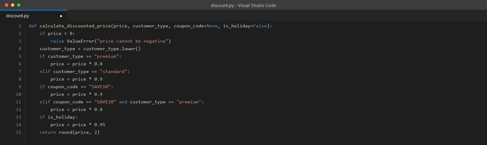

---

## Step 2 — Create `test_discount_partial.py`

This is the lab's deliberately weak starting point — two tests, both obviously correct, both passing.

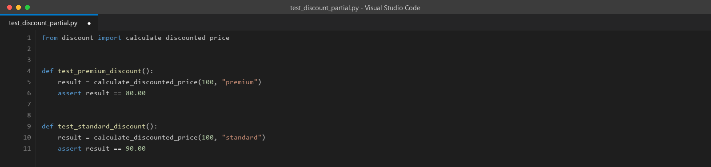

> **Why start from a weak test file on purpose?** This mirrors a very real, very common situation: a developer tests the two most obvious inputs, everything passes, nobody ever runs a coverage report, and the team quietly believes the code is tested. It isn't. The lab wants you to *feel* that false confidence before the coverage report takes it away from you.

---

## Step 3 — Run the baseline coverage report

```bash
pip install pytest pytest-cov
pytest test_discount_partial.py --cov=discount --cov-report=term-missing -v
```

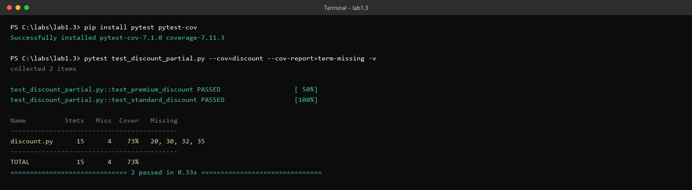

> **A heads-up before you run this yourself:** the original lab text shows an example output of "13 stmts, 69% cover, missing lines 15, 25, 27, 30." When this walkthrough's author actually ran the exact starter code above, the real result was **15 statements, 73% coverage, missing lines 20, 30, 32, 35** — different numbers, on a newer `pytest-cov`. The four *gaps themselves* are identical (the `raise ValueError` line, the SAVE10 body, the SAVE20 body, the holiday body) — only the line-number bookkeeping shifted. If your numbers don't match the lab document exactly, you haven't done anything wrong; trust what your own terminal tells you over the printed example.

Now run it again with branch coverage on:

```bash
pytest test_discount_partial.py --cov=discount --cov-report=term-missing --cov-branch -v
```

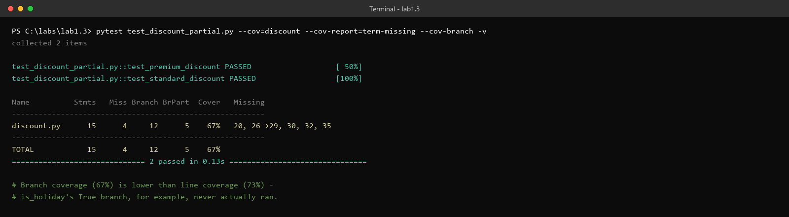

> **Why is branch coverage (67%) lower than line coverage (73%)?** Line coverage only asks "did this line run at all." The line `if is_holiday:` runs on every single test — so it counts as covered — but `is_holiday` is `False` both times, so the code *inside* that `if` never runs. Branch coverage catches that; line coverage can't. This is the actual mechanical reason the lab spends a whole section explaining the difference: it's not academic, you can see it happen in your own two-line diff between these two runs.

---

## Step 4 — Ask AI to turn the coverage report into tests

Paste the terminal output above and the function into your AI tool with a prompt like the lab's suggested one:

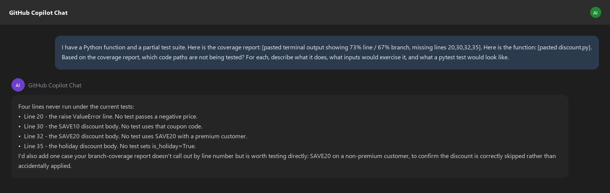

> **Why paste the coverage report *and* the function, instead of just asking "write more tests"?** The report is what tells the AI exactly which lines are dead weight — without it, you're back to a generic "cover the edge cases" prompt, which (per Lab 1.1) tends to miss the specific eligibility rules your business logic actually cares about. The coverage report turns a vague request into four concrete, checkable targets.

---

## Step 5 — Write the tests and reach 100%

Create `test_discount_coverage.py` with tests for each of the four gaps:

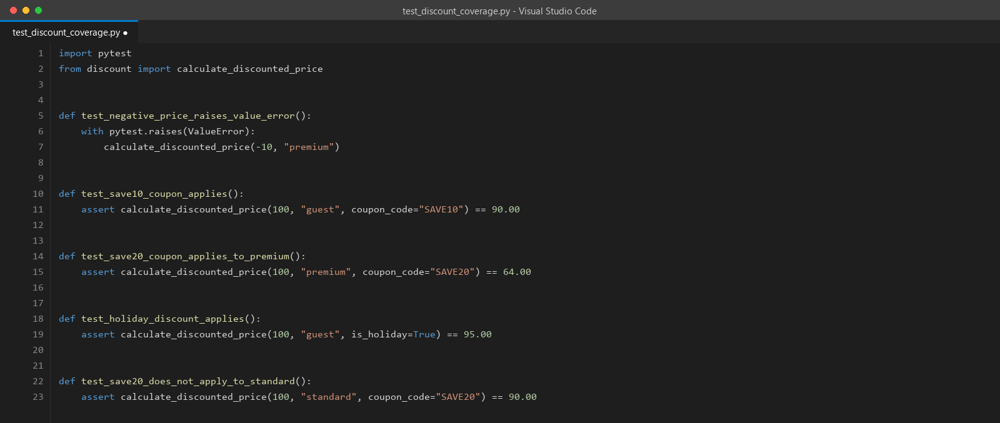

Run everything together:

```bash
pytest --cov=discount --cov-report=term-missing --cov-branch -v
```

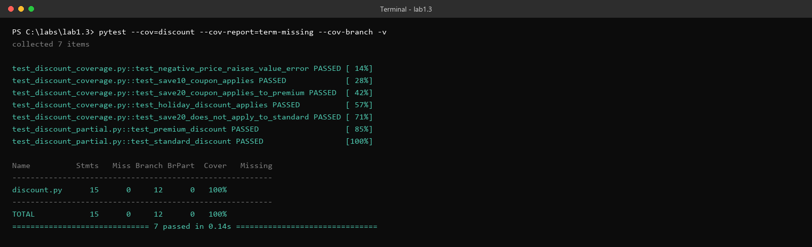

> **100% here is a real, verified result** — every line and every branch in this file did in fact execute during this run. Worth sitting with for a second: coverage tells you the tests *ran* every path. It says nothing yet about whether they'd catch a bug in any of those paths. That's exactly the gap the next section closes.

---

## Step 6 — Install mutmut and hit the wall

```bash
pip install mutmut
```

Create `setup.cfg`:
```ini
[mutmut]
paths_to_mutate=discount.py
tests_dir=.
```

Now run it:

```bash
mutmut run
```

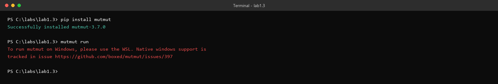

> **This is real, and it is not a typo or a broken lab machine.** `mutmut` genuinely does not support running natively on Windows — the tool itself tells you so, with a link to the open GitHub issue tracking it. If you're on a Windows laptop and this is the first time you're hitting it, you have not done anything wrong. **Skip ahead to Step 7 for the fix**, and don't burn time troubleshooting a pip reinstall or a Python version — that won't help here.
>
> If you're on one of the ProTech-provisioned Linux/EC2 lab machines rather than a personal Windows laptop, you likely won't hit this at all — `mutmut run` should work immediately. This wall is specifically a Windows-laptop problem.

---

## Step 7 — The fix: run it inside WSL

If you have the Windows Subsystem for Linux available (`wsl --install` from an elevated PowerShell if you don't; a restart may be required), open a WSL terminal, `cd` into the same lab folder, and install the same three packages there instead:

```bash
python3 -m pip install --user pytest pytest-cov mutmut
```

Then run mutation testing for real:

```bash
mutmut run
mutmut results
mutmut show discount.x_calculate_discounted_price__mutmut_2
```

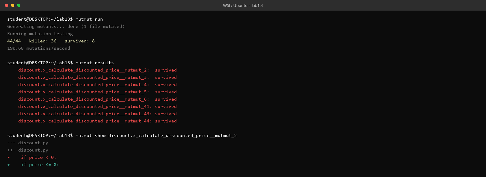

> **Why WSL and not "just install Java-style, from the Microsoft Store" or similar?** `mutmut` needs to fork the Python process to isolate each mutant's test run, and that's a Unix-specific mechanism the Windows native Python build doesn't support the same way. WSL gives you a real Linux kernel underneath your Windows machine, which is exactly what the tool needs — it's not a workaround so much as the actual supported path.
>
> **What the output above is telling you:** 44 small changes ("mutants") were introduced into `discount.py`, one at a time. Your test suite caught 36 of them (killed) and missed 8 (survived). Every "survived" line is a place where your tests would not notice if that specific bug were introduced into the real code. The `mutmut show` output at the bottom is the actual diff for one specific survivor: `if price < 0:` mutated to `if price <= 0:`.

---

## Step 8 — Ask AI why a specific mutant survived

Paste the diff from `mutmut show` into your AI tool:

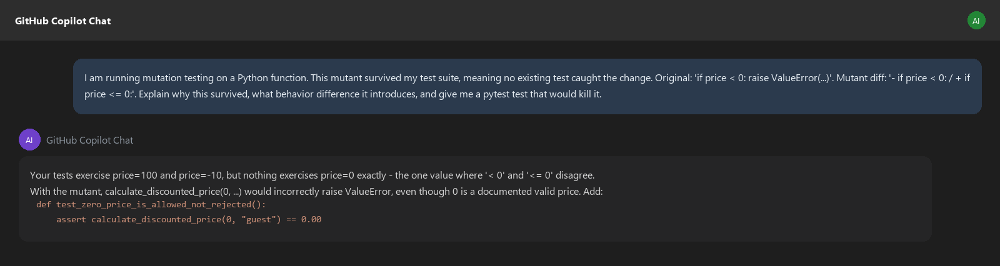

> **Why did `< 0` vs. `<= 0` slip through, when you already have a test for `price = -10`?** Because `-10` satisfies both `< 0` and `<= 0` — the mutant and the original agree on that input, so no test that only checks a clearly-negative number can tell them apart. The one value where they *disagree* is exactly `0`. This is the mechanical reason mutation testing catches things coverage can't: your test suite had 100% coverage of this function and still couldn't tell a correct boundary check from a slightly-wrong one.

---

## Step 9 — Add the test, re-run, and see the real improvement

Add the suggested test to `test_discount_coverage.py` and run mutation testing again:

```bash
mutmut run
```

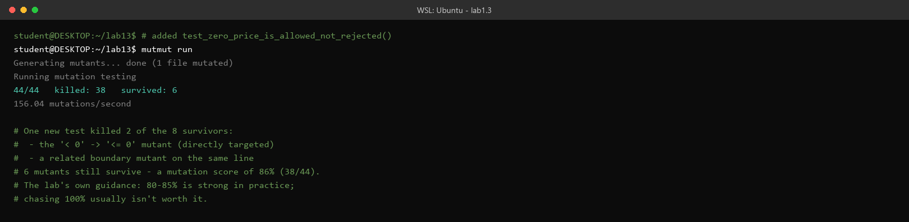

> **One targeted test killed two mutants, not just the one you were aiming at** — the `<= 0` mutant directly, plus a second boundary mutant on the same line that turned out to fail for the same underlying reason. That's a real, common pattern: a single well-placed boundary test often kills a small cluster of mutants at once, because mutation tools generate several small variations of the same line.
>
> Six mutants still survive. That's fine — the lab's own guidance is that a mutation score around 80–85% is considered strong in practice, and chasing 100% usually isn't worth the time it costs. This run landed at 38/44, or 86%.

---

## Discussion questions (for your own notes, or the group)

1. Before running coverage, would you have predicted those four exact lines were untested?
2. Now that you've seen the `mutmut` Windows failure firsthand — if you were writing this lab for a mixed group of Windows-laptop and Linux-VM students, how would you flag this ahead of time?
3. This walkthrough's test suite reached 100% coverage *and* still missed 8 mutants on the first mutation run. What does that gap tell you about what coverage percentage can and can't promise?
4. Is a mutation score of 86% good enough here? What would make you push for higher, versus stop and move on?

---

## Key takeaway

Coverage answers "did my tests run this code." Mutation testing answers "would my tests notice if this code were subtly wrong." They're different questions, and a high score on one doesn't guarantee a high score on the other — this walkthrough hit 100% coverage and only an 82% mutation score on the very same test file, before the fix. On the tooling side: if you hit the Windows wall here, it's a known, real limitation of `mutmut` itself, not something broken in your setup — WSL is the actual supported path, not a workaround of last resort.
