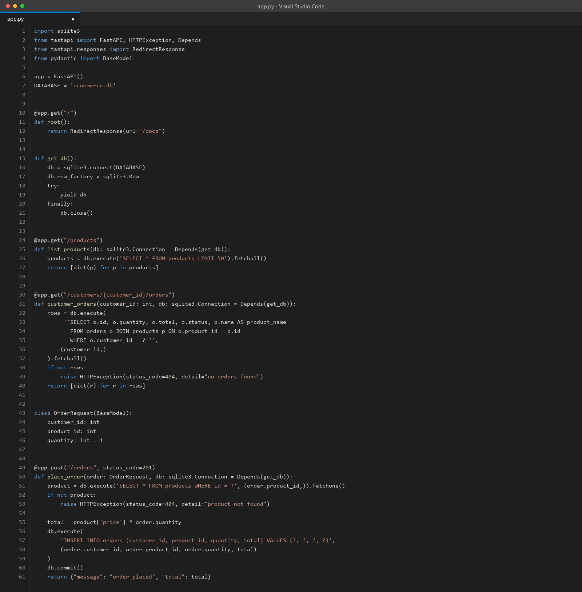
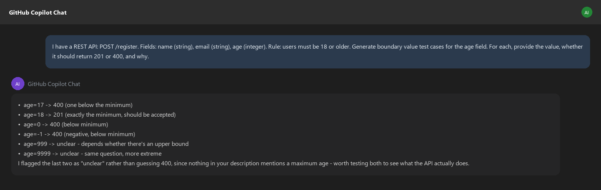
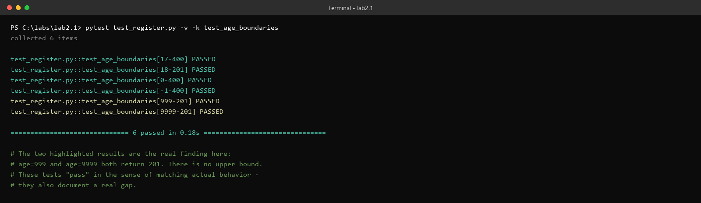
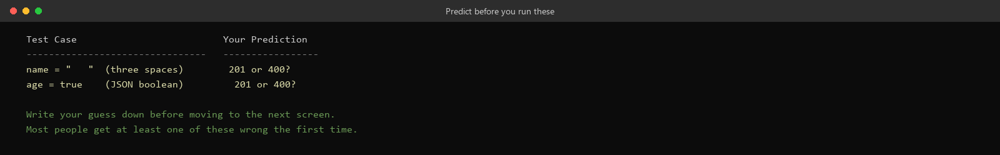
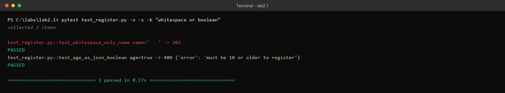
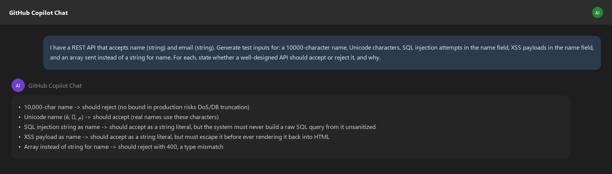
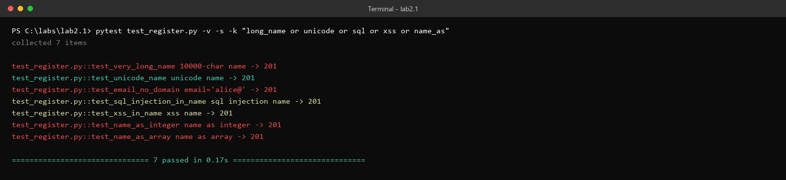

# Lab 2.1 Walkthrough — AI-Assisted Exploratory and Edge Case Testing

**Use this if:** you want to see exactly what this lab looks like, click for click, before sitting down at a lab machine — or if you're reviewing it afterward. Every result below is real, verified output from actually running these exact requests against the exact starter API.

**Original lab:** `sample_coursware/AI-In-Software-Testing-main/2.1-exploratory-testing.md`

---

## What you're building toward

The developer of this registration endpoint says all inputs are validated. Your job is to find out whether that's actually true — not by reading the code, but by throwing a systematic set of nasty inputs at it and watching what comes back. By the end, you'll have a concrete list of inputs that silently pass when they shouldn't, which is a more dangerous failure mode than a crash.

---

## Step 1 — Create `app.py`

```bash
pip install flask pytest
```



> **Why is the most interesting bug in this lab never in the "obvious" validation checks?** Every field here has *some* check — `name` isn't allowed to be missing, `email` must contain `@`, `age` must be an integer over 18. The bugs live in the gaps between what these checks say and what they actually enforce: `if not name:` sounds like it blocks empty input, but doesn't block whitespace. `isinstance(age, int)` sounds like it blocks non-integers, but Python's `bool` is technically a subclass of `int`. This lab is really about that gap — the difference between "there's a check" and "the check does what you'd assume it does."

---

## Step 2 — Ask AI for boundary values on the `age` field



Add the tests and run them:

```bash
pytest test_register.py -v -k test_age_boundaries
```



> **Notice the AI explicitly declined to guess on `age=999` and `age=9999`** rather than assuming they should fail — that's the correct call, and it's worth noticing when it happens. Running those two against the real API confirms there genuinely is no upper bound: a 999-year-old registers successfully. All 6 tests "pass" in the sense that they correctly predicted what the API does — but two of those predictions are also, themselves, the bug.

---

## Step 3 — Predict, then check, two specific cases

Before running anything, write down your own guess:



Now run them and see:

```bash
pytest test_register.py -v -s -k "whitespace or boolean"
```



> **Both results are real, and both are more subtle than they look.** `"   "` (three spaces) returns 201 because `if not name:` treats a whitespace-only string as truthy — Python's `not` only catches empty strings, not strings that are empty *after trimming*. The fix is one character: `if not name.strip():`.
>
> `age=true` returns 400 — but read the error message: `"must be 18 or older to register"`. That's not the type-check firing, even though `age=True` genuinely is a type mismatch by any reasonable definition. It's the age-comparison firing, because in Python, `True < 18` evaluates to `True` (since `bool` is a subclass of `int`, and `True == 1`). The rejection here is correct, but for a coincidental reason — the type check (`if not isinstance(age, int):`) never actually catches it, because `isinstance(True, int)` is also `True`. The only reason this specific case comes out right is that `1` happens to be less than `18`. Change the business rule to "must be 1 or older" and this same boolean would sail through as a fully valid age. The lesson isn't "it's broken" — it's that the correct-looking result is masking a type check that doesn't do what its name suggests.

---

## Step 4 — Long strings, Unicode, and security-shaped inputs



Add the tests — plus two extra ones checking whether `name` has any type restriction at all, since the lab's own checks only ever mention type-checking `age` — and run everything:

```bash
pytest test_register.py -v -s -k "long_name or unicode or sql or xss or name_as"
```



> **Read the color-coding in that output as two different categories of finding, because they're not the same severity.** The 10,000-character name and the `email='alice@'` case (both flagged) are real, bounded gaps — no length limit, no real email-format check — worth fixing but low drama. The SQL-injection and XSS strings passing as plain string content (shown but not flagged) are *correct* behavior for this API specifically, per the lab's own note: there's no database and no HTML rendering here, so these strings do no actual harm in this sandbox — the point is only to confirm the API doesn't do anything *unexpected* with them, which it doesn't.
>
> **The two flagged results at the bottom aren't anywhere in the lab's own answer key.** `name` accepts an integer and accepts a JSON array, both returning 201 — because unlike `age`, `name` is never run through an `isinstance()` check at all. It's the exact same class of bug the lab spends the whole exercise teaching you to look for, just in a spot the lab's own "API Weaknesses Revealed" table doesn't mention. Worth adding to your own notes as a reminder that an answer key is a floor, not a ceiling.

---

> **Verified local result:** all 11 exploratory checks passed against the starter API, including whitespace-only names, ages 999 and 9999, a bare `alice@` email, and a 10,000-character name. These are test assertions about the current behavior, not evidence that the inputs are acceptable.

### Mitigations to discuss

- Reject whitespace-only names with `not isinstance(name, str) or not name.strip()`.
- Reject booleans before integer validation: `isinstance(age, bool) or not isinstance(age, int)`.
- Add an explicit maximum age only if the product rule requires one.
- Validate name and email types, maximum lengths, and email structure with a request schema or validation library.
- Add tests that assert the desired 400 responses so the fixes cannot silently regress.

---

## Discussion questions (for your own notes, or the group)

1. Before running anything, how many of these 19 test results would you have predicted correctly?
2. Which felt more "wrong" to you: the whitespace-name bug, or the no-upper-bound-on-age bug? Why might one matter more in a real production system than the other?
3. The `age=true` case returned the "correct" status code for an incidental reason. What's the difference between a test that catches a bug and a test that catches the *right kind* of bug?
4. Now that you've seen `name` has no type check either, what does that suggest about how thoroughly a single field-by-field code read would need to go to catch every gap like this?

---

## Key takeaway

The most dangerous result in this whole lab isn't a crash — it's a silent 201 on input that should have been rejected. AI is good at generating the categories of nasty input a human tester tends to skip (boundary values, type confusion, oversized payloads); it's still up to you to run them, read the actual response, and decide which of those "technically passing" results are actually bugs.
