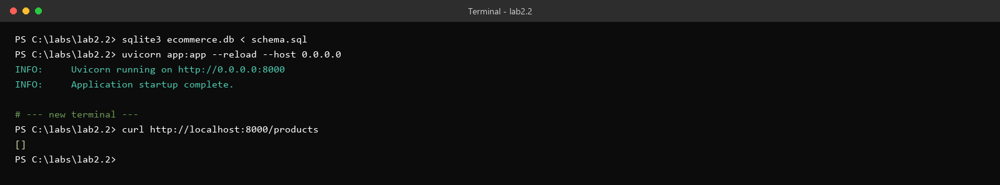
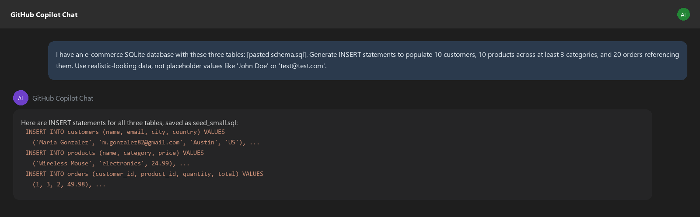
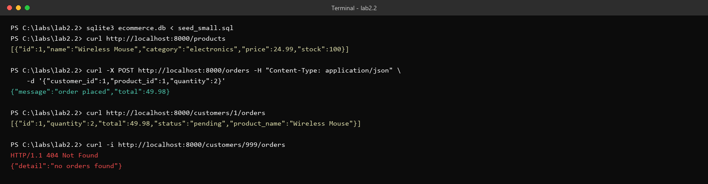
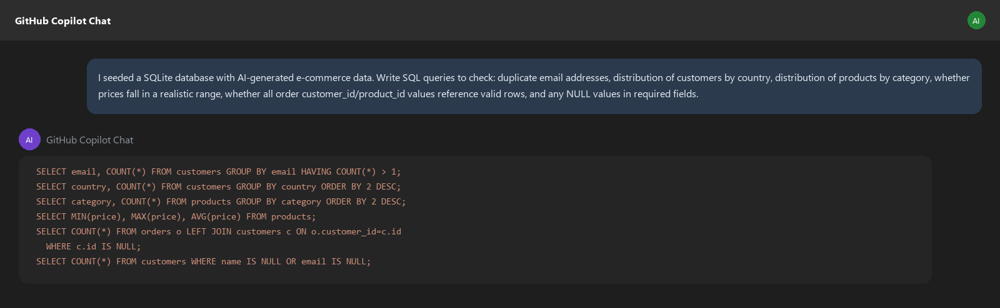
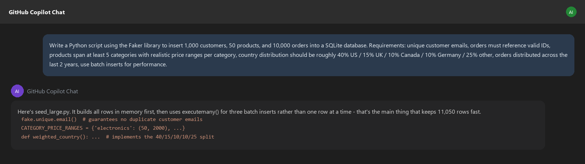
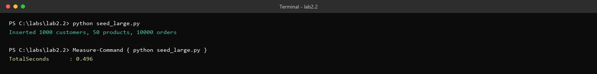
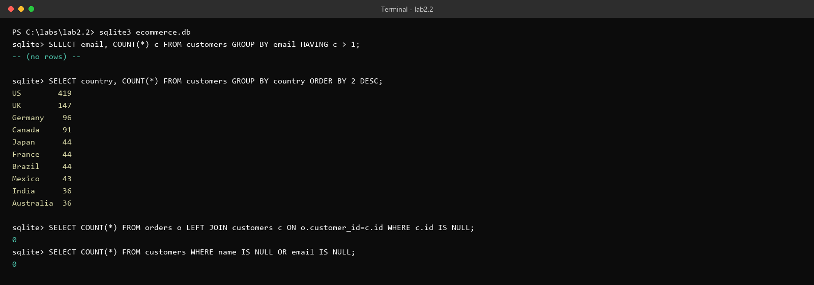

# Lab 2.2 Walkthrough — AI-Generated Test Data

**Use this if:** you want to see exactly what this lab looks like, click for click, before sitting down at a lab machine — or if you're reviewing it afterward. Every number below is real: this API was actually stood up, this Faker script actually ran, and these quality checks actually came back clean against the real generated data.

**Original lab:** `sample_coursware/AI-In-Software-Testing-main/2.2-synthetics.md`

---

## What you're building toward

You need realistic data to test an e-commerce platform before peak season, and production data is off-limits for privacy reasons. AI can generate synthetic data quickly — the point of this lab is that "quickly" and "trustworthy" are different properties, and you validate the second one before you rely on it in a test suite.

---

## Step 1 — Create `app.py` and the schema

```bash
sudo dnf install -y sqlite
pip install fastapi uvicorn faker
```


> **Why does `place_order` compute `total` server-side from `product.price`, instead of trusting a `total` field in the request?** This is a small, easy-to-miss design detail worth noticing on your first read: if the endpoint trusted a client-supplied price, anyone could order a $2,000 item for a penny by editing the request. Recomputing from the database's own price is what makes this endpoint safe to test with adversarial input later.

---

## Step 2 — Initialize the schema and start the API

```bash
sqlite3 ecommerce.db < schema.sql
uvicorn app:app --reload --host 0.0.0.0
```



An empty `[]` here is the correct result — you haven't loaded any data yet. If you see an error instead, that's a real signal something in the schema or app didn't load, not something to skip past.

---

## Step 3 — Ask AI for a small seed dataset



Save the output as `seed_small.sql`, load it, and verify:

```bash
sqlite3 ecommerce.db < seed_small.sql
curl http://localhost:8000/products
```

Then place a real order and confirm it worked:



> **The 404 at the bottom is deliberate, and worth testing on purpose.** `GET /customers/999/orders` correctly returns 404 with `{"detail":"no orders found"}` for a customer that exists in neither the customers nor orders table (or a customer with zero orders). This is the kind of "does the API behave correctly on the input I *didn't* seed" check that's easy to skip once the happy path works — but it's exactly the endpoint behavior a real test suite needs to lock in before you trust it.

---

## Step 4 — Ask AI for data-quality validation queries

Before trusting anything the AI generated, validate it:



> **Why ask AI to write the validation queries too, instead of trusting your own review of the seed data by eye?** At 10 rows you could eyeball the INSERT statements and probably catch an obvious problem. At 10,000 rows (which is where this lab is headed next) eyeballing stops being possible — the validation queries are what let the same quality check scale from "glance at it" to "actually verifiable," regardless of dataset size.

---

## Step 5 — Ask AI to write a script that scales to thousands of rows

Simple `INSERT` statements don't scale. Ask for a proper generation script:



Save it as `seed_large.py`, review it against the checklist the lab gives you (does it handle duplicate emails? batch inserts? does the country-distribution logic actually match the requirement?), then run it:

```bash
python seed_large.py
```



> **11,050 rows in under half a second is real, and it's real specifically *because* of the batching.** The script builds every row in memory first and inserts each table in one `executemany()` call, rather than committing after every single row. That's not a micro-optimization here — it's the difference between "a script you can iterate on in an afternoon" and "a script you start and go get coffee for," and it's exactly the kind of implementation detail the lab's own review checklist asks you to confirm before you trust the AI's output.

---

## Step 6 — Re-run the quality checks against the full dataset

The checks that mattered at 10 rows matter more at 10,000 — run them again:



> **This is the actual pass/fail moment of the whole lab.** Every requirement from the Step 5 prompt is independently verifiable in this output: zero duplicate emails (the `fake.unique.email()` call worked), a country split that's visibly close to the requested 40/15/10/10/25 (419/147/96/91 out of 1,000 — within a few points of target on every major country), and zero orphaned orders (every `customer_id` and `product_id` in 10,000 generated orders correctly points at a real row). None of this was assumed — it was checked, the same way you'd check it if a human teammate handed you this dataset and said "trust me."

---

## Discussion questions (for your own notes, or the group)

1. At 10 rows, could you have caught a bad distribution (e.g., every customer from the same country) just by reading the INSERT statements? At 10,000?
2. The lab's common-issues list warns about "email addresses following one obvious pattern" at small scale. Would the validation queries above have caught that specific problem if it existed? Which query?
3. If the Faker script's country-distribution logic had a bug and skewed 90% toward "US" instead of 40%, would any test built on top of this data silently start failing in a way that's hard to trace back to the seed script?
4. What's the actual risk of skipping Step 4 (validating the small dataset) and going straight to generating 10,000 rows?

---

## Key takeaway

AI generates data fast. Fast is not the same as trustworthy. The validation step in this lab isn't optional busywork — it's the only thing separating "data that looks plausible" from "data you can actually build a test suite on." Every number in this walkthrough was checked, not assumed, and that's the habit the lab is actually trying to build.
