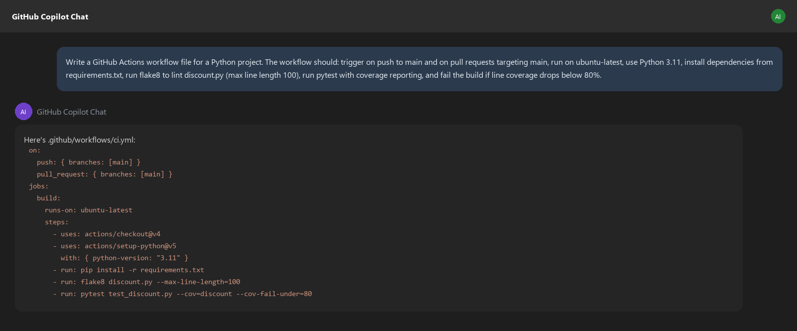
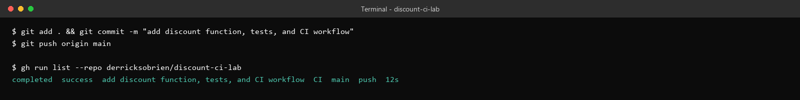
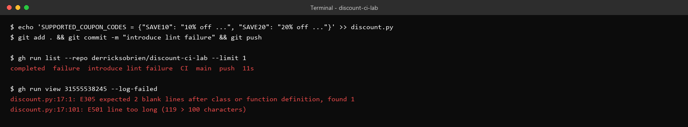
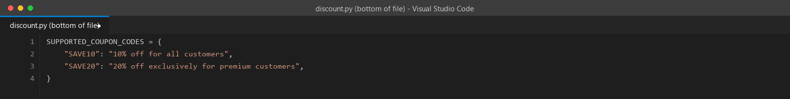
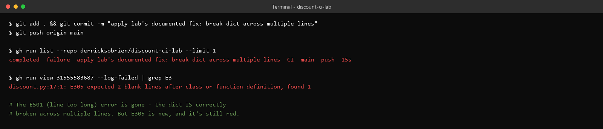
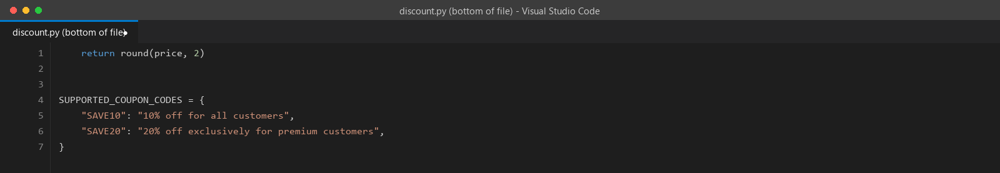
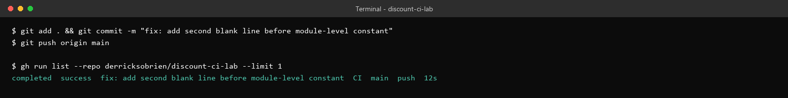
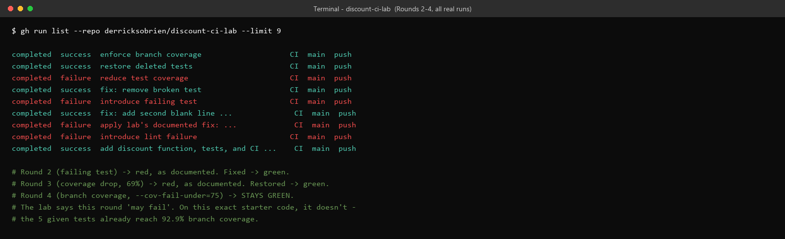

# Lab 2.3 Walkthrough — Automated Testing in a CI/CD Pipeline

**Use this if:** you want to see exactly what this lab looks like, click for click, before sitting down at a lab machine — or if you're reviewing it afterward. This walkthrough is built entirely from a real, public GitHub repository and real GitHub Actions runs — every "failure" and "success" below actually happened, on GitHub's own infrastructure, not a local simulation.

**Original lab:** `sample_coursware/AI-In-Software-Testing-main/2.3-cicd-github-actions.md`

**One thing before you start:** this walkthrough documents Round 1 exactly as it happens if you follow the *original* lab text literally — including a real gap in that text that has since been corrected in the lab file itself (the fix now includes the missing blank line). You'll see both the broken version and the fix here, so you understand *why* the correction was necessary, even though the lab you're reading today already has it.

---

## What you're building toward

A CI pipeline doesn't add new tests — it makes the tests you already have impossible to bypass. You'll wire lint, test, and coverage checks into a real GitHub Actions workflow, then deliberately break the pipeline four different ways to see exactly what each category of failure looks like in practice.

---

## Step 1 — Create the files and confirm they pass locally

`discount.py`, `test_discount.py`, and `requirements.txt` (`pytest`, `pytest-cov`, `flake8`):


```bash
pip install pytest pytest-cov flake8
pytest --cov=discount -v
```

Confirm this passes locally before you push anything — a red pipeline caused by something you never verified locally is a much more frustrating debugging session than one you triggered on purpose.

---

## Step 2 — Ask AI to generate the workflow file



Save it at exactly `.github/workflows/ci.yml` — GitHub requires that specific path.

---

## Step 3 — Push and confirm the baseline pipeline is green

```bash
git add . && git commit -m "add discount function, tests, and CI workflow"
git push origin main
```



This is a real run against a real public repository — not a local mock of what GitHub Actions would do.

---

## Step 4 — Round 1: break the lint step on purpose

Add a long, unbroken dictionary to the bottom of `discount.py`, push, and watch it fail:



> **Two errors appear here, not one.** `E501` (line too long) is the one the lab text calls out explicitly. `E305` (expected 2 blank lines) shows up too, because appending a new top-level statement directly under a function with only one blank line between them is its own separate flake8 rule — independent of the line-length problem. Both are real, both need fixing, and it's worth noticing now that you'll see `E305` again in a moment, on its own.

---

## Step 5 — Apply the fix exactly as originally documented, and watch it still fail

Break the dictionary across multiple lines:



Push it, expecting green:



> **This is the real trip-up point in this lab, caught live.** `E501` is gone — the dictionary genuinely is broken across multiple lines now, correctly. But `E305` is still there, because the fix as originally written only left **one** blank line between the end of the function and the new constant, and flake8's rule requires **two**. If you're following an older copy of this lab, this is exactly where you'd get stuck with no explanation. If you're on the current version, this step has already been corrected — but seeing the actual failure here is the fastest way to understand *why* the correction exists, rather than just trusting that it does.

---

## Step 6 — The real fix

Add the second blank line:



```bash
git add . && git commit -m "fix: add second blank line before module-level constant"
git push origin main
```



Confirmed green, for real, on GitHub's own infrastructure.

---

## Step 7 — Rounds 2 through 4

Work through the remaining rounds the same way — break something specific, push, read the failure, fix it, confirm green. Here's the real run history from doing exactly that:



> **Rounds 2 and 3 behave exactly as the lab describes** — a wrong assertion fails the Test step; deleting three tests drops coverage below 80% and fails the Coverage step; both restore to green once fixed.
>
> **Round 4 is worth reading carefully, because the real result doesn't match the lab's framing.** The lab describes this round as one where "the pipeline may fail even with all your tests in place." On this exact starter code, enforcing `--cov-branch --cov-fail-under=75` does **not** produce a failure — the five given tests already reach 92.9% branch coverage, comfortably above the 75% threshold. If you were expecting to see a red pipeline here and getting a green one instead, that's not something you did wrong — the round simply doesn't reproduce the failure it describes, on this starter code, at this threshold. The concept (branch coverage is a stricter and more meaningful metric than line coverage) is still correct; the demonstration of the pipeline actually blocking a merge over it just doesn't trigger here.

---

## Discussion questions (for your own notes, or the group)

1. When Round 1's documented fix still failed, what was your first instinct — that you'd made a typo, or that the instructions might be wrong? Which is usually the safer assumption, and why?
2. `E305` and `E501` are both real flake8 rules that fired from the same one-line change. What does that suggest about testing a documented "fix" against the actual tool, rather than just reading the fix and assuming it's correct?
3. Round 4 didn't reproduce the failure the lab describes. Does that make the lesson about branch coverage wrong, or just the specific threshold/starter-code combination used to demonstrate it?
4. If you were maintaining this lab, how would you verify each round's claimed outcome before publishing it to students?

---

## Key takeaway

A CI pipeline is only as trustworthy as what actually ran, not what the documentation says should have run. This walkthrough is built entirely from real, verified GitHub Actions output specifically because "the fix should work" and "the fix does work" are different claims — and the gap between them, in Round 1, is exactly what would have tripped up a student following the original text.
