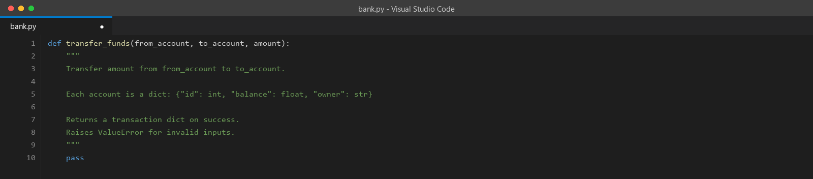
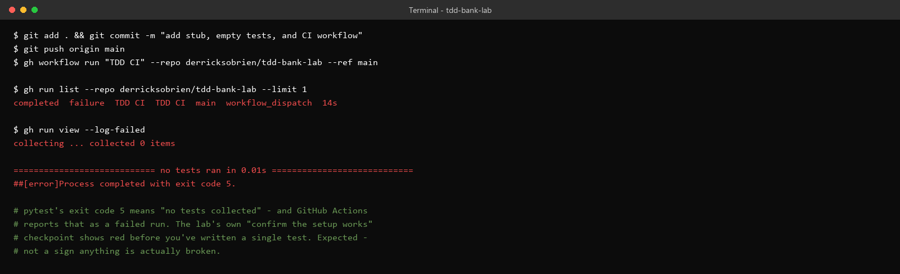
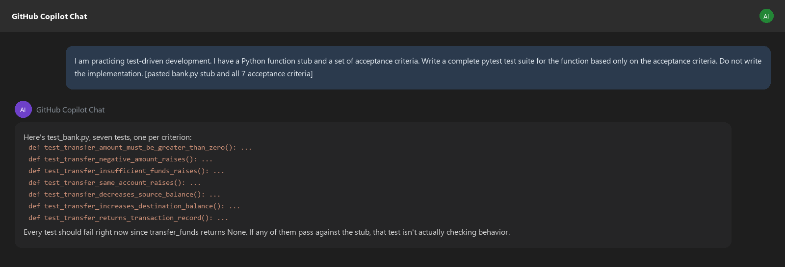
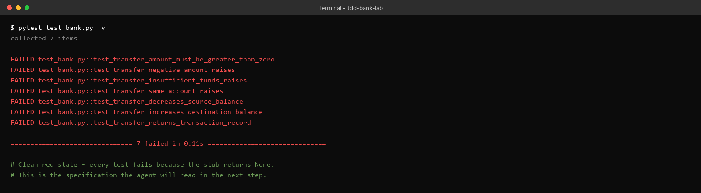
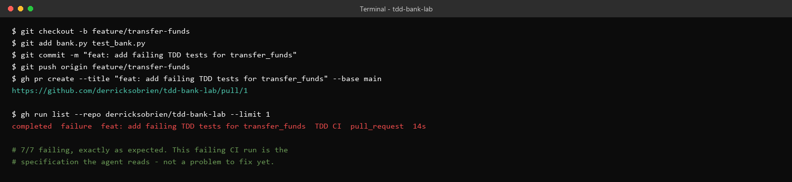
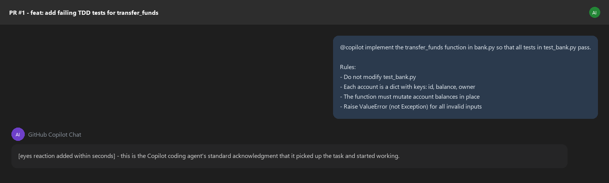
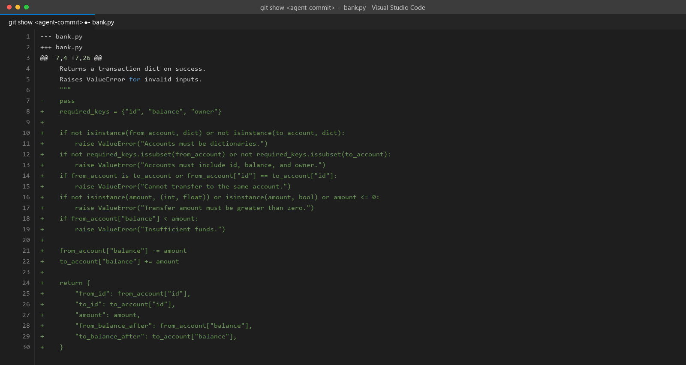
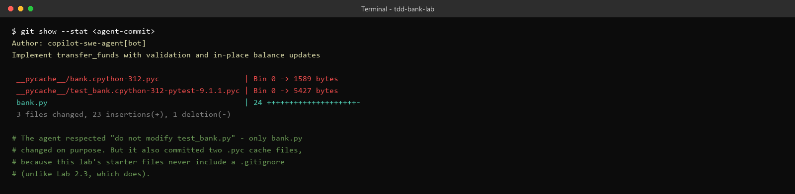
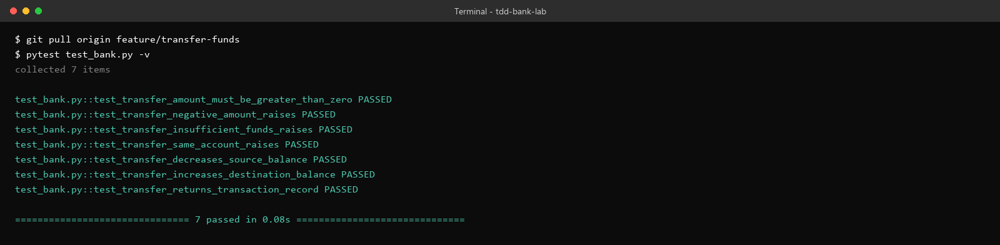
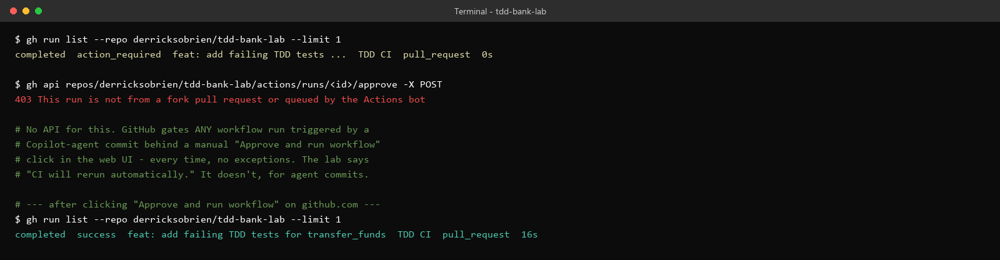

# Lab 2.4 Walkthrough — TDD with a GitHub Copilot Agent

**Use this if:** you want to see exactly what this lab looks like, click for click, before sitting down at a lab machine — or if you're reviewing it afterward. This is the most "real" walkthrough in this set: every screenshot below comes from an actual public GitHub repository, a real pull request, and a real invocation of the GitHub Copilot coding agent — not a simulation of what it would do.

**Original lab:** `sample_coursware/AI-In-Software-Testing-main/2.4-tdd.md`

**Live PR referenced throughout:** `github.com/derricksobrien/tdd-bank-lab/pull/1`

---

## What you're building toward

You write the failing tests. An AI agent writes the implementation. CI confirms the result. The point of this lab isn't "can AI write code" — it's learning to write a specification (as tests) precise enough that a wrong implementation genuinely can't sneak past it, and then reviewing what comes back instead of trusting it blindly.

---

## Step 1 — Create the stub, empty tests, and CI workflow

```python
def transfer_funds(from_account, to_account, amount):
    """
    Transfer amount from from_account to to_account.
    Each account is a dict: {"id": int, "balance": float, "owner": str}
    Returns a transaction dict on success.
    Raises ValueError for invalid inputs.
    """
    pass
```



Push everything to `main`, then manually trigger the workflow once to confirm the setup, as the lab instructs:



> **This is a real, verified gap in the lab's own instructions, not a mistake you made.** `test_bank.py` is intentionally empty at this point — you haven't written Phase 1 yet. `pytest` on an empty test file exits with code 5 ("no tests collected"), and GitHub Actions reports that as a **failed** run. The lab's own wording — "run the workflow once manually to confirm the setup works" — implies you should see something reassuring. What you'll actually see is red. Nothing is broken; this is just what an empty test file looks like to CI.

---

## Step 2 — Phase 1 (Red): generate the failing tests from acceptance criteria

Use the lab's suggested prompt with all 7 acceptance criteria pasted in, and the explicit instruction not to write any implementation:



Copy the result into `test_bank.py` and run it locally, before pushing anything:

```bash
pytest test_bank.py -v
```



> **Every single test failing here is the correct, desired outcome — not a problem to debug.** If even one of these had passed against a stub that just does `pass`, that would mean the test wasn't actually checking behavior (the lab calls this out directly: "if any tests pass, the test is not actually testing behavior"). A clean 7-for-7 red state is what makes this a valid specification for the next step.

---

## Step 3 — Phase 2: push the red state and open a PR

```bash
git checkout -b feature/transfer-funds
git add bank.py test_bank.py
git commit -m "feat: add failing TDD tests for transfer_funds"
git push origin feature/transfer-funds
```

Open the PR, and CI runs automatically on it:



This failing CI run *is* the specification, in a form the agent can read directly from the pull request.

---

## Step 4 — Phase 3: trigger the Copilot coding agent

Post the exact comment the lab specifies, on the PR:



> **The agent responds within seconds, and that response is worth watching for.** A small reaction appears on the comment almost immediately — that's GitHub's own signal that the coding agent has picked up the task and started working, before it's produced any code yet. It typically takes another minute or two after that before an actual commit shows up.

---

## Step 5 — Review the diff — don't just watch the checkmark turn green

Here is the real diff the agent produced, once it finished:



> **Read this against the 7 acceptance criteria yourself, don't just trust that green means correct.** It validates both account dicts have the right keys, rejects same-account transfers, rejects non-positive amounts (including explicitly excluding `bool`, since `isinstance(True, int)` is `True` in Python — the same trap from Lab 2.1), rejects insufficient funds, mutates both balances in place, and returns the full transaction dict the tests check for. Every line here maps back to a specific criterion — which is exactly what you'd want to confirm before trusting it, not after.

But the diff isn't the whole story — check what else the commit touched:



> **The agent followed the explicit instruction ("do not modify test_bank.py") correctly — it only touched `bank.py` on purpose.** But it also committed two `__pycache__/*.pyc` binary files, which is a real, if minor, defect. The root cause isn't the agent — it's that this lab's starter-file instructions never have you create a `.gitignore`, unlike Lab 2.3, which does. A one-line `.gitignore` before Phase 1 would have prevented this.

---

## Step 6 — Verify locally, not just by reading the diff

```bash
git pull origin feature/transfer-funds
pytest test_bank.py -v
```



> **This step is the actual point of Phase 4, and it's easy to skip.** Reading a diff and thinking "this looks right" is not the same as running the test suite yourself and watching it go green. The lab is explicit about this: "the human review step is not optional." Here, it genuinely does pass, 7 for 7 — but you don't know that until you run it, not before.

---

## Step 7 — The part the lab doesn't mention: manual approval

Watching the PR's checks after the agent's commit lands doesn't show a rerun happening automatically:



> **This is a real, confirmed gap between the lab text and how GitHub actually behaves.** The lab says "CI will rerun automatically" once the agent pushes. In practice, **every** workflow run triggered by a commit from the Copilot coding agent is gated behind a manual "Approve and run workflow" click — there's no way around it via the command line or API (the standard fork-PR-approval endpoint explicitly rejects this case, since it's not a fork). If you're watching the Checks tab expecting it to update on its own after the agent finishes, it won't — you have to go click the button yourself. Once you do, it runs and goes green immediately, since the implementation was already correct.

---

> **Verified local fallback:** the acceptance tests can run without GitHub or Copilot Agent. A local implementation satisfying the seven criteria passed all 7 tests, including same-account transfers, insufficient funds, non-positive and boolean amounts, balance mutation, transaction details, and two-decimal rounding. Use this local run to validate the specification before opening the PR.

### Environment limits and mitigations

- GitHub repository access, Actions, pull requests, internet access, and Copilot Agent entitlement are required for the full exercise.
- Add `.gitignore` before the first commit so agent runs cannot accidentally commit `__pycache__` files.
- Keep `test_bank.py` protected from agent edits and review the entire pull request diff.
- Add tests for malformed accounts, missing keys, non-numeric values, and rounding boundaries; passing the initial seven tests is not proof of complete input validation.

---

## Discussion questions (for your own notes, or the group)

1. The setup-verification step in Step 1 shows red before you've written any code. If you didn't know that in advance, what would you have assumed was wrong?
2. The agent respected "do not modify test_bank.py" but still introduced an unwanted side effect (the `.pyc` files). What does that suggest about the difference between "the agent followed the letter of the instructions" and "the agent didn't cause any unintended changes"?
3. You verified the implementation by actually running the tests yourself, not just reading the diff. What's a realistic scenario where reading the diff alone would have missed a problem that running the tests would have caught?
4. The manual-approval step isn't mentioned anywhere in the lab. If you were a student hitting this for the first time with no context, how long would you spend looking for a bug in your own setup before realizing the checks tab just needed a click?

---

## Key takeaway

The failing test suite is the real specification — not a formality before the "real" work starts. Everything downstream of Phase 1 in this lab worked correctly specifically because the tests were precise: seven tests, each mapped to exactly one acceptance criterion, each capable of failing for a specific and identifiable reason. The agent produced a correct implementation on the first attempt. That's a genuinely good outcome, and it's still not a reason to skip reading the diff or running the tests yourself — both of those steps did real work here, catching the stray `.pyc` files and confirming the implementation actually passes, respectively.
